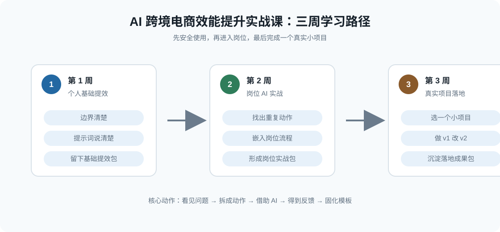

# 课程阅读与使用指南

这份指南用于把课程总纲、21 个章节、模板库、提示词库和评分反馈表串起来。  
讲师、助教和后续协作者可以先读这里，再进入具体章节。

## 一、这套资料适合怎么读

建议按 4 层阅读：

1. 先读课程方向：`README.md`、`00_课程总纲/00_课程设计说明.md`、`00_课程总纲/11_单源一致性约定.md`。
2. 再读课程主线：`00_课程总纲/01_课程总目录.md`、`00_课程总纲/02_教学方法论_正反馈式训练.md`。
3. 接着读 21 个章节：按 Day01 到 Day21 顺序阅读，每章只抓一个核心动作。
4. 做练习时打开 `09_章节实操手册/`：每章都有一份更细的 step by step 指引。
5. 如果想继续学习 AI Agent Skills，读 `08_AI_Agent_Skills教程/00_AI_Agent_Skills编写入门.md`。
6. 最后读工具资料：`04_模板库/`、`05_提示词库/`、`06_评分与反馈/`。

如果时间有限，可以先读：

- `00_课程总纲/01_课程总目录.md`
- 每周第 1 天和复盘日章节
- `04_模板库/00_模板库使用说明.md`
- `06_评分与反馈/00_评分反馈使用说明.md`

## 二、两种 HTML 阅读方式

本资料库提供两种 HTML 阅读方式：

| 版本 | 位置 | 适合谁 | 特点 |
| --- | --- | --- | --- |
| 资料库阅读器 | `html_reading_package/index.html` | 讲师、助教、协作者 | 展示所有 Markdown 文件，带全文搜索 |
| 书籍阅读版 | `book_reading_package/index.html` | 学员、外部分享对象 | 按课程顺序阅读，包含 21 个章节和 21 份实操手册 |

如果要分享给别人阅读，优先分享根目录里的 `AI跨境电商效能提升实战课_书籍阅读版.html`。  
如果要继续改资料、查模板和提示词，优先使用资料库阅读器。

当前 HTML 打包会把课程图示转成内嵌 SVG。  
这样分享单个 HTML 文件时，不需要额外安装 Mermaid，也不依赖外部 CDN。

## 三、课程交付主线

这门课不是让学员记住很多 AI 概念，而是让学员留下可复用的工作成果。

建议先按下面的图表导读快速建立整体印象，再进入具体章节：

| 图表 | 解决的问题 | 建议阅读时机 |
| --- | --- | --- |
| 三周学习路径图 | 这门课为什么分成基础、岗位、项目三步 | 开始阅读前 |
| 21 天交付物总览图 | 每天最终要留下什么成果 | 学员开始做作业前 |
| AI 使用边界矩阵 | 哪些工作能让 AI 辅助，哪些必须人负责 | 第 1 周前 2 章 |
| 提示词质量评分雷达图 | 怎样判断一条提示词够不够清楚 | 第 2 章写提示词时 |
| 跨境 AI 应用场景热力图 | 哪些岗位场景适合优先试点 | 第 2 周选动作时 |
| 项目选择优先级气泡图 | 第 3 周应该选哪个真实小项目 | 第 15 章 |
| 成果包结构图 | 结营成果包应该包含哪些证据 | 第 21 章 |

三周可以这样理解：

| 周次 | 学员变化 | 最终成果 |
| --- | --- | --- |
| 第 1 周 | 从不会用、不敢用、乱用 AI，变成能用 AI 完成基础任务 | 个人 AI 基础提效包 |
| 第 2 周 | 从会问 AI，变成能把 AI 放进岗位工作 | 岗位 AI 实战包 |
| 第 3 周 | 从零散尝试，变成完成一个真实小项目 | 个人 AI 落地成果包 |

讲师分享时可以反复提醒：

> 今天不追求一次到位。先做一版，能看懂，能修改，能留下来下次继续用。

## 四、章节、交付物和配套资料对照表

| 章节 | 主要交付物 | 建议配套模板 | 建议配套提示词 |
| --- | --- | --- | --- |
| 第 1 章：AI 不是神，是减轻重复劳动的助手 | AI 使用边界清单 | `04_模板库/01_AI使用边界清单.md` | `05_提示词库/01_通用提示词框架.md` |
| 第 2 章：学会把问题说清楚 | 个人提示词模板 v1 | `04_模板库/02_个人提示词模板.md` | `05_提示词库/01_通用提示词框架.md` |
| 第 3 章：AI 辅助产品理解 | 产品理解卡 | `04_模板库/03_产品理解卡.md` | `05_提示词库/02_产品理解提示词.md` |
| 第 4 章：AI 辅助竞品和评论分析 | 竞品评论分析表 | `04_模板库/04_竞品评论分析表.md` | `05_提示词库/03_竞品评论分析提示词.md` |
| 第 5 章：AI 辅助 Listing 初稿 | Listing 初稿 v1 | `04_模板库/05_Listing生成与审核模板.md` | `05_提示词库/04_Listing生成提示词.md` |
| 第 6 章：修改比生成更重要 | Listing 修改稿 v2、Listing 审核清单 | `04_模板库/05_Listing生成与审核模板.md`、`06_评分与反馈/04_前后版本对比表.md` | `05_提示词库/04_Listing生成提示词.md` |
| 第 7 章：第 1 周复盘 | 个人 AI 基础提效包 | `04_模板库/02_个人提示词模板.md`、`06_评分与反馈/04_前后版本对比表.md` | `05_提示词库/01_通用提示词框架.md` |
| 第 8 章：从“会用 AI”到“用 AI 做工作” | 岗位提效诊断表 | `04_模板库/06_岗位提效诊断表.md` | `05_提示词库/01_通用提示词框架.md` |
| 第 9 章：AI 辅助广告素材方向 | 广告素材方向表 | `04_模板库/07_广告素材方向表.md` | `05_提示词库/05_广告素材提示词.md` |
| 第 10 章：AI 辅助广告数据复盘 | 广告数据复盘表 | `04_模板库/08_广告数据复盘表.md` | `05_提示词库/06_广告数据复盘提示词.md` |
| 第 11 章：AI 辅助客服和售后回复 | 客服 FAQ 表、标准回复库 | `04_模板库/09_客服FAQ与回复库.md` | `05_提示词库/07_客服回复提示词.md` |
| 第 12 章：AI 辅助运营周报 | 运营周报模板 | `04_模板库/10_运营周报模板.md` | `05_提示词库/01_通用提示词框架.md` |
| 第 13 章：把一个动作变成 SOP | 岗位 SOP v1 | `04_模板库/11_岗位SOP模板.md` | `05_提示词库/08_SOP生成提示词.md` |
| 第 14 章：第 2 周复盘 | 岗位 AI 实战包 | `04_模板库/06_岗位提效诊断表.md`、`04_模板库/11_岗位SOP模板.md` | `05_提示词库/08_SOP生成提示词.md` |
| 第 15 章：选择一个真实项目 | 落地项目选择表 | `04_模板库/12_落地项目选择表.md` | `05_提示词库/01_通用提示词框架.md` |
| 第 16 章：把项目拆成小步骤 | 项目拆解表 | `04_模板库/13_项目拆解表.md` | `05_提示词库/01_通用提示词框架.md` |
| 第 17 章：完成第一版 | 项目初稿 v1 | 根据项目选择对应模板 | 根据项目选择对应提示词 |
| 第 18 章：反馈和修改 | 项目修改稿 v2 | `06_评分与反馈/04_前后版本对比表.md` | 根据项目选择对应提示词 |
| 第 19 章：固化成模板 | 个人可复用模板 | `04_模板库/11_岗位SOP模板.md` | `05_提示词库/08_SOP生成提示词.md` |
| 第 20 章：做一个 7 天微计划 | 7 天 AI 使用计划 | `04_模板库/14_7天AI使用计划.md` | `05_提示词库/01_通用提示词框架.md` |
| 第 21 章：结营复盘 | 个人 AI 落地成果包 | `04_模板库/15_结营复盘表.md`、`06_评分与反馈/05_结业评估表.md` | 根据项目选择对应提示词 |

## 五、每章正文和实操手册怎么配合

每章正文负责讲“为什么这样做、什么是好结果、哪里容易误用”。  
实操手册负责带学员一步一步完成作业，不占用正文篇幅。

| 阅读动作 | 看哪里 | 适合什么时候 |
| --- | --- | --- |
| 先理解概念和边界 | Day 章节正文 | 课前预习、讲师讲解 |
| 跟着一步一步做 | `09_章节实操手册/DayXX_...md` | 课堂实操、课后补做 |
| 自评和修改 | 实操手册里的评分表与提示词 | 提交作业前 |
| 复盘和沉淀 | 实操手册里的反思问题 | 每章结束后 |

## 六、每章建议的课堂节奏

每章可以控制在 60 到 90 分钟。

| 环节 | 建议时长 | 讲师要做什么 | 学员要留下什么 |
| --- | --- | --- | --- |
| 问题导入 | 5 到 10 分钟 | 用一个真实工作场景说明本章为什么有用 | 写下自己的相似问题 |
| 方法讲解 | 10 到 15 分钟 | 讲清核心理念，不展开太多概念 | 知道今天只做一个动作 |
| 讲师示范 | 10 到 20 分钟 | 用示例资料跑一遍提示词和模板 | 看见一版可修改的结果 |
| 学员实操 | 20 到 30 分钟 | 巡视、提醒、帮学员把问题变小 | 完成本章交付物初稿 |
| 反馈修改 | 10 到 15 分钟 | 用评分表给具体建议 | 标出至少 2 处人工修改 |
| 沉淀复用 | 5 分钟 | 提醒命名、归档、下次复用 | 保存模板或提示词 |

## 七、讲师课前准备清单

每次上课前建议准备 5 类材料：

1. 一个真实但脱敏的业务案例。
2. 一份可以演示的输入资料。
3. 本章对应模板。
4. 本章对应提示词。
5. 一个简单的反馈标准。

如果没有真实数据，可以使用模拟资料，但要明确告诉学员这是练习资料。  
不要要求学员上传账号密码、客户隐私、未公开财务数据或平台后台敏感信息。

## 八、学员提交作业的统一要求

为了让讲师批改更轻，建议所有作业统一包含 4 个部分：

1. 原始问题：这次想解决什么。
2. AI 初稿：AI 帮忙做了什么。
3. 人工修改：自己改了哪里，为什么改。
4. 可复用结果：最后留下什么模板、清单或提示词。

讲师不需要只看结果是否漂亮，更要看学员有没有完成“AI 辅助、人做判断”的过程。

## 九、继续完善资料库的建议顺序

如果后续还要继续补内容，建议按这个顺序做：

1. 先给每章补 1 个跨境电商真实场景案例。
2. 再给每章补 1 段讲师示范话术。
3. 再把每章作业评分标准和 `06_评分与反馈/` 对齐。
4. 最后统一 21 个章节的语言细节和案例口径。

不建议一开始就追求复杂自动化。  
这门课的核心是让学员形成稳定的小成果，而不是展示工具复杂度。
