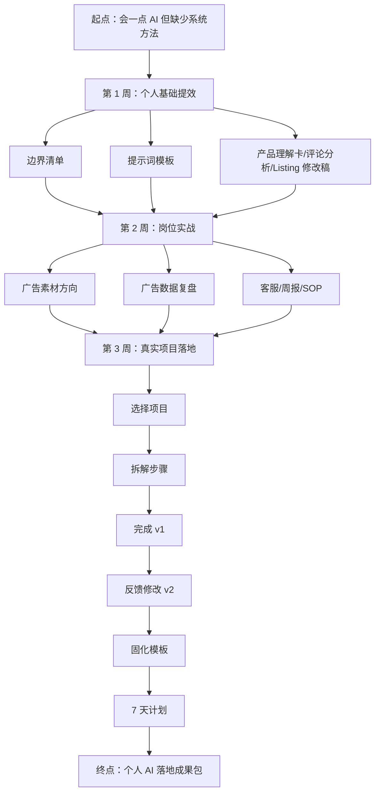

# 整体课程设计说明

这门课采用“大闭环套小闭环”的结构。

大闭环回答四个问题：

1. 学习者从哪里来：已经知道 AI 很重要，但缺少系统方法，容易焦虑、乱用或只停留在尝鲜。
2. 学完能解决什么问题：能把 AI 放进跨境电商真实工作，完成一个可复用的小项目。
3. 中间如何递进：先建立个人基础，再进入岗位实战，最后完成真实项目落地。
4. 课程最终留下什么：个人 AI 基础提效包、岗位 AI 实战包、个人 AI 落地成果包。

每章小闭环都按同一套结构展开：

为什么要学 → 核心概念 → 方法论 → 工具资源 → 案例讲解 → 实操练习 → 常见误区 → 本章小结。

## 课程结构图（文字描述）

## 能力成长路径

1. 认知层：知道 AI 能做什么、不能做什么。
2. 表达层：能把问题讲清楚，写出可复用提示词。
3. 分析层：能整理产品、评论、广告和运营数据。
4. 生成层：能生成 Listing、回复、周报、素材方向等第一版。
5. 修改层：能复核事实、规则、语气和业务边界。
6. 流程层：能把一个动作写成 SOP。
7. 项目层：能完成一个真实小项目，并固化成模板。
8. 迁移层：能把同一套方法迁移到新品、广告、客服、周报和团队协作。

## 每章之间的依赖关系

| 阶段 | 依赖能力 | 阶段成果 |
| --- | --- | --- |
| 第 1 周 | AI 边界、提示词、产品理解、评论分析、Listing 与修改 | 个人 AI 基础提效包 |
| 第 2 周 | 岗位诊断、广告素材、广告复盘、客服、周报、SOP | 岗位 AI 实战包 |
| 第 3 周 | 选项目、拆步骤、做第一版、收反馈、模板化、7 天计划 | 个人 AI 落地成果包 |

更细一点看：

- 第 1 章是安全边界，第 2 章是沟通方式。
- 第 3 到第 6 章形成产品内容闭环：产品理解 → 评论证据 → Listing 初稿 → 人工修改。
- 第 7 章把个人基础打包，为岗位应用做准备。
- 第 8 章先诊断岗位动作，第 9 到第 13 章分别落到广告、数据、客服、周报和 SOP。
- 第 14 章把岗位工具打包，为真实项目提供素材。
- 第 15 到第 21 章完整跑项目闭环：选项目 → 拆步骤 → 做 v1 → 反馈 v2 → 模板化 → 7 天持续使用 → 成果包。

## 如何形成完整闭环

课程的底层闭环是：

这个闭环在三个层次同时发生：

- 章节层：每章都产出一个小成果。
- 周层：每周都打包一个阶段成果。
- 课程层：最终形成能继续使用的个人 AI 落地成果包。

## 逐章交付物地图

| 章节 | 主题 | 核心交付物 |
| --- | --- | --- |
| 第 1 章 | AI 不是神，是减轻重复劳动的助手 | 《AI 使用边界清单》 |
| 第 2 章 | 学会把问题说清楚 | 《个人提示词模板 v1》 |
| 第 3 章 | AI 辅助产品理解 | 《产品理解卡》 |
| 第 4 章 | AI 辅助竞品和评论分析 | 《竞品评论分析表》 |
| 第 5 章 | AI 辅助 Listing 初稿 | 《Listing 初稿 v1》 |
| 第 6 章 | 修改比生成更重要 | 《Listing 修改稿 v2》与《Listing 审核清单》 |
| 第 7 章 | 第 1 周复盘：建立个人 AI 基础提效包 | 《个人 AI 基础提效包》 |
| 第 8 章 | 从“会用 AI”到“用 AI 做工作” | 《岗位提效诊断表》 |
| 第 9 章 | AI 辅助广告素材方向 | 《广告素材方向表》 |
| 第 10 章 | AI 辅助广告数据复盘 | 《广告数据复盘表》 |
| 第 11 章 | AI 辅助客服和售后回复 | 《客服 FAQ 与回复库》 |
| 第 12 章 | AI 辅助运营周报 | 《运营周报模板》 |
| 第 13 章 | 把一个动作变成 SOP | 《岗位 SOP 模板》 |
| 第 14 章 | 第 2 周复盘：建立岗位 AI 实战包 | 《岗位 AI 实战包》 |
| 第 15 章 | 选择一个真实项目 | 《落地项目选择表》 |
| 第 16 章 | 把项目拆成小步骤 | 《项目拆解表》 |
| 第 17 章 | 完成第一版 | 《项目第一版 v1》 |
| 第 18 章 | 反馈和修改 | 《前后版本对比表》与《项目 v2》 |
| 第 19 章 | 固化成模板 | 《可复用模板 v1》 |
| 第 20 章 | 做一个 7 天微计划 | 《7 天 AI 使用计划》 |
| 第 21 章 | 结营复盘：建立个人 AI 落地成果包 | 《个人 AI 落地成果包》 |

## 视觉与图片建议

- 总览页：使用“三周阶梯图”，从个人基础、岗位实战到真实项目落地。
- 第 1 周：使用“AI 边界三分法”和“产品内容生产流程图”。
- 第 2 周：使用“岗位动作四象限”和“岗位实战包结构图”。
- 第 3 周：使用“项目落地闭环图”和“v1 到模板的版本演进图”。
- 结营页：使用“成果包目录树”，展示学习者最终带走的文件结构。

## 课程表达原则

- 讲清楚，但不制造焦虑。
- 给方法，但不神化工具。
- 要案例，但每个案例都要回到真实动作。
- 要产出，但产出必须可复核、可复用、可迁移。
