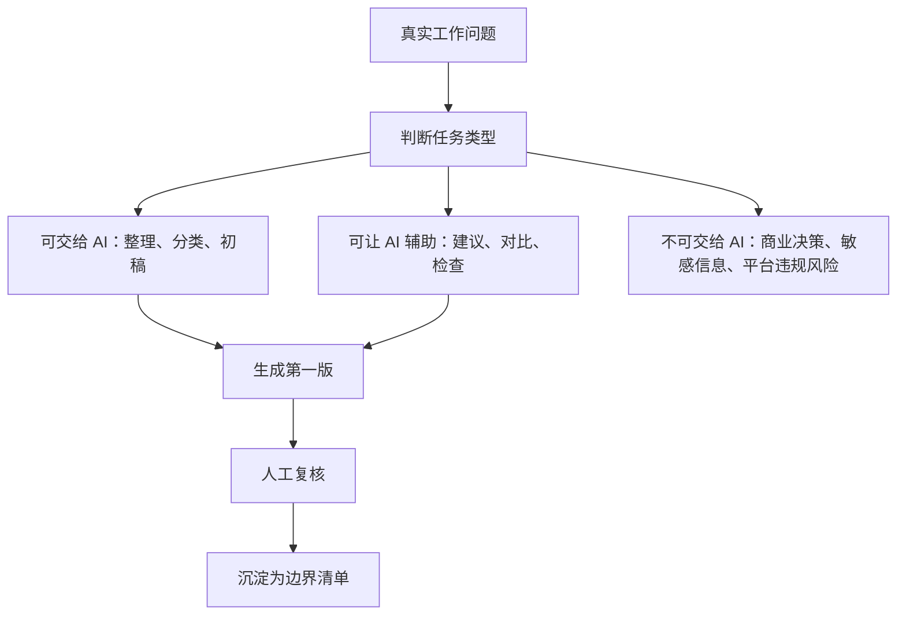

# 第 1 章：AI 不是神，是减轻重复劳动的助手

> ※ 通用约定（AI 价值原则、SOP 五步、自评三档、提示词骨架、AI 工具入口、敏感信息约定）见 [`00_课程总纲/10_课程通用约定.md`](../00_课程总纲/10_课程通用约定.md)。本章只写章节特化部分。

## 一、为什么要学（问题引入）

**本章在课程闭环中的位置**：课程起点。先帮学习者把“AI 焦虑”和“AI 神化”都放下来，建立正确边界。

**真实问题**：很多人一开始会走两个极端：要么觉得 AI 很厉害，什么都敢交给它；要么觉得 AI 会乱写，所以干脆不用。两个极端都会影响工作效率。

**课堂引导可以这样讲**：

> 可以把 AI 想成一位很勤快的实习同事：它可以帮你整理、起草、归纳，但不能替你拍板，也不能替你承担业务后果。

**本章交付物**：《AI 使用边界清单》
**配套实操手册：[Day01_第1章：AI不是神，是减轻重复劳动的助手_实操手册](#manual-day01)。**

## 二、核心概念讲解

| 概念 | 大白话解释 |
| --- | --- |
| AI 辅助 | AI 适合做整理、分类、初稿和思路扩展，价值在于把重复劳动变轻。 |
| 人工判断 | 产品取舍、投放预算、客户争议、品牌承诺等关键判断必须由人负责。 |
| 边界意识 | 先分清“可以交给 AI”“可以让 AI 辅助”“必须人工处理”，再开始使用工具。 |
| 结果复核 | AI 输出越流畅，越要检查事实、数据、规则和语气。 |

**一个好记的类比**：AI 像电动螺丝刀，不会替你决定这面墙能不能打孔，但能让重复拧螺丝这件事轻松很多。

## 三、方法论（可复用框架）

**方法框架：AI 使用三分法：可交给、可辅助、不可交给**

| 步骤 | 动作 | 怎么做 |
| --- | --- | --- |
| 1 | 列任务 | 写下自己每天或每周重复做的 5 个动作。 |
| 2 | 分类型 | 判断每个动作属于整理类、生成类、判断类还是发布类。 |
| 3 | 定边界 | 标出哪些资料不能上传，哪些结论不能让 AI 直接决定。 |
| 4 | 做试点 | 选择一个低风险、可检查的小动作交给 AI 做第一版。 |
| 5 | 留清单 | 把经验写成《AI 使用边界清单》，下次不用重新纠结。 |

**本章 Checklist**

- 任务是否来自真实工作，而不是为了试工具而试工具。
- 输入资料是否已脱敏，未包含客户隐私、账号密码、内部价格策略等敏感信息。
- AI 输出是否经过人工复核。
- 最终结果是否能保存成清单或模板。

**本章流程图**

> 通用 SOP 五步（写清问题 → 脱敏输入 → AI 生成 → 人工复核 → 沉淀模板）见通用约定。本章流程图是这五步的特化形态。

## 四、工具与资源

| 工具 / 资源 | 用途 | 使用场景与提醒 |
| --- | --- | --- |
| 对话大模型 | 生成初稿、分类、改写、归纳 | 用上面任一常用模型即可，不需要同时追很多工具。 |
| Google Sheets / Excel | 记录边界清单和任务分类 | 适合团队共享和后续复盘。 |
| Notion / 飞书文档 / Google Docs | 沉淀个人 AI 使用规则 | 适合写成团队可读的说明文档。 |

> 通用 AI 工具入口表（ChatGPT / Claude / Gemini / Qwen / DeepSeek / 豆包）和工具组合建议（基础版 / 稳妥版 / 团队版）统一放在 [`00_课程总纲/10_课程通用约定.md`](../00_课程总纲/10_课程通用约定.md)。本章只列与本章动作直接相关的工具。

## 五、案例讲解

**场景**：一位亚马逊运营每天都要整理买家评论，过去是一条条看，耗时且容易漏掉高频问题。

**输入资料**：脱敏后的 30 条买家评论，只保留评论内容、星级和产品型号，不包含买家姓名、订单号和邮箱。

**AI 可以帮忙**：请 AI 按“质量、物流、使用体验、价格感受、包装”分类，并标出每类 1 到 2 条原文证据。

**人必须判断**：运营检查分类是否准确，删除 AI 猜测的内容，把能支撑后续改进的高频问题留下。

**最后留下**：《AI 使用边界清单》：评论分类可以用 AI，退款判断、客户隐私、账号信息和最终产品决策不能交给 AI。

## 六、实操练习

**Mini 项目：给自己的工作做一张 AI 边界清单**

**准备资料**：任选 5 个真实工作动作，例如评论整理、标题初稿、客服回复、周报总结、广告复盘。

**操作步骤**

1. 把 5 个动作写进表格。
2. 标注每个动作的风险：低、中、高。
3. 写清 AI 能帮哪一步，以及人必须检查哪一步。
4. 选择其中 1 个低风险动作，用 AI 做一版。
5. 把人工修改痕迹记录下来。

**交付物**：《AI 使用边界清单》

**自评要点**：本章交付物按通用三档（好 / 中性 / 需要继续改）自评，重点看是否做出了**《AI 使用边界清单》**——结构是否完整、是否有人工复核痕迹、下次能否复用。

**提示词建议**：优先用 [`09_章节实操手册/`](../09_章节实操手册/) 里本章 4 条专用提示词（拆任务 / 生成第一版 / 自评 / 模板化）。如果想从零起步，可以先用通用约定里的提示词骨架做一版。

## 七、常见误区

| 误区 | 会带来的问题 | 改法 |
| --- | --- | --- |
| 把 AI 当答案机 | 看见完整输出就直接使用，容易把错误带进业务。 | 把 AI 输出看作初稿，先核事实再使用。 |
| 上传敏感资料 | 可能造成隐私或商业信息泄露。 | 先脱敏，再输入；不确定能不能放，就先不放。 |
| 一开始就做大项目 | 范围太大，反馈慢，容易失控。 | 从低风险、可检查、重复度高的小动作开始。 |

## 八、本章小结

**带走什么**

- AI 的第一价值不是替你做决定，而是减轻重复劳动。
- 使用 AI 前先定边界，使用 AI 后必须复核。
- 这一章留下的边界清单，会保护后面所有章节的实操安全。

**和下一章的关系**

下一章会把“边界清楚”继续推进到“问题说清楚”，学习如何写出能让 AI 真正干活的任务说明。
