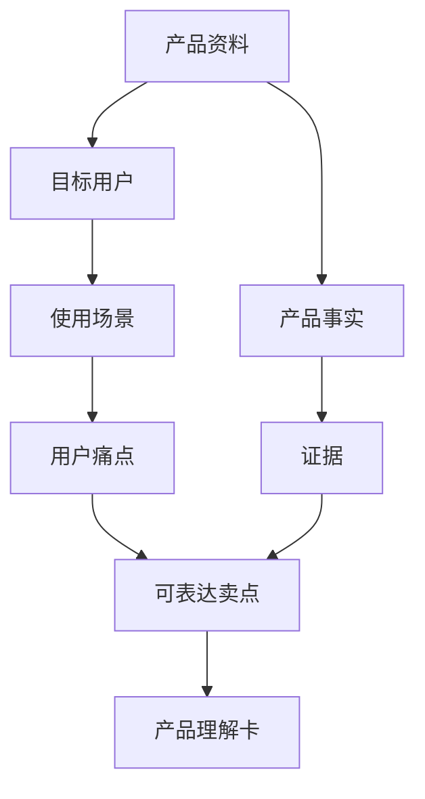

# 第 3 章：AI 辅助产品理解

> ※ 通用约定（AI 价值原则、SOP 五步、自评三档、提示词骨架、AI 工具入口、敏感信息约定）见 [`00_课程总纲/10_课程通用约定.md`](../00_课程总纲/10_课程通用约定.md)。本章只写章节特化部分。

## 一、为什么要学（问题引入）

**本章在课程闭环中的位置**：有了清楚提示词之后，先让 AI 帮我们读懂产品。产品理解不清，后面的 Listing、广告和客服都会跟着跑偏。

**真实问题**：很多跨境电商资料只有参数：尺寸、材质、颜色、重量。参数不等于卖点，卖点也不等于用户愿意购买的理由。

**课堂引导可以这样讲**：

> 产品理解像给产品办身份证：不是把所有特征都塞进去，而是写清它是谁、帮谁、解决什么问题、有什么证据。

**本章交付物**：《产品理解卡》
**配套实操手册：[Day03_第3章：AI辅助产品理解_实操手册](#manual-day03)。**

## 二、核心概念讲解

| 概念 | 大白话解释 |
| --- | --- |
| 产品事实 | 资料中能被验证的信息，例如尺寸、材质、适用型号。 |
| 使用场景 | 用户在什么时间、地点、状态下使用产品。 |
| 用户痛点 | 用户现在不方便、不满意、担心或反复抱怨的地方。 |
| 可表达卖点 | 有事实支撑、能回应用户痛点、适合对外表达的购买理由。 |

**一个好记的类比**：产品资料是一堆食材，产品理解卡是备菜表。先切好、分好，后面炒 Listing、广告、客服这几道菜才不会手忙脚乱。

## 三、方法论（可复用框架）

**方法框架：人-场-痛-证-卖 产品理解框架**

| 步骤 | 动作 | 怎么做 |
| --- | --- | --- |
| 1 | 人 | 明确目标用户是谁，不要写成“所有人”。 |
| 2 | 场 | 写出 3 个真实使用场景。 |
| 3 | 痛 | 列出用户购买前最在意的 3 个问题。 |
| 4 | 证 | 把每个卖点对应到产品事实或评论证据。 |
| 5 | 卖 | 把事实翻译成用户听得懂的表达。 |

**本章 Checklist**

- 卖点是否有事实或资料支撑。
- 目标用户是否足够具体。
- 是否区分了功能、利益点和证据。
- 是否标出需要人工确认的参数或认证信息。

**本章流程图**

> 通用 SOP 五步（写清问题 → 脱敏输入 → AI 生成 → 人工复核 → 沉淀模板）见通用约定。本章流程图是这五步的特化形态。

## 四、工具与资源

| 工具 / 资源 | 用途 | 使用场景与提醒 |
| --- | --- | --- |
| 对话大模型 | 把参数整理成用户语言 | 适合把说明书、图片信息、评论摘要整理成卡片。 |
| 产品资料表 | 记录尺寸、材质、适用范围、限制 | 建议用 Excel 或 Google Sheets 管理。 |
| 图片标注工具 | 标出产品结构和使用场景 | 可用 Canva、截图标注或飞书妙记类工具。 |

> 通用 AI 工具入口表（ChatGPT / Claude / Gemini / Qwen / DeepSeek / 豆包）和工具组合建议（基础版 / 稳妥版 / 团队版）统一放在 [`00_课程总纲/10_课程通用约定.md`](../00_课程总纲/10_课程通用约定.md)。本章只列与本章动作直接相关的工具。

## 五、案例讲解

**场景**：团队准备上架一款宠物除毛刷，资料里有材质、适用毛发、清洁方式和产品图片。

**输入资料**：产品参数、3 张场景图、10 条竞品评论摘要。

**AI 可以帮忙**：请 AI 按“目标用户、使用场景、购买顾虑、可表达卖点、需要确认的信息”整理成产品理解卡。

**人必须判断**：检查 AI 是否把“适合猫狗”说得过满，是否编造安全认证，是否把清洁方式讲错。

**最后留下**：《产品理解卡》：后续 Listing、广告素材和客服 FAQ 都从这张卡取信息。

## 六、实操练习

**Mini 项目：为一个真实产品做产品理解卡**

**准备资料**：一个产品的参数、图片、说明书或内部卖点资料。

**操作步骤**

1. 整理产品事实，不写推测。
2. 列出目标用户和 3 个使用场景。
3. 让 AI 把资料转成“痛点-事实-卖点”表格。
4. 人工删除没有证据的表达。
5. 把最终版保存为产品理解卡。

**交付物**：《产品理解卡》

**自评要点**：本章交付物按通用三档（好 / 中性 / 需要继续改）自评，重点看是否做出了**《产品理解卡》**——结构是否完整、是否有人工复核痕迹、下次能否复用。

**提示词建议**：优先用 [`09_章节实操手册/`](../09_章节实操手册/) 里本章 4 条专用提示词（拆任务 / 生成第一版 / 自评 / 模板化）。如果想从零起步，可以先用通用约定里的提示词骨架做一版。

## 七、常见误区

| 误区 | 会带来的问题 | 改法 |
| --- | --- | --- |
| 把参数当卖点 | 用户看完仍不知道为什么要买。 | 把参数翻译成用户利益。 |
| 目标用户太宽 | 文案没有方向，广告也难聚焦。 | 至少写出人群、场景和购买动机。 |
| AI 编造证据 | 容易出现虚假宣传风险。 | 所有认证、数据、效果都回到原资料核实。 |

## 八、本章小结

**带走什么**

- 产品理解先于文案生成。
- 好卖点必须同时有用户痛点和事实证据。
- 产品理解卡是后续章节的基础输入。

**和下一章的关系**

下一章会把产品理解延伸到外部市场，通过竞品和评论寻找用户真实反馈。
