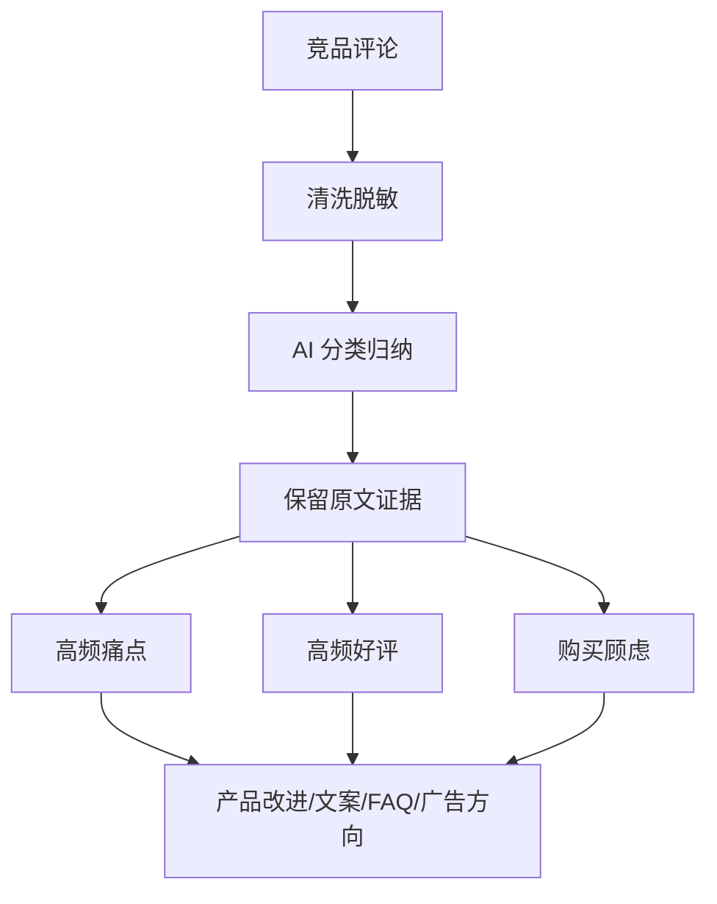

# 第 4 章：AI 辅助竞品和评论分析

> ※ 通用约定（AI 价值原则、SOP 五步、自评三档、提示词骨架、AI 工具入口、敏感信息约定）见 [`00_课程总纲/10_课程通用约定.md`](../00_课程总纲/10_课程通用约定.md)。本章只写章节特化部分。

## 一、为什么要学（问题引入）

**本章在课程闭环中的位置**：产品理解解决“我们怎么讲自己”，竞品和评论分析解决“用户到底怎么说、市场已经怎么卖”。

**真实问题**：很多人看竞品只看销量、价格和图片，忽略评论里最有价值的信息：用户真实满意什么、不满什么、担心什么。

**课堂引导可以这样讲**：

> 评论区像免费的用户访谈室，只是里面声音太杂。AI 的作用不是替你下结论，而是先帮你把声音分门别类。

**本章交付物**：《竞品评论分析表》
**配套实操手册：[Day04_第4章：AI辅助竞品和评论分析_实操手册](#manual-day04)。**

## 二、核心概念讲解

| 概念 | 大白话解释 |
| --- | --- |
| 竞品 | 与自己争夺同一类用户、解决相似问题的产品。 |
| 评论证据 | 用户原话、星级、图片反馈等可追溯资料。 |
| 高频问题 | 多位用户反复提到的问题，比单条极端评论更有参考价值。 |
| 机会点 | 从好评、差评和未满足需求中提炼出的可改进方向。 |

**一个好记的类比**：竞品分析不是抄作业，而是看隔壁班试卷：别人哪里失分、哪里得分，你要带着证据学习。

## 三、方法论（可复用框架）

**方法框架：收集-清洗-分类-证据-转化 五步法**

| 步骤 | 动作 | 怎么做 |
| --- | --- | --- |
| 1 | 收集 | 选择 3 到 5 个竞品，收集评论、标题、图片卖点。 |
| 2 | 清洗 | 去掉无关、重复、带个人隐私的信息。 |
| 3 | 分类 | 让 AI 按功能、质量、物流、包装、使用场景等归类。 |
| 4 | 证据 | 每个结论保留原评论或截图来源。 |
| 5 | 转化 | 把结论转成 Listing 卖点、客服 FAQ、产品改进或广告方向。 |

**本章 Checklist**

- 是否至少分析了好评和差评两类信息。
- 每个结论是否能追溯到原始评论。
- 是否区分用户事实和自己的推测。
- 是否把分析结果转成下一步动作。

**本章流程图**

> 通用 SOP 五步（写清问题 → 脱敏输入 → AI 生成 → 人工复核 → 沉淀模板）见通用约定。本章流程图是这五步的特化形态。

## 四、工具与资源

| 工具 / 资源 | 用途 | 使用场景与提醒 |
| --- | --- | --- |
| Amazon / Shopify / TikTok Shop 前台页面 | 查看竞品呈现和用户反馈 | 只采集公开信息，不抓取或使用违规数据。 |
| Google Sheets / Excel | 整理评论、分类、证据链接 | 适合做成可筛选的分析表。 |
| Helium 10 / Jungle Scout / Keepa（可选） | 辅助观察关键词、趋势或价格变化 | 适合有预算和相关权限的团队，课程不依赖这些工具。 |
| 对话大模型 | 评论分类、痛点归纳、机会点整理 | 必须要求 AI 保留原文证据。 |

> 通用 AI 工具入口表（ChatGPT / Claude / Gemini / Qwen / DeepSeek / 豆包）和工具组合建议（基础版 / 稳妥版 / 团队版）统一放在 [`00_课程总纲/10_课程通用约定.md`](../00_课程总纲/10_课程通用约定.md)。本章只列与本章动作直接相关的工具。

## 五、案例讲解

**场景**：准备做一款露营灯，团队收集了 50 条竞品差评和 30 条好评。

**输入资料**：评论文本、星级、评论日期、对应竞品链接。

**AI 可以帮忙**：让 AI 按亮度、续航、重量、防水、充电、包装六类归纳，并为每类保留代表性原话。

**人必须判断**：检查结论是否真能从评论中推出，避免把个别抱怨夸大成普遍问题。

**最后留下**：《竞品评论分析表》，用于后续 Listing 卖点、广告钩子和客服 FAQ。

## 六、实操练习

**Mini 项目：完成一份 30 条评论的轻量分析**

**准备资料**：一个产品类目下 30 条公开评论，建议好评和差评都包含。

**操作步骤**

1. 把评论放入表格并去掉个人信息。
2. 让 AI 按 5 到 7 个维度分类。
3. 要求 AI 每类保留原文证据。
4. 人工标注“可转卖点、需避坑、需客服解释、需产品改进”。
5. 整理成竞品评论分析表。

**交付物**：《竞品评论分析表》

**自评要点**：本章交付物按通用三档（好 / 中性 / 需要继续改）自评，重点看是否做出了**《竞品评论分析表》**——结构是否完整、是否有人工复核痕迹、下次能否复用。

**提示词建议**：优先用 [`09_章节实操手册/`](../09_章节实操手册/) 里本章 4 条专用提示词（拆任务 / 生成第一版 / 自评 / 模板化）。如果想从零起步，可以先用通用约定里的提示词骨架做一版。

## 七、常见误区

| 误区 | 会带来的问题 | 改法 |
| --- | --- | --- |
| 只看差评 | 容易把产品方向做得过度防御。 | 好评、差评、问答都要看。 |
| 没有证据链 | 结论看起来高级，但无法复查。 | 每个结论保留原文或来源链接。 |
| 直接照抄竞品 | 容易同质化，也有合规风险。 | 学习用户需求，不复制表达。 |

## 八、本章小结

**带走什么**

- 评论分析的核心不是数量，而是证据和转化。
- AI 负责整理声音，人负责判断哪些声音值得行动。
- 本章输出会成为 Listing 和广告素材的重要输入。

**和下一章的关系**

下一章会把产品理解卡和竞品评论分析表合在一起，生成一版可修改的 Listing 初稿。
