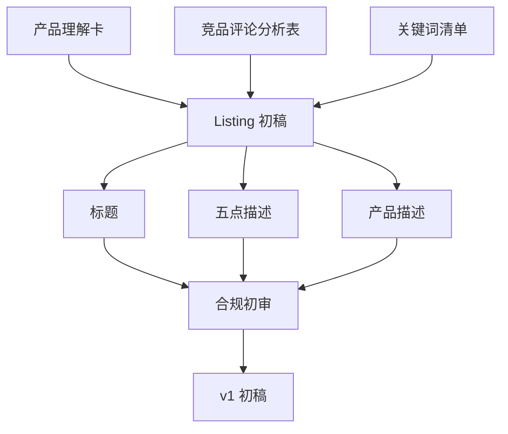

# 第 5 章：AI 辅助 Listing 初稿

> ※ 通用约定（AI 价值原则、SOP 五步、自评三档、提示词骨架、AI 工具入口、敏感信息约定）见 [`00_课程总纲/10_课程通用约定.md`](../00_课程总纲/10_课程通用约定.md)。本章只写章节特化部分。

## 一、为什么要学（问题引入）

**本章在课程闭环中的位置**：第 3 章解决产品事实，第 4 章解决用户反馈，本章把这些资料转成商品详情页初稿。

**真实问题**：很多 Listing 写作从空白页开始，结果要么堆关键词，要么堆形容词。AI 可以降低起稿难度，但不能替代事实审核和平台合规。

**课堂引导可以这样讲**：

> Listing 初稿像搭房子的脚手架：它不是最终装修，但没有它，后面修改会很累。

**本章交付物**：《Listing 初稿 v1》
**配套实操手册：[Day05_第5章：AI辅助Listing初稿_实操手册](#manual-day05)。**

## 二、核心概念讲解

| 概念 | 大白话解释 |
| --- | --- |
| Listing | 商品详情页内容，常包含标题、五点描述、产品描述、图片文案方向等。 |
| 关键词 | 用户搜索产品时可能使用的词，需要自然放入，不是硬塞。 |
| 卖点结构 | 建议按“用户问题-产品事实-使用利益”组织。 |
| 合规初审 | 检查是否有夸大、虚假、禁用词或无法证明的承诺。 |

**一个好记的类比**：AI 写 Listing 像帮你先把菜切好摆好，能不能上桌，还要你尝味、看火候、查食材是否真实。

## 三、方法论（可复用框架）

**方法框架：资料-结构-表达-合规-版本 Listing 起稿法**

| 步骤 | 动作 | 怎么做 |
| --- | --- | --- |
| 1 | 资料 | 输入产品理解卡、评论分析表和关键词清单。 |
| 2 | 结构 | 分别生成标题、五点、描述，不把所有内容混在一起。 |
| 3 | 表达 | 让 AI 用清楚、克制、用户能理解的语言表达。 |
| 4 | 合规 | 标出所有需要事实支持的词和平台风险表达。 |
| 5 | 版本 | 保存 v1 初稿，后续统一进入修改环节。 |

**本章 Checklist**

- 标题是否包含核心关键词但仍自然可读。
- 五点是否每条只讲一个主卖点。
- 卖点是否来自产品事实或评论证据。
- 是否标出需要人工确认的参数、认证和效果描述。

**本章流程图**

> 通用 SOP 五步（写清问题 → 脱敏输入 → AI 生成 → 人工复核 → 沉淀模板）见通用约定。本章流程图是这五步的特化形态。

## 四、工具与资源

| 工具 / 资源 | 用途 | 使用场景与提醒 |
| --- | --- | --- |
| 对话大模型 | 生成 Listing 初稿和多版本表达 | 建议一次只生成一个模块，便于检查。 |
| Amazon Seller University / 平台帮助中心 | 查平台内容规则和学习资料 | 规则以当前官方页面为准。 |
| 关键词工具（平台后台、广告搜索词、第三方工具） | 提供关键词输入 | 关键词要自然融入，不机械堆砌。 |
| Grammarly / DeepL Write（可选） | 英文表达检查 | 只做语言辅助，不替代事实审核。 |

> 通用 AI 工具入口表（ChatGPT / Claude / Gemini / Qwen / DeepSeek / 豆包）和工具组合建议（基础版 / 稳妥版 / 团队版）统一放在 [`00_课程总纲/10_课程通用约定.md`](../00_课程总纲/10_课程通用约定.md)。本章只列与本章动作直接相关的工具。

## 五、案例讲解

**场景**：要为一款可折叠瑜伽垫收纳架写 Amazon Listing 初稿。

**输入资料**：产品理解卡、竞品评论痛点、关键词清单、平台限制。

**AI 可以帮忙**：输出 3 个标题方向、5 条 Bullet Points 和一段产品描述，并列出每条卖点对应的资料来源。

**人必须判断**：核对尺寸、承重、材质是否真实，删除“最强、100%解决、医生推荐”等无证据表达。

**最后留下**：《Listing 初稿 v1》，用于下一章做人工修改。

## 六、实操练习

**Mini 项目：生成一版 Listing 初稿**

**准备资料**：上一章的产品理解卡、评论分析表、关键词清单。

**操作步骤**

1. 先让 AI 输出标题，保留 3 个候选。
2. 再让 AI 输出五点，每点包含事实证据。
3. 最后生成产品描述，语气保持克制。
4. 让 AI 单独列出风险词和待确认信息。
5. 保存 v1，不急着追求完美。

**交付物**：《Listing 初稿 v1》

**自评要点**：本章交付物按通用三档（好 / 中性 / 需要继续改）自评，重点看是否做出了**《Listing 初稿 v1》**——结构是否完整、是否有人工复核痕迹、下次能否复用。

**提示词建议**：优先用 [`09_章节实操手册/`](../09_章节实操手册/) 里本章 4 条专用提示词（拆任务 / 生成第一版 / 自评 / 模板化）。如果想从零起步，可以先用通用约定里的提示词骨架做一版。

## 七、常见误区

| 误区 | 会带来的问题 | 改法 |
| --- | --- | --- |
| 让 AI 凭空写 | 内容华丽但可能不真实。 | 必须输入产品卡和评论证据。 |
| 关键词堆砌 | 影响可读性，也可能降低转化。 | 关键词自然出现，不牺牲表达。 |
| 把初稿当终稿 | 风险词和错误事实可能直接发布。 | 初稿只进入下一章修改流程。 |

## 八、本章小结

**带走什么**

- Listing 初稿的目标是可修改，不是一次完美。
- AI 生成内容必须回到产品事实和评论证据。
- 保存 v1 版本，才能在下一章看见修改带来的真实提升。

**和下一章的关系**

下一章会专门训练修改能力，因为真正决定质量的往往不是生成，而是判断和修改。
