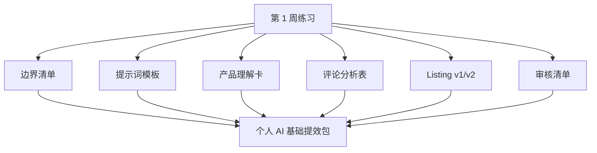

# 第 7 章：第 1 周复盘：建立个人 AI 基础提效包

> ※ 通用约定（AI 价值原则、SOP 五步、自评三档、提示词骨架、AI 工具入口、敏感信息约定）见 [`00_课程总纲/10_课程通用约定.md`](../00_课程总纲/10_课程通用约定.md)。本章只写章节特化部分。

## 一、为什么要学（问题引入）

**本章在课程闭环中的位置**：第 1 周收口章。把零散练习整理成一个能继续使用的个人工具包。

**真实问题**：很多课程学完一周后，文件散落在聊天记录、表格和文档里。没有整理，就很难复用，也很难看见自己真的进步了。

**课堂引导可以这样讲**：

> 复盘像给工具箱归位：锤子、尺子、螺丝刀都在，但不归类，下次还是会满屋找。

**本章交付物**：《个人 AI 基础提效包》
**配套实操手册：[Day07_第7章：第1周复盘：建立个人AI基础提效包_实操手册](#manual-day07)。**

## 二、核心概念讲解

| 概念 | 大白话解释 |
| --- | --- |
| 成果包 | 把本周产出的清单、模板、表格和版本稿整理在一起。 |
| 复盘 | 不是写心得，而是找出哪些动作可复用、哪些地方要改。 |
| 正反馈 | 用小成果证明自己能做到，降低继续使用 AI 的心理阻力。 |
| 基础提效 | 先把个人层面的重复动作变轻，再进入岗位级应用。 |

**一个好记的类比**：学习不是收集漂亮截图，而是整理成下次能直接打开使用的工具箱。

## 三、方法论（可复用框架）

**方法框架：整理-筛选-打包-演练-更新 五步复盘法**

| 步骤 | 动作 | 怎么做 |
| --- | --- | --- |
| 1 | 整理 | 找回第 1 至第 6 章的所有交付物。 |
| 2 | 筛选 | 留下真正会再次使用的版本。 |
| 3 | 打包 | 按边界、提示词、产品、评论、Listing、审核六类归档。 |
| 4 | 演练 | 任选一个新产品，用工具包跑一遍。 |
| 5 | 更新 | 记录最需要改进的一条规则或提示词。 |

**本章 Checklist**

- 是否能在 3 分钟内找到本周所有交付物。
- 每个文件是否有清楚命名和版本。
- 是否至少保留 1 条可复用提示词。
- 是否写下下周要用于岗位的一个场景。

**本章流程图**

> 通用 SOP 五步（写清问题 → 脱敏输入 → AI 生成 → 人工复核 → 沉淀模板）见通用约定。本章流程图是这五步的特化形态。

## 四、工具与资源

| 工具 / 资源 | 用途 | 使用场景与提醒 |
| --- | --- | --- |
| 云盘 / 本地文件夹 | 集中保存成果包 | 建议按日期、章节、版本命名。 |
| Notion / 飞书文档 | 做一个索引页 | 适合放链接、用途、更新记录。 |
| Google Sheets / Excel | 管理清单和评分 | 适合快速复盘和查漏补缺。 |

> 通用 AI 工具入口表（ChatGPT / Claude / Gemini / Qwen / DeepSeek / 豆包）和工具组合建议（基础版 / 稳妥版 / 团队版）统一放在 [`00_课程总纲/10_课程通用约定.md`](../00_课程总纲/10_课程通用约定.md)。本章只列与本章动作直接相关的工具。

## 五、案例讲解

**场景**：一位运营本周做了 6 个文件，但都散在聊天窗口和下载目录里。

**输入资料**：AI 边界清单、提示词模板、产品理解卡、评论分析表、Listing v1/v2、审核清单。

**AI 可以帮忙**：请 AI 帮忙生成一个成果包目录结构和文件命名规范。

**人必须判断**：人工检查每个文件是否可复用，删除不成熟版本，补上使用说明。

**最后留下**：《个人 AI 基础提效包》索引页。

## 六、实操练习

**Mini 项目：搭建自己的第 1 周成果包**

**准备资料**：第 1 至第 6 章交付物。

**操作步骤**

1. 建立一个文件夹或 Notion 页面。
2. 按六类归档交付物。
3. 为每个文件写一句用途说明。
4. 选择一个文件做二次优化。
5. 写下第 2 周最想落地的岗位场景。

**交付物**：《个人 AI 基础提效包》

**自评要点**：本章交付物按通用三档（好 / 中性 / 需要继续改）自评，重点看是否做出了**《个人 AI 基础提效包》**——结构是否完整、是否有人工复核痕迹、下次能否复用。

**提示词建议**：优先用 [`09_章节实操手册/`](../09_章节实操手册/) 里本章 4 条专用提示词（拆任务 / 生成第一版 / 自评 / 模板化）。如果想从零起步，可以先用通用约定里的提示词骨架做一版。

## 七、常见误区

| 误区 | 会带来的问题 | 改法 |
| --- | --- | --- |
| 只收藏不整理 | 下次用时找不到，也不知道哪个版本好。 | 建立索引页和版本命名。 |
| 复盘写成感想 | 有情绪但没有动作。 | 用交付物和修改记录复盘。 |
| 追求完整大礼包 | 整理成本太高，反而放弃。 | 先保留 6 个核心文件即可。 |

## 八、本章小结

**带走什么**

- 第 1 周的终点不是学会聊天，而是留下个人基础提效包。
- 成果包让 AI 使用从临时行为变成可复用资产。
- 有了个人基础，下一周才能把 AI 放进岗位流程。

**和下一章的关系**

第 2 周开始进入岗位实战：不再只问“AI 能做什么”，而是问“我的工作中哪一步最值得用 AI 改进”。
