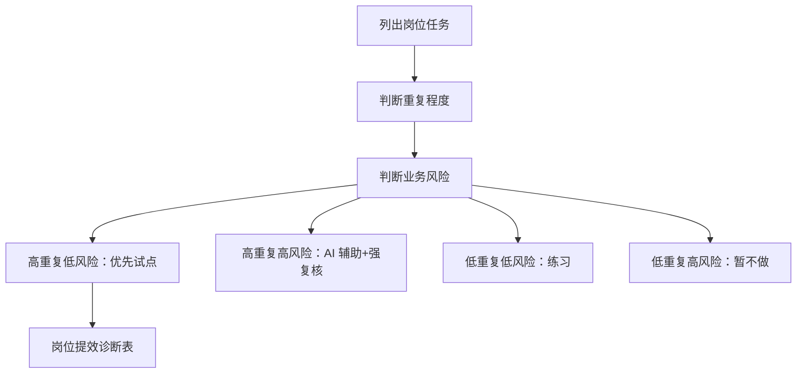

# 第 8 章：从“会用 AI”到“用 AI 做工作”

> ※ 通用约定（AI 价值原则、SOP 五步、自评三档、提示词骨架、AI 工具入口、敏感信息约定）见 [`00_课程总纲/10_课程通用约定.md`](../00_课程总纲/10_课程通用约定.md)。本章只写章节特化部分。

## 一、为什么要学（问题引入）

**本章在课程闭环中的位置**：第 2 周起点。把个人工具包放进岗位任务，找到最适合先优化的日常动作。

**真实问题**：很多人会偶尔问 AI，但工作流并没有改变。真正的提效不是多开一个聊天窗口，而是把 AI 放进一个固定动作里。

**课堂引导可以这样讲**：

> 会用 AI 像会开车，用 AI 做工作像会规划路线。只会踩油门不够，还要知道从哪里出发、去哪、在哪停。

**本章交付物**：《岗位提效诊断表》
**配套实操手册：[Day08_第8章：从“会用AI”到“用AI做工作”_实操手册](#manual-day08)。**

## 二、核心概念讲解

| 概念 | 大白话解释 |
| --- | --- |
| 岗位任务 | 每天或每周必须交付的真实工作。 |
| 提效诊断 | 找出重复、耗时、容易出错、结果可检查的动作。 |
| 输入输出 | 每个岗位动作都要说清需要什么资料，最后留下什么结果。 |
| 试点动作 | 先选择一个低风险动作做改进，不追求一次改造整个岗位。 |

**一个好记的类比**：岗位提效像整理流水线，先看哪一站最堵，再决定把 AI 这个工具放在哪一站。

## 三、方法论（可复用框架）

**方法框架：岗位动作四格诊断法**

| 步骤 | 动作 | 怎么做 |
| --- | --- | --- |
| 1 | 高重复低风险 | 优先做，例如评论分类、FAQ 归纳、周报初稿。 |
| 2 | 高重复高风险 | 可以辅助，但必须加强人工复核，例如客服争议回复。 |
| 3 | 低重复低风险 | 可作为练习，不优先投入太多精力。 |
| 4 | 低重复高风险 | 暂不交给 AI，例如重大客户投诉、预算决策。 |
| 5 | 选择试点 | 从第一类里选一个动作进入实操。 |

**本章 Checklist**

- 是否列出自己岗位的真实任务，而不是泛泛写职责。
- 是否标注每个任务的重复程度和风险。
- 是否明确试点动作的输入、步骤、输出和检查标准。
- 是否避免一开始做复杂自动化。

**本章流程图**

> 通用 SOP 五步（写清问题 → 脱敏输入 → AI 生成 → 人工复核 → 沉淀模板）见通用约定。本章流程图是这五步的特化形态。

## 四、工具与资源

| 工具 / 资源 | 用途 | 使用场景与提醒 |
| --- | --- | --- |
| 岗位任务清单 | 列出每天、每周、每月动作 | 可用表格、Notion 或飞书多维表格。 |
| 对话大模型 | 辅助拆解岗位动作 | 让 AI 帮你找重复点，但选择权在人。 |
| Trello / Notion / 飞书任务 | 跟踪试点任务 | 适合把动作变成可执行小卡片。 |

> 通用 AI 工具入口表（ChatGPT / Claude / Gemini / Qwen / DeepSeek / 豆包）和工具组合建议（基础版 / 稳妥版 / 团队版）统一放在 [`00_课程总纲/10_课程通用约定.md`](../00_课程总纲/10_课程通用约定.md)。本章只列与本章动作直接相关的工具。

## 五、案例讲解

**场景**：一位运营每天处理新品上架、评论整理、客服问题、广告观察和周报。

**输入资料**：一天的工作记录和每个任务大概耗时。

**AI 可以帮忙**：让 AI 把任务拆成“资料整理、初稿生成、人工判断、发布执行”。

**人必须判断**：选择评论整理作为试点，因为重复高、风险低、结果可检查。

**最后留下**：《岗位提效诊断表》。

## 六、实操练习

**Mini 项目：拆解自己的岗位一天**

**准备资料**：最近一天或一周的真实工作记录。

**操作步骤**

1. 列出不少于 8 个岗位动作。
2. 给每个动作标注重复程度和风险。
3. 写清每个动作的输入和输出。
4. 选出 1 个高重复低风险动作。
5. 为它写一条 AI 辅助提示词。

**交付物**：《岗位提效诊断表》

**自评要点**：本章交付物按通用三档（好 / 中性 / 需要继续改）自评，重点看是否做出了**《岗位提效诊断表》**——结构是否完整、是否有人工复核痕迹、下次能否复用。

**提示词建议**：优先用 [`09_章节实操手册/`](../09_章节实操手册/) 里本章 4 条专用提示词（拆任务 / 生成第一版 / 自评 / 模板化）。如果想从零起步，可以先用通用约定里的提示词骨架做一版。

## 七、常见误区

| 误区 | 会带来的问题 | 改法 |
| --- | --- | --- |
| 把岗位写成职责口号 | 无法落地到具体动作。 | 写动作，不写空泛职责。 |
| 先做高风险动作 | 容易影响客户、广告预算或平台合规。 | 先做低风险试点。 |
| 追求自动化 | 基础流程没清楚，自动化只会放大混乱。 | 先人工跑通，再考虑工具连接。 |

## 八、本章小结

**带走什么**

- 岗位提效从重复动作开始，不从炫酷工具开始。
- 每个动作都要有输入、输出和检查标准。
- 本章诊断表会决定后面广告、客服、周报和 SOP 的落地点。

**和下一章的关系**

下一章进入广告素材方向，用岗位诊断的方式拆一个具体广告工作动作。
