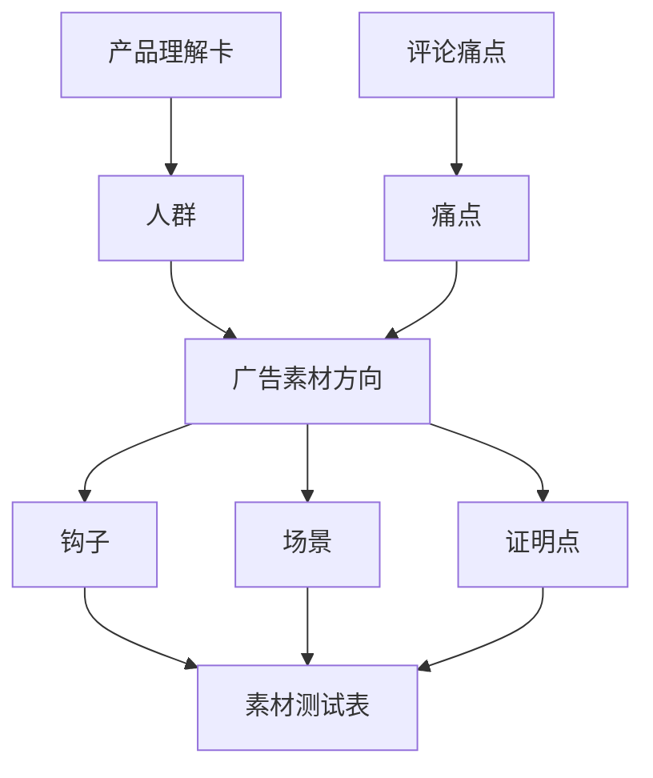

# 第 9 章：AI 辅助广告素材方向

> ※ 通用约定（AI 价值原则、SOP 五步、自评三档、提示词骨架、AI 工具入口、敏感信息约定）见 [`00_课程总纲/10_课程通用约定.md`](../00_课程总纲/10_课程通用约定.md)。本章只写章节特化部分。

## 一、为什么要学（问题引入）

**本章在课程闭环中的位置**：把 AI 用到广告岗位的前端环节：不是直接让 AI 投广告，而是帮我们整理素材方向和测试假设。

**真实问题**：广告素材常见问题是没有方向：今天做一个痛点视频，明天做一个功能图，后天又改风格。没有结构，就很难复盘。

**课堂引导可以这样讲**：

> 广告素材不是抽盲盒。AI 可以帮你把“试试看”变成“有假设地测试”。

**本章交付物**：《广告素材方向表》
**配套实操手册：[Day09_第9章：AI辅助广告素材方向_实操手册](#manual-day09)。**

## 二、核心概念讲解

| 概念 | 大白话解释 |
| --- | --- |
| 素材方向 | 一组围绕同一用户痛点、场景或卖点的创意假设。 |
| 钩子 | 广告开头吸引用户继续看的第一句话、画面或问题。 |
| 证明点 | 让用户相信卖点的证据，例如演示、对比、评价、参数。 |
| 测试假设 | 这条素材想验证什么，例如用户是否在意便携或清洁方便。 |

**一个好记的类比**：广告素材方向像菜单分类：先分清主食、饮料、甜点，再决定每类做几款，而不是把所有菜混在一盘里。

## 三、方法论（可复用框架）

**方法框架：人群-痛点-钩子-场景-证明 五格素材法**

| 步骤 | 动作 | 怎么做 |
| --- | --- | --- |
| 1 | 人群 | 确定这条素材面向谁，不写成所有买家。 |
| 2 | 痛点 | 来自评论、客服问题或使用场景。 |
| 3 | 钩子 | 用一句话或一个画面抓住注意力。 |
| 4 | 场景 | 展示产品在什么情况下解决问题。 |
| 5 | 证明 | 用演示、对比、用户评价或参数支撑卖点。 |

**本章 Checklist**

- 每个素材方向是否只验证一个主要假设。
- 痛点是否来自用户反馈或产品理解卡。
- 钩子是否能在 3 秒内让用户知道在讲什么。
- 证明点是否真实、可展示、不过度承诺。

**本章流程图**

> 通用 SOP 五步（写清问题 → 脱敏输入 → AI 生成 → 人工复核 → 沉淀模板）见通用约定。本章流程图是这五步的特化形态。

## 四、工具与资源

| 工具 / 资源 | 用途 | 使用场景与提醒 |
| --- | --- | --- |
| TikTok Creative Center | 观察广告案例、趋势和创意形式 | 用于找灵感，不直接照抄。 |
| Meta Ad Library | 观察公开广告素材方向 | 适合查看竞品表达方式。 |
| Canva / CapCut | 制作图片、短视频、脚本草稿 | 适合快速出测试素材。 |
| 对话大模型 | 生成素材方向、脚本结构和钩子备选 | 必须输入产品卡和用户痛点。 |

> 通用 AI 工具入口表（ChatGPT / Claude / Gemini / Qwen / DeepSeek / 豆包）和工具组合建议（基础版 / 稳妥版 / 团队版）统一放在 [`00_课程总纲/10_课程通用约定.md`](../00_课程总纲/10_课程通用约定.md)。本章只列与本章动作直接相关的工具。

## 五、案例讲解

**场景**：一款厨房切菜辅助工具需要做短视频广告，但团队不知道先测什么。

**输入资料**：产品理解卡、20 条评论痛点、竞品广告截图。

**AI 可以帮忙**：生成 5 个素材方向：省时间、减少手部接触、厨房整洁、新手友好、收纳方便，并为每个方向写钩子和证明点。

**人必须判断**：删除无法真实展示的方向，优先选择能拍出演示画面的 3 个方向。

**最后留下**：《广告素材方向表》。

## 六、实操练习

**Mini 项目：为一个产品生成 3 个广告素材方向**

**准备资料**：产品理解卡、评论分析表、竞品广告截图或链接。

**操作步骤**

1. 从用户痛点中选 3 个最有代表性的点。
2. 让 AI 为每个痛点生成钩子、场景、证明点。
3. 人工判断哪些素材能真实拍出来。
4. 把每个方向写成测试假设。
5. 整理成广告素材方向表。

**交付物**：《广告素材方向表》

**自评要点**：本章交付物按通用三档（好 / 中性 / 需要继续改）自评，重点看是否做出了**《广告素材方向表》**——结构是否完整、是否有人工复核痕迹、下次能否复用。

**提示词建议**：优先用 [`09_章节实操手册/`](../09_章节实操手册/) 里本章 4 条专用提示词（拆任务 / 生成第一版 / 自评 / 模板化）。如果想从零起步，可以先用通用约定里的提示词骨架做一版。

## 七、常见误区

| 误区 | 会带来的问题 | 改法 |
| --- | --- | --- |
| 只追热点形式 | 形式热闹，但和产品购买理由无关。 | 先从人群和痛点出发。 |
| 一个素材讲太多 | 用户抓不到重点，也难复盘。 | 一个素材只验证一个主要假设。 |
| 钩子夸大 | 短期吸引注意，长期伤害信任。 | 钩子要直接，但不能虚假承诺。 |

## 八、本章小结

**带走什么**

- 广告素材方向的核心是测试假设，不是灵感堆砌。
- AI 适合扩展方向，人负责筛选真实可拍、可证明的方向。
- 本章输出会成为下一章广告数据复盘的对照表。

**和下一章的关系**

下一章会看素材投放后的数据，用 AI 辅助复盘哪些假设成立、哪些需要调整。
