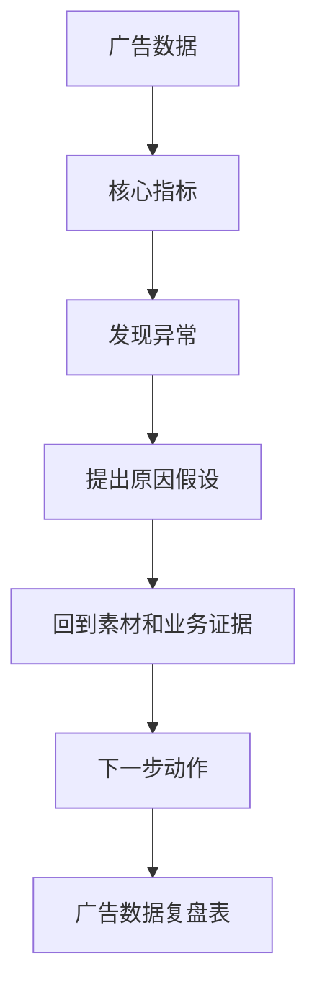

# 第 10 章：AI 辅助广告数据复盘

> ※ 通用约定（AI 价值原则、SOP 五步、自评三档、提示词骨架、AI 工具入口、敏感信息约定）见 [`00_课程总纲/10_课程通用约定.md`](../00_课程总纲/10_课程通用约定.md)。本章只写章节特化部分。

## 一、为什么要学（问题引入）

**本章在课程闭环中的位置**：承接素材方向。前一章提出假设，本章用数据和业务判断决定下一步动作。

**真实问题**：广告数据表经常有很多指标：曝光、点击、CTR、CPC、CVR、CPA、ROAS。没有复盘框架，容易只盯一个数字，然后做出过度反应。

**课堂引导可以这样讲**：

> 广告复盘像体检报告，不能只看一个箭头。血压、血糖、心率要放在一起看，广告也是一样。

**本章交付物**：《广告数据复盘表》
**配套实操手册：[Day10_第10章：AI辅助广告数据复盘_实操手册](#manual-day10)。**

## 二、核心概念讲解

| 概念 | 大白话解释 |
| --- | --- |
| 指标 | 衡量广告表现的数字，例如点击率、转化率、花费、成交。 |
| 异常 | 与历史、目标或同组素材相比明显偏离的指标。 |
| 假设 | 对异常原因的解释，需要用数据或素材证据验证。 |
| 动作 | 复盘后要做的具体调整，例如继续测、换钩子、停素材、改落地页。 |

**一个好记的类比**：数据不会直接告诉你答案，它更像路牌：告诉你可能往哪边走，但开车的人还是你。

## 三、方法论（可复用框架）

**方法框架：指标-异常-假设-证据-动作 五步复盘法**

| 步骤 | 动作 | 怎么做 |
| --- | --- | --- |
| 1 | 指标 | 先明确这次看哪些核心指标，不一口气分析所有数字。 |
| 2 | 异常 | 找出高于或低于预期的地方。 |
| 3 | 假设 | 让 AI 帮忙列可能原因，但不要直接采信。 |
| 4 | 证据 | 回到素材、受众、落地页、评论和订单数据验证。 |
| 5 | 动作 | 输出下一步 1 到 3 个可执行动作。 |

**本章 Checklist**

- 是否明确数据时间范围和广告对象。
- 是否区分现象、原因假设和行动建议。
- 是否避免用单日波动做重大判断。
- 是否把下一步动作写得足够具体。

**本章流程图**

> 通用 SOP 五步（写清问题 → 脱敏输入 → AI 生成 → 人工复核 → 沉淀模板）见通用约定。本章流程图是这五步的特化形态。

### 本章硬参数与判断门槛

> 该表同时是 [`04_模板库/08_广告数据复盘表.md`](../04_模板库/08_广告数据复盘表.md) 里《参考基准》表的源头。以下数字是“起步参考”，**学员第一次使用时要用自己店铺 3 个月历史中位数重新校准**，类目 / 价格段 / 季节都会影响。

| 指标 | 预警下限 | 健康区间 | 预警上限 |
| --- | ---: | ---: | ---: |
| CTR | < 0.3% | 0.4%–1.0% | > 2.0%（需复查是否集中在无效词） |
| CVR | < 5% | 8%–15% | — |
| ACOS（成熟品） | — | 15%–30% | > 40% |
| TACOS | — | 5%–15% | > 25% |

**决策门槛（避免不够数据下谈调优）：**

- 关键词样本下该词**点击 ≥ 20** 才开始看其 CVR 结论；< 20 点击只看 CTR。
- 词 / 素材 / 出价调整需**运行 ≥ 7 天**后再根据数据调；紧急止损除外。
- 一轮复盘后下周动作**不超过 3 个**；一次改太多下周数据变动无法归因。

> 客服 / SOP 等章节也均在各自 “本章硬参数与判断门槛” 小节里付同类表格。

## 四、工具与资源

| 工具 / 资源 | 用途 | 使用场景与提醒 |
| --- | --- | --- |
| 广告后台导出数据 | 提供真实投放结果 | 可来自 Amazon Ads、Meta、TikTok、Google Ads 等后台。 |
| Google Sheets / Excel | 清洗数据、计算指标、做简单图表 | 适合课堂练习。 |
| Looker Studio（可选） | 做固定看板 | 适合团队长期复盘。 |
| 对话大模型 | 解释指标、生成复盘框架、整理动作 | 不要上传敏感账户信息和完整客户数据。 |

> 通用 AI 工具入口表（ChatGPT / Claude / Gemini / Qwen / DeepSeek / 豆包）和工具组合建议（基础版 / 稳妥版 / 团队版）统一放在 [`00_课程总纲/10_课程通用约定.md`](../00_课程总纲/10_课程通用约定.md)。本章只列与本章动作直接相关的工具。

## 五、案例讲解

**场景**：某 DTC 产品 3 条短视频素材投放 7 天，其中素材 A 点击率高但转化低，素材 B 点击率低但转化较好。

**输入资料**：脱敏广告数据：曝光、点击、花费、加购、订单、素材方向。

**AI 可以帮忙**：让 AI 按“现象、可能原因、需要补充的数据、下一步动作”整理复盘。

**人必须判断**：结合素材内容和落地页检查，判断 A 可能钩子强但购买理由弱，B 可能人群窄但更精准。

**最后留下**：《广告数据复盘表》。

## 六、实操练习

**Mini 项目：复盘一组广告素材数据**

**准备资料**：3 到 5 条广告素材的脱敏数据，至少包含曝光、点击、花费、成交或询盘。

**操作步骤**

1. 明确数据周期和复盘目标。
2. 计算或整理核心指标。
3. 让 AI 找出异常并提出原因假设。
4. 人工检查假设是否有业务证据。
5. 写出下周 3 个以内动作。

**交付物**：《广告数据复盘表》

**自评要点**：本章交付物按通用三档（好 / 中性 / 需要继续改）自评，重点看是否做出了**《广告数据复盘表》**——结构是否完整、是否有人工复核痕迹、下次能否复用。

**提示词建议**：优先用 [`09_章节实操手册/`](../09_章节实操手册/) 里本章 4 条专用提示词（拆任务 / 生成第一版 / 自评 / 模板化）。如果想从零起步，可以先用通用约定里的提示词骨架做一版。

## 七、常见误区

| 误区 | 会带来的问题 | 改法 |
| --- | --- | --- |
| 只看 ROAS | 忽略素材前端问题或漏斗其他环节。 | 分层看曝光、点击、转化和成本。 |
| 让 AI 直接决定预算 | 预算涉及业务风险，不能交给 AI 拍板。 | AI 辅助分析，人决定动作。 |
| 没有时间范围 | 数据不可比，结论不可靠。 | 每次复盘写清周期和样本。 |

## 八、本章小结

**带走什么**

- 广告复盘要区分现象、假设、证据和动作。
- AI 适合帮助梳理逻辑，不适合替你做预算决策。
- 本章复盘表会帮助岗位工作从“看数据”变成“用数据改动作”。

**和下一章的关系**

下一章转到客服和售后，学习如何用 AI 整理高频问题和回复库。
