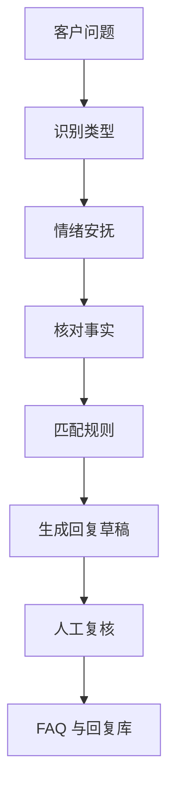

# 第 11 章：AI 辅助客服和售后回复

> ※ 通用约定（AI 价值原则、SOP 五步、自评三档、提示词骨架、AI 工具入口、敏感信息约定）见 [`00_课程总纲/10_课程通用约定.md`](../00_课程总纲/10_课程通用约定.md)。本章只写章节特化部分。

## 一、为什么要学（问题引入）

**本章在课程闭环中的位置**：把 AI 用在高频客服场景：先整理问题，再生成可审核的回复，不做无人监管的自动回复。

**真实问题**：客服回复最怕两个问题：慢和乱。慢会影响体验，乱会造成承诺不一致，甚至触碰平台规则。

**课堂引导可以这样讲**：

> 客服不是聊天比赛，而是带着温度解决问题。AI 可以帮你先搭回复骨架，人要负责语气、规则和最终承诺。

**本章交付物**：《客服 FAQ 与回复库》
**配套实操手册：[Day11_第11章：AI辅助客服和售后回复_实操手册](#manual-day11)。**

## 二、核心概念讲解

| 概念 | 大白话解释 |
| --- | --- |
| FAQ | 高频问题和标准答案集合。 |
| 售后边界 | 哪些可以解释、安抚、引导，哪些必须升级给人工或主管。 |
| 语气一致 | 不同客服回复要保持品牌和平台要求一致。 |
| 敏感信息 | 订单号、地址、联系方式等不能随意输入第三方工具。 |

**一个好记的类比**：AI 像客服的草稿本，能先写几版话术；但真正发给客户前，必须由人看一遍。

## 三、方法论（可复用框架）

**方法框架：情绪-事实-规则-方案-复核 五段回复法**

| 步骤 | 动作 | 怎么做 |
| --- | --- | --- |
| 1 | 情绪 | 先识别客户情绪，回应而不是冷冰冰解释。 |
| 2 | 事实 | 确认订单、物流、产品问题等事实，但不要暴露敏感信息。 |
| 3 | 规则 | 对照平台和店铺政策，不能随口承诺。 |
| 4 | 方案 | 给出清楚下一步，例如补发、退款申请路径、使用指导。 |
| 5 | 复核 | 发送前检查语气、承诺和敏感信息。 |

**本章 Checklist**

- 是否先处理客户情绪，再讲规则。
- 是否避免承诺平台或公司不支持的方案。
- 是否脱敏处理订单和个人信息。
- 是否把高频问题沉淀进 FAQ。

**本章流程图**

> 通用 SOP 五步（写清问题 → 脱敏输入 → AI 生成 → 人工复核 → 沉淀模板）见通用约定。本章流程图是这五步的特化形态。

### 本章硬参数与判断门槛

> 该表同时是 [`04_模板库/09_客服FAQ与回复库.md`](../04_模板库/09_客服FAQ与回复库.md) 里《敏感红线》与《人工介入触发条件》的源头。

**响应时效门槛（建议仅作起步值，独立站 / 亚马逊 / Chewy / Etsy 都不同）：**

| 场景 | 首响 | 问题关闭 |
| --- | ---: | ---: |
| 一般售前 / 使用问题 | ≤ 24 小时 | ≤ 48 小时 |
| 物流 / 货损 / 退款 | ≤ 12 小时 | ≤ 72 小时 |
| 差评安抚 | ≤ 6 小时 | — |
| 敏感（健康 / 法律 / 媒体 / 群体） | **立即转人工** | 主管 2 小时内响应 |

**需立即转人工的关键词（词表与后台自动转人工规则对齐）：**

- 健康伤害：hurt / injury / allergic / burned / shocked / bled / pet got sick
- 法律：lawsuit / lawyer / sue / FDA / FTC / attorney general
- 媒体 / 群体：reporter / news / class action / subreddit / viral
- 账号安全：hacked / unauthorized charge / chargeback

**授权门槛（一线客服可独立决策的补偿上限、参考）：**

| 角色 | 退款金额上限 | 免退货金额上限 | 赠品上限 |
| --- | ---: | ---: | ---: |
| 一线客服 | $0（仅可发退货标签） | $30 | $10 |
| 主管 | $200 | $100 | $30 |
| 总监 / 财务 | $500+ | $300+ | — |

> 广告复盘 / SOP 等章节均在各自 “本章硬参数与判断门槛” 小节里付同类表格，便于跨章节对齐。

## 四、工具与资源

| 工具 / 资源 | 用途 | 使用场景与提醒 |
| --- | --- | --- |
| 客服后台 | 查看真实问题和历史回复 | 如 Amazon Buyer Messages、Shopify Inbox、Zendesk、Gorgias 等。 |
| 对话大模型 | 归纳 FAQ、生成回复草稿、优化语气 | 只输入脱敏内容。 |
| 知识库文档 | 保存标准回复和升级规则 | 可用 Notion、飞书文档、Google Docs。 |
| 评分反馈表 | 检查回复是否清楚、合规、有温度 | 适合培训新人客服。 |

> 通用 AI 工具入口表（ChatGPT / Claude / Gemini / Qwen / DeepSeek / 豆包）和工具组合建议（基础版 / 稳妥版 / 团队版）统一放在 [`00_课程总纲/10_课程通用约定.md`](../00_课程总纲/10_课程通用约定.md)。本章只列与本章动作直接相关的工具。

## 五、案例讲解

**场景**：独立站客户反馈包裹延迟，并且语气比较着急。

**输入资料**：脱敏后的客户问题、物流状态摘要、店铺售后政策。

**AI 可以帮忙**：生成 3 个语气版本：正式、温和、简短，并标出涉及承诺的句子。

**人必须判断**：确认物流状态和政策，删除超出权限的补偿承诺，保留安抚和查询路径。

**最后留下**：《客服 FAQ 与回复库》。

## 六、实操练习

**Mini 项目：整理 5 个高频客服问题**

**准备资料**：5 条脱敏客服问题和现有回复。

**操作步骤**

1. 按问题类型分类：物流、尺码、使用、退换、质量。
2. 让 AI 归纳客户真实诉求和情绪。
3. 按五段回复法生成回复草稿。
4. 人工检查规则和承诺。
5. 整理成 FAQ 与回复库。

**交付物**：《客服 FAQ 与回复库》

**自评要点**：本章交付物按通用三档（好 / 中性 / 需要继续改）自评，重点看是否做出了**《客服 FAQ 与回复库》**——结构是否完整、是否有人工复核痕迹、下次能否复用。

**提示词建议**：优先用 [`09_章节实操手册/`](../09_章节实操手册/) 里本章 4 条专用提示词（拆任务 / 生成第一版 / 自评 / 模板化）。如果想从零起步，可以先用通用约定里的提示词骨架做一版。

## 七、常见误区

| 误区 | 会带来的问题 | 改法 |
| --- | --- | --- |
| 直接复制 AI 回复 | 可能承诺过度或语气不合适。 | 发送前必须人工复核。 |
| 忽略客户情绪 | 回复正确但体验很差。 | 先安抚，再处理事实。 |
| 不区分权限 | 客服可能承诺自己不能兑现的方案。 | 写清升级条件和禁止承诺内容。 |

## 八、本章小结

**带走什么**

- 客服 AI 的重点是标准化草稿和 FAQ，不是无人监管自动回复。
- 好回复要同时照顾情绪、事实、规则和方案。
- 回复库可以降低新人上手成本，也能提升团队一致性。

**和下一章的关系**

下一章会把运营工作中的数据、问题和动作整理成周报，让团队沟通更稳定。
