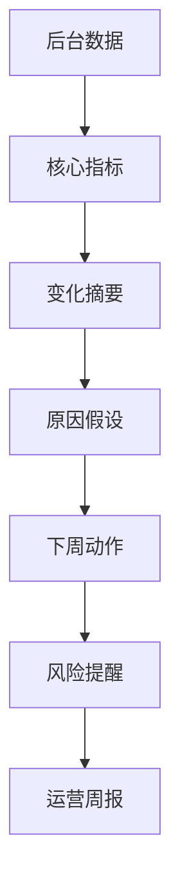

# 第 12 章：AI 辅助运营周报

> ※ 通用约定（AI 价值原则、SOP 五步、自评三档、提示词骨架、AI 工具入口、敏感信息约定）见 [`00_课程总纲/10_课程通用约定.md`](../00_课程总纲/10_课程通用约定.md)。本章只写章节特化部分。

## 一、为什么要学（问题引入）

**本章在课程闭环中的位置**：把 AI 放进运营汇报场景，让周报从流水账变成可复盘、可决策的工作记录。

**真实问题**：很多周报写成“本周做了什么”，但老板和团队更需要知道：发生了什么变化、为什么、下周怎么办。

**课堂引导可以这样讲**：

> 周报不是工作日记，而是仪表盘加方向盘：既要看见状态，也要知道下一步怎么开。

**本章交付物**：《运营周报模板》
**配套实操手册：[Day12_第12章：AI辅助运营周报_实操手册](#manual-day12)。**

## 二、核心概念讲解

| 概念 | 大白话解释 |
| --- | --- |
| 运营指标 | 销售、流量、转化、库存、广告、客服等能反映业务状态的数据。 |
| 变化 | 本周与上周、目标或活动前后的差异。 |
| 原因假设 | 对变化的解释，需要数据或事件支持。 |
| 下周动作 | 复盘后要推进的具体事项。 |

**一个好记的类比**：周报像医生查房记录：不能只写“病人还在”，要写指标变化、可能原因、接下来怎么处理。

## 三、方法论（可复用框架）

**方法框架：数据-变化-原因-动作-风险 五段周报法**

| 步骤 | 动作 | 怎么做 |
| --- | --- | --- |
| 1 | 数据 | 列核心指标，不把所有后台截图都贴上来。 |
| 2 | 变化 | 标出上升、下降和异常。 |
| 3 | 原因 | 结合活动、广告、库存、评价等事件提出假设。 |
| 4 | 动作 | 写出下周 3 到 5 个明确动作。 |
| 5 | 风险 | 提示库存、评分、预算、物流等需要关注的问题。 |

**本章 Checklist**

- 周报是否有时间范围和数据来源。
- 是否区分事实、原因假设和下一步动作。
- 下周动作是否有负责人和完成标准。
- 是否避免把未经确认的判断写成事实。

**本章流程图**

> 通用 SOP 五步（写清问题 → 脱敏输入 → AI 生成 → 人工复核 → 沉淀模板）见通用约定。本章流程图是这五步的特化形态。

## 四、工具与资源

| 工具 / 资源 | 用途 | 使用场景与提醒 |
| --- | --- | --- |
| 平台后台 | 获取销售、流量、转化、广告、库存数据 | 以自己实际平台为准，如 Amazon、Shopify、TikTok Shop。 |
| GA4 / Shopify Analytics / Seller Central 报表 | 辅助分析站点和店铺表现 | 不要上传完整敏感数据到公开工具。 |
| Google Sheets / Excel | 整理数据和图表 | 适合周报固定模板。 |
| 对话大模型 | 生成摘要、提出原因假设、润色表达 | 必须提供数据范围和背景事件。 |

> 通用 AI 工具入口表（ChatGPT / Claude / Gemini / Qwen / DeepSeek / 豆包）和工具组合建议（基础版 / 稳妥版 / 团队版）统一放在 [`00_课程总纲/10_课程通用约定.md`](../00_课程总纲/10_课程通用约定.md)。本章只列与本章动作直接相关的工具。

## 五、案例讲解

**场景**：某 Amazon 店铺本周销售额下降，但广告点击上升，库存也接近预警。

**输入资料**：脱敏后的周度销售、流量、转化、广告和库存数据。

**AI 可以帮忙**：整理成“本周变化、可能原因、下周动作、风险提醒”。

**人必须判断**：确认销售下降是否与库存、价格、竞品活动或广告流量质量有关。

**最后留下**：《运营周报模板》。

## 六、实操练习

**Mini 项目：写一份 1 页运营周报**

**准备资料**：一周脱敏运营数据和关键事件记录。

**操作步骤**

1. 选出 5 个以内核心指标。
2. 让 AI 生成周报初稿。
3. 人工补充背景事件和真实原因判断。
4. 把下周动作写成可执行清单。
5. 保存为固定周报模板。

**交付物**：《运营周报模板》

**自评要点**：本章交付物按通用三档（好 / 中性 / 需要继续改）自评，重点看是否做出了**《运营周报模板》**——结构是否完整、是否有人工复核痕迹、下次能否复用。

**提示词建议**：优先用 [`09_章节实操手册/`](../09_章节实操手册/) 里本章 4 条专用提示词（拆任务 / 生成第一版 / 自评 / 模板化）。如果想从零起步，可以先用通用约定里的提示词骨架做一版。

## 七、常见误区

| 误区 | 会带来的问题 | 改法 |
| --- | --- | --- |
| 写成流水账 | 看不出重点，也无法决策。 | 围绕变化、原因和动作写。 |
| 数据没有来源 | 团队难以信任和复查。 | 写清时间范围和来源。 |
| 动作太虚 | 下周无法执行。 | 写成负责人、动作、完成标准。 |

## 八、本章小结

**带走什么**

- 周报不是记录忙碌，而是帮助团队看见变化和下一步。
- AI 可以提升周报结构，但业务判断仍来自人。
- 周报模板会成为岗位 SOP 的重要输入。

**和下一章的关系**

下一章会把前面这些重复动作进一步固化成 SOP，让团队下次可以按步骤执行。
