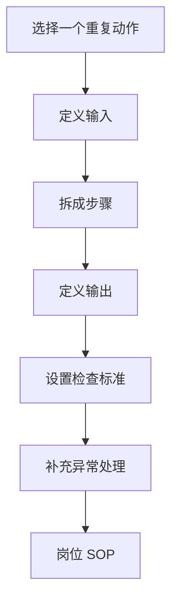

# 第 13 章：把一个动作变成 SOP

> ※ 通用约定（AI 价值原则、SOP 五步、自评三档、提示词骨架、AI 工具入口、敏感信息约定）见 [`00_课程总纲/10_课程通用约定.md`](../00_课程总纲/10_课程通用约定.md)。本章只写章节特化部分。

## 一、为什么要学（问题引入）

**本章在课程闭环中的位置**：第 2 周的关键沉淀章。把一次做对的动作，变成别人也能照着做的流程。

**真实问题**：很多团队问题不是没人会做，而是只有某个人会做。经验不写下来，换人、忙起来、重复做时就容易变形。

**课堂引导可以这样讲**：

> SOP 不是厚厚的制度文件，而是给下一次执行的导航。它不需要高级，但必须让人少走弯路。

**本章交付物**：《岗位 SOP 模板》
**配套实操手册：[Day13_第13章：把一个动作变成SOP_实操手册](#manual-day13)。**

## 二、核心概念讲解

| 概念 | 大白话解释 |
| --- | --- |
| SOP | 标准操作流程，写清输入、步骤、输出、检查标准和异常处理。 |
| 动作颗粒度 | 步骤不能太粗，也不能细到让人读不下去。 |
| 检查标准 | 告诉执行者做到什么程度算完成。 |
| 异常处理 | 遇到不符合预期的情况时，应该找谁、看哪里、怎么升级。 |

**一个好记的类比**：SOP 像菜谱：只写“把菜做好”没用，写到油温、顺序、判断标准，别人才做得出来。

## 三、方法论（可复用框架）

**方法框架：输入-步骤-输出-检查-异常 SOP 五件套**

| 步骤 | 动作 | 怎么做 |
| --- | --- | --- |
| 1 | 输入 | 执行前要准备哪些资料、权限和模板。 |
| 2 | 步骤 | 按真实顺序写，不跳步。 |
| 3 | 输出 | 完成后要留下什么文件或结果。 |
| 4 | 检查 | 用清单判断是否合格。 |
| 5 | 异常 | 写清哪些情况需要暂停、复核或升级。 |

**本章 Checklist**

- SOP 是否能被非本人看懂。
- 是否写清输入资料和输出文件。
- 是否包含人工复核点。
- 是否说明异常情况怎么处理。

**本章流程图**

> 通用 SOP 五步（写清问题 → 脱敏输入 → AI 生成 → 人工复核 → 沉淀模板）见通用约定。本章流程图是这五步的特化形态。

### 本章硬参数与判断门槛

> 该表同时是 [`04_模板库/11_岗位SOP模板.md`](../04_模板库/11_岗位SOP模板.md) 里《什么动作值得写成 SOP》与《验收标准》的源头。

**是否该写成 SOP（3 项中需满足 2 项）：**

- 频率门槛：每周 / 每两周都要做一次（偶发动作不必写）。
- 人多门槛：团队中有 ≥ 2 人做同件事，但结果不一致。
- 代价门槛：出错后果明显（投诉 / 广告亏损 / 合规风险），或新人上手需 ≥ 30 分钟手把手。

> 个人运营（一人店）没有"人多门槛"：满足频率 + 代价两项即可写；如果这件事将来要交接给新人或外包，也视同满足人多门槛。不要因为"团队只有自己"就放弃写 SOP——SOP 首先是写给 3 个月后的自己。

**SOP 本体的质量门槛：**

| 项 | 门槛 |
| --- | --- |
| 长度 | 推荐 ≤ 2 页可打印；超过应拆成多份子 SOP |
| 步骤数 | 最佳 5–9 步；超过 12 步说明颗粒度太细 |
| 检查标准 | 每项必须能被“是 / 否”或数字门槛验证，不允许写“质量达标”这种主观词 |
| 预计耗时 | 每步必须写出，便于排期 |
| 责任人 | “由谁做”列不得留空或全部“运营” |
| 常见错误 | 必须列出 ≥ 3 条 |
| 版本号 | 必须有号 + 日期（如 v1.2 / 2026-04） |

**迭代门槛：**

- 每季度至少 review 一次 SOP；如果 1 个季度内未被执行过，考虑废弃。
- 一次 SOP 迭代 ≤ 30% 内容变动为微调（升小版本）；> 30% 为升大版本。

> 广告复盘 / 客服等章节均在各自 “本章硬参数与判断门槛” 小节里付同类表格。

## 四、工具与资源

| 工具 / 资源 | 用途 | 使用场景与提醒 |
| --- | --- | --- |
| 对话大模型 | 把口述流程整理成 SOP 初稿 | 适合从聊天记录、周报、操作记录中提炼步骤。 |
| Notion / 飞书文档 / Google Docs | 发布 SOP 和维护版本 | 适合团队协作。 |
| draw.io / Miro / 飞书画板（可选） | 画流程图 | 适合复杂流程可视化。 |
| 检查清单模板 | 把 SOP 变成可执行检查项 | 适合新人照着做。 |

> 通用 AI 工具入口表（ChatGPT / Claude / Gemini / Qwen / DeepSeek / 豆包）和工具组合建议（基础版 / 稳妥版 / 团队版）统一放在 [`00_课程总纲/10_课程通用约定.md`](../00_课程总纲/10_课程通用约定.md)。本章只列与本章动作直接相关的工具。

## 五、案例讲解

**场景**：团队每周都要整理竞品评论，但每个人分类方式不同，结果难比较。

**输入资料**：现有评论分析表、一次完整操作记录、常见问题。

**AI 可以帮忙**：把流程整理成“准备资料、评论清洗、AI 分类、人工复核、输出报告、归档命名”。

**人必须判断**：补充哪些评论要剔除、哪些结论必须保留原文证据、什么时候需要二次复核。

**最后留下**：《岗位 SOP 模板：竞品评论分析》。

## 六、实操练习

**Mini 项目：把一个重复动作写成 SOP**

**准备资料**：选择广告复盘、客服 FAQ、周报、评论分析中的任一动作。

**操作步骤**

1. 口述或写下自己平时怎么做。
2. 让 AI 整理成五件套 SOP。
3. 人工补充检查标准和异常处理。
4. 让另一个人按 SOP 读一遍，标出不清楚的地方。
5. 修改成 v1。

**交付物**：《岗位 SOP 模板》

**自评要点**：本章交付物按通用三档（好 / 中性 / 需要继续改）自评，重点看是否做出了**《岗位 SOP 模板》**——结构是否完整、是否有人工复核痕迹、下次能否复用。

**提示词建议**：优先用 [`09_章节实操手册/`](../09_章节实操手册/) 里本章 4 条专用提示词（拆任务 / 生成第一版 / 自评 / 模板化）。如果想从零起步，可以先用通用约定里的提示词骨架做一版。

## 七、常见误区

| 误区 | 会带来的问题 | 改法 |
| --- | --- | --- |
| SOP 写成原则 | 看起来正确，但不能执行。 | 每一步都写动作和完成标准。 |
| 没有异常处理 | 一遇到特殊情况就卡住。 | 写清暂停、复核、升级条件。 |
| 写完不更新 | 流程变化后 SOP 失效。 | 保留版本号和更新时间。 |

## 八、本章小结

**带走什么**

- SOP 的价值是把个人经验变成团队资产。
- AI 适合整理流程，人负责判断边界和异常。
- 本章 SOP 会进入第 2 周岗位 AI 实战包。

**和下一章的关系**

下一章会把第 2 周的岗位诊断、广告、数据、客服、周报和 SOP 统一打包。
