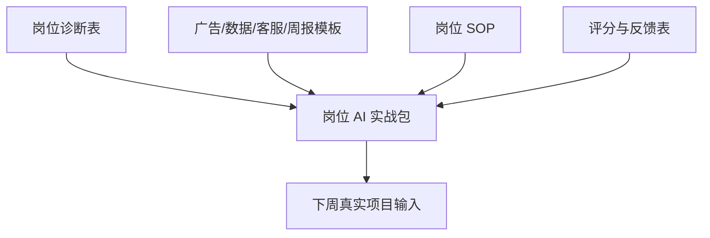

# 第 14 章：第 2 周复盘：建立岗位 AI 实战包

> ※ 通用约定（AI 价值原则、SOP 五步、自评三档、提示词骨架、AI 工具入口、敏感信息约定）见 [`00_课程总纲/10_课程通用约定.md`](../00_课程总纲/10_课程通用约定.md)。本章只写章节特化部分。

## 一、为什么要学（问题引入）

**本章在课程闭环中的位置**：第 2 周收口章。把岗位相关成果整理成一套能重复使用、能交接、能继续优化的实战包。

**真实问题**：岗位实战内容更杂：广告、数据、客服、周报、SOP 如果不归档，很快又会回到各做各的状态。

**课堂引导可以这样讲**：

> 岗位实战包像工作台：常用工具就放在手边，标签清楚，谁来都知道怎么用。

**本章交付物**：《岗位 AI 实战包》
**配套实操手册：[Day14_第14章：第2周复盘：建立岗位AI实战包_实操手册](#manual-day14)。**

## 二、核心概念讲解

| 概念 | 大白话解释 |
| --- | --- |
| 岗位实战包 | 围绕一个岗位或角色沉淀的提示词、表格、SOP、案例和检查标准。 |
| 岗位闭环 | 诊断问题、执行动作、得到反馈、固化流程。 |
| 交接友好 | 别人能看懂用途、输入、输出和注意事项。 |
| 持续更新 | 实战包不是一次性文件夹，而是随业务迭代的工作资产。 |

**一个好记的类比**：如果第 1 周是个人文具盒，第 2 周就是岗位工具柜。工具更多，所以更需要分类和标签。

## 三、方法论（可复用框架）

**方法框架：岗位包四层结构：场景、工具、流程、反馈**

| 步骤 | 动作 | 怎么做 |
| --- | --- | --- |
| 1 | 场景 | 写清这个包服务哪个岗位、哪个任务。 |
| 2 | 工具 | 放入提示词、表格、模板和数据字段说明。 |
| 3 | 流程 | 放入 SOP 和执行步骤。 |
| 4 | 反馈 | 放入评分表、复盘表和版本对比。 |
| 5 | 索引 | 建立一页目录，说明每个文件什么时候用。 |

**本章 Checklist**

- 是否能说明这个岗位包解决什么问题。
- 是否包含至少 3 个可复用工具或模板。
- 是否包含一个 SOP 或固定流程。
- 是否有反馈和更新机制。

**本章流程图**

> 通用 SOP 五步（写清问题 → 脱敏输入 → AI 生成 → 人工复核 → 沉淀模板）见通用约定。本章流程图是这五步的特化形态。

## 四、工具与资源

| 工具 / 资源 | 用途 | 使用场景与提醒 |
| --- | --- | --- |
| Notion / 飞书文档 | 建立岗位包首页和索引 | 适合团队共享。 |
| 云盘 | 保存表格、模板、截图和版本文件 | 建议统一命名规则。 |
| Airtable / 飞书多维表格（可选） | 管理多个岗位模板 | 适合多人团队。 |
| 对话大模型 | 生成索引说明、检查遗漏 | 让 AI 做整理助手。 |

> 通用 AI 工具入口表（ChatGPT / Claude / Gemini / Qwen / DeepSeek / 豆包）和工具组合建议（基础版 / 稳妥版 / 团队版）统一放在 [`00_课程总纲/10_课程通用约定.md`](../00_课程总纲/10_课程通用约定.md)。本章只列与本章动作直接相关的工具。

## 五、案例讲解

**场景**：广告专员本周做了素材方向表、数据复盘表和一个广告复盘 SOP。

**输入资料**：第 8 至第 13 章所有岗位交付物。

**AI 可以帮忙**：生成岗位包目录、文件说明和使用顺序。

**人必须判断**：检查哪些文件真的会用，删除重复内容，补充评分标准。

**最后留下**：《岗位 AI 实战包》。

## 六、实操练习

**Mini 项目：整理一个岗位 AI 实战包**

**准备资料**：第 8 至第 13 章交付物。

**操作步骤**

1. 选择一个岗位：运营、广告、客服或老板视角。
2. 建立岗位包目录。
3. 放入 3 个以上可复用文件。
4. 为每个文件写使用场景和输入资料。
5. 写下第 3 周要落地的真实项目。

**交付物**：《岗位 AI 实战包》

**自评要点**：本章交付物按通用三档（好 / 中性 / 需要继续改）自评，重点看是否做出了**《岗位 AI 实战包》**——结构是否完整、是否有人工复核痕迹、下次能否复用。

**提示词建议**：优先用 [`09_章节实操手册/`](../09_章节实操手册/) 里本章 4 条专用提示词（拆任务 / 生成第一版 / 自评 / 模板化）。如果想从零起步，可以先用通用约定里的提示词骨架做一版。

## 七、常见误区

| 误区 | 会带来的问题 | 改法 |
| --- | --- | --- |
| 把所有文件都塞进去 | 看似丰富，实际难用。 | 只保留会再次使用的文件。 |
| 没有使用顺序 | 别人不知道从哪开始。 | 在索引页写清推荐流程。 |
| 缺少反馈表 | 无法判断是否越用越好。 | 配套评分或复盘标准。 |

## 八、本章小结

**带走什么**

- 岗位实战包让 AI 使用从个人技巧升级为岗位方法。
- 好岗位包要有场景、工具、流程和反馈。
- 第 3 周会选择其中一个真实项目，完整跑一遍落地闭环。

**和下一章的关系**

第 3 周开始不再继续扩展新模块，而是选择一个真实小项目，从选择、拆解、完成、反馈到固化完整走完。
