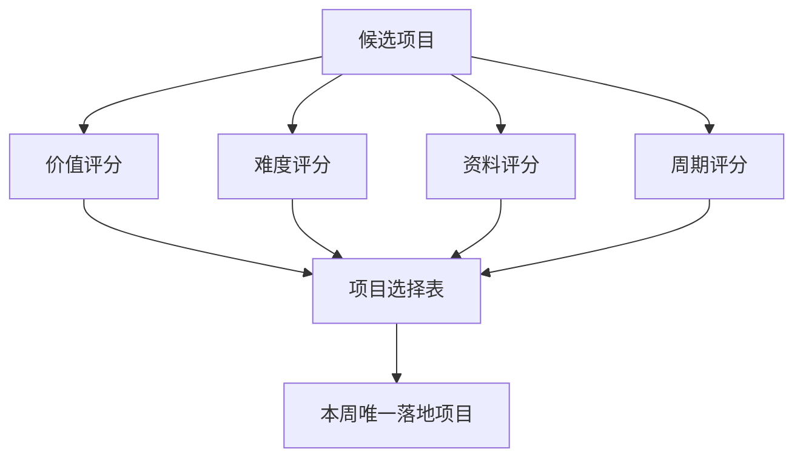

# 第 15 章：选择一个真实项目

> ※ 通用约定（AI 价值原则、SOP 五步、自评三档、提示词骨架、AI 工具入口、敏感信息约定）见 [`00_课程总纲/10_课程通用约定.md`](../00_课程总纲/10_课程通用约定.md)。本章只写章节特化部分。

## 一、为什么要学（问题引入）

**本章在课程闭环中的位置**：第 3 周起点。把前两周的能力集中到一个真实、可完成的小项目上。

**真实问题**：学完很多方法后，最常见的问题是贪多：想同时改 Listing、做广告、建客服库、自动化周报。结果每个都开头，每个都没完成。

**课堂引导可以这样讲**：

> 第 3 周像收网。我们不再撒大网，而是选一条最值得先抓的鱼：小、真、能完成。

**本章交付物**：《落地项目选择表》
**配套实操手册：[Day15_第15章：选择一个真实项目_实操手册](#manual-day15)。**

## 二、核心概念讲解

| 概念 | 大白话解释 |
| --- | --- |
| 真实项目 | 来自当前工作、有实际使用者、有明确交付物的任务。 |
| 项目范围 | 这次做什么，不做什么。 |
| 可完成性 | 资料、时间、权限和能力都支持一周内做出第一版。 |
| 业务价值 | 项目完成后能减少重复劳动、提升质量或让协作更清楚。 |

**一个好记的类比**：项目选择像点菜，预算和胃口有限。先点一份能吃完、能尝出味道的主菜，比摆一桌吃不完更实际。

## 三、方法论（可复用框架）

**方法框架：价值-难度-资料-周期 四维选择法**

| 步骤 | 动作 | 怎么做 |
| --- | --- | --- |
| 1 | 价值 | 做完后是否能改善一个真实工作环节。 |
| 2 | 难度 | 是否能在现有能力下完成第一版。 |
| 3 | 资料 | 是否已有足够输入资料。 |
| 4 | 周期 | 是否能在 7 天内完成并复盘。 |
| 5 | 确定 | 选择高价值、低到中等难度、资料较全、周期可控的项目。 |

**本章 Checklist**

- 项目是否来自真实业务，而不是纯练习。
- 是否能明确交付一个文件、模板、表格或 SOP。
- 是否能在一周内做出可用第一版。
- 是否清楚哪些内容本周不做。

**本章流程图**

> 通用 SOP 五步（写清问题 → 脱敏输入 → AI 生成 → 人工复核 → 沉淀模板）见通用约定。本章流程图是这五步的特化形态。

## 四、工具与资源

| 工具 / 资源 | 用途 | 使用场景与提醒 |
| --- | --- | --- |
| 项目选择表 | 对候选项目打分 | 课程模板即可。 |
| 对话大模型 | 辅助拆分项目范围和风险 | 让 AI 帮忙看项目是否过大。 |
| Notion / Trello / 飞书任务 | 记录项目卡片 | 适合一周陪跑。 |

> 通用 AI 工具入口表（ChatGPT / Claude / Gemini / Qwen / DeepSeek / 豆包）和工具组合建议（基础版 / 稳妥版 / 团队版）统一放在 [`00_课程总纲/10_课程通用约定.md`](../00_课程总纲/10_课程通用约定.md)。本章只列与本章动作直接相关的工具。

## 五、案例讲解

**场景**：老板说想“全面用 AI 改造运营”，但这个目标一周内太大。

**输入资料**：团队当前痛点：客服重复问题多、Listing 审核慢、广告复盘不稳定、周报费时间。

**AI 可以帮忙**：把大目标拆成 6 个候选项目，并按四维选择法打分。

**人必须判断**：选择《客服 FAQ 与回复库》作为本周项目，因为资料足、范围小、价值清楚。

**最后留下**：《落地项目选择表》。

## 六、实操练习

**Mini 项目：选出本周唯一项目**

**准备资料**：前两周成果包和当前岗位痛点。

**操作步骤**

1. 列出 3 到 5 个候选项目。
2. 按四维选择法打分。
3. 删除范围过大的项目。
4. 为最终项目写一句目标。
5. 写清本周不做什么。

**交付物**：《落地项目选择表》

**自评要点**：本章交付物按通用三档（好 / 中性 / 需要继续改）自评，重点看是否做出了**《落地项目选择表》**——结构是否完整、是否有人工复核痕迹、下次能否复用。

**提示词建议**：优先用 [`09_章节实操手册/`](../09_章节实操手册/) 里本章 4 条专用提示词（拆任务 / 生成第一版 / 自评 / 模板化）。如果想从零起步，可以先用通用约定里的提示词骨架做一版。

## 七、常见误区

| 误区 | 会带来的问题 | 改法 |
| --- | --- | --- |
| 项目太大 | 一周内做不完，容易挫败。 | 缩小到一个文件、一个流程或一个模板。 |
| 没有真实使用场景 | 做完也没人用。 | 先问谁会用、什么时候用。 |
| 只按兴趣选 | 容易变成玩工具。 | 按业务价值和可完成性选。 |

## 八、本章小结

**带走什么**

- 第 3 周只选一个真实小项目。
- 好项目要小、真、可完成、可复用。
- 项目选择表会成为后面拆解和复盘的起点。

**和下一章的关系**

下一章会把选定项目拆成小步骤，避免一上来就被大任务压住。
