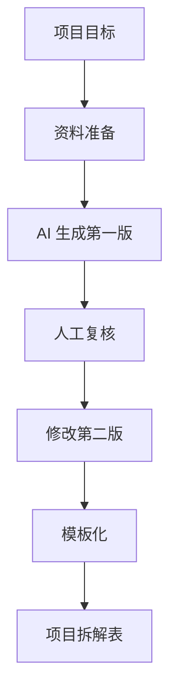

# 第 16 章：把项目拆成小步骤

> ※ 通用约定（AI 价值原则、SOP 五步、自评三档、提示词骨架、AI 工具入口、敏感信息约定）见 [`00_课程总纲/10_课程通用约定.md`](../00_课程总纲/10_课程通用约定.md)。本章只写章节特化部分。

## 一、为什么要学（问题引入）

**本章在课程闭环中的位置**：项目已选定，本章把它拆成可以每天推进的小动作。

**真实问题**：项目失败常常不是因为能力不够，而是任务太大太模糊。只写“完成客服库”很难开始，拆成“整理 20 条问题、分类、写 5 条回复、复核规则”就能动起来。

**课堂引导可以这样讲**：

> 拆项目像切蛋糕，一整块不好入口，切成小块就能一口一口吃完。

**本章交付物**：《项目拆解表》
**配套实操手册：[Day16_第16章：把项目拆成小步骤_实操手册](#manual-day16)。**

## 二、核心概念讲解

| 概念 | 大白话解释 |
| --- | --- |
| 任务拆解 | 把项目目标拆成可执行小动作。 |
| 里程碑 | 阶段性完成点，例如资料整理完、第一版完成、反馈完成。 |
| 依赖关系 | 某一步必须等前一步完成后才能做。 |
| 完成标准 | 每个小步骤做到什么程度才算完成。 |

**一个好记的类比**：项目拆解不是把清单写长，而是把模糊的山路变成一个个路标。

## 三、方法论（可复用框架）

**方法框架：目标-输入-动作-输出-检查 拆解法**

| 步骤 | 动作 | 怎么做 |
| --- | --- | --- |
| 1 | 目标 | 写清项目最终交付物。 |
| 2 | 输入 | 列出每一步需要的资料。 |
| 3 | 动作 | 把每一步写成动词开头的任务。 |
| 4 | 输出 | 每一步都要留下中间成果。 |
| 5 | 检查 | 设置完成标准和复核人。 |

**本章 Checklist**

- 每个任务是否能在 30 到 90 分钟内推进。
- 是否写清任务之间的先后顺序。
- 是否每一步都有输出物。
- 是否标注哪些步骤需要 AI，哪些需要人判断。

**本章流程图**

> 通用 SOP 五步（写清问题 → 脱敏输入 → AI 生成 → 人工复核 → 沉淀模板）见通用约定。本章流程图是这五步的特化形态。

## 四、工具与资源

| 工具 / 资源 | 用途 | 使用场景与提醒 |
| --- | --- | --- |
| 项目拆解表 | 记录任务、输入、输出、负责人、完成标准 | 课程模板即可。 |
| Trello / Notion / 飞书任务 | 把拆解结果变成看板 | 适合按天推进。 |
| 对话大模型 | 辅助拆分任务和识别依赖 | 输入项目目标后，让 AI 帮忙检查是否过大。 |

> 通用 AI 工具入口表（ChatGPT / Claude / Gemini / Qwen / DeepSeek / 豆包）和工具组合建议（基础版 / 稳妥版 / 团队版）统一放在 [`00_课程总纲/10_课程通用约定.md`](../00_课程总纲/10_课程通用约定.md)。本章只列与本章动作直接相关的工具。

## 五、案例讲解

**场景**：上一章选择了《客服 FAQ 与回复库》作为项目。

**输入资料**：30 条脱敏客服问题、售后政策、历史优质回复。

**AI 可以帮忙**：把项目拆成资料整理、问题分类、回复草稿、规则复核、语气统一、模板归档六步。

**人必须判断**：判断每一步的完成标准和哪些回复必须由主管复核。

**最后留下**：《项目拆解表》。

## 六、实操练习

**Mini 项目：把本周项目拆成 5 到 7 个小步骤**

**准备资料**：第 15 章项目选择表。

**操作步骤**

1. 写下最终交付物。
2. 列出项目需要的资料。
3. 让 AI 生成 5 到 7 个步骤。
4. 人工调整顺序和完成标准。
5. 标出今天先做哪一步。

**交付物**：《项目拆解表》

**自评要点**：本章交付物按通用三档（好 / 中性 / 需要继续改）自评，重点看是否做出了**《项目拆解表》**——结构是否完整、是否有人工复核痕迹、下次能否复用。

**提示词建议**：优先用 [`09_章节实操手册/`](../09_章节实操手册/) 里本章 4 条专用提示词（拆任务 / 生成第一版 / 自评 / 模板化）。如果想从零起步，可以先用通用约定里的提示词骨架做一版。

## 七、常见误区

| 误区 | 会带来的问题 | 改法 |
| --- | --- | --- |
| 步骤仍然太大 | 看似拆了，还是无法开始。 | 每步控制在 30 到 90 分钟内。 |
| 没有中间输出 | 做了但看不见进度。 | 每步都留下文件或表格。 |
| 忽略依赖关系 | 后面返工多。 | 先准备资料，再生成，再复核。 |

## 八、本章小结

**带走什么**

- 项目拆解让落地从口号变成行动。
- 每一步都要有输入、动作、输出和检查。
- 拆解表会直接指导下一章完成第一版。

**和下一章的关系**

下一章会进入执行阶段，先完成一版，不急着完美。
