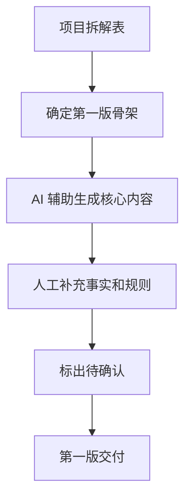

# 第 17 章：完成第一版

> ※ 通用约定（AI 价值原则、SOP 五步、自评三档、提示词骨架、AI 工具入口、敏感信息约定）见 [`00_课程总纲/10_课程通用约定.md`](../00_课程总纲/10_课程通用约定.md)。本章只写章节特化部分。

## 一、为什么要学（问题引入）

**本章在课程闭环中的位置**：项目从计划进入执行。本章强调先做出可看的第一版，而不是在准备阶段反复打磨。

**真实问题**：很多人项目卡在“我再准备一下”。准备当然重要，但没有第一版，就没有反馈，也没有真正的改进。

**课堂引导可以这样讲**：

> 第一版像试穿衣服，不是为了立刻参加正式场合，而是为了知道哪里合身、哪里要改。

**本章交付物**：《项目第一版 v1》
**配套实操手册：[Day17_第17章：完成第一版_实操手册](#manual-day17)。**

## 二、核心概念讲解

| 概念 | 大白话解释 |
| --- | --- |
| 第一版 | 能看、能改、能被反馈的初步成果。 |
| 最小可用 | 先包含核心结构和关键内容，不追求完整豪华。 |
| 完成标准 | 第一版做到什么程度可以进入反馈。 |
| 时间盒 | 给第一版限定时间，防止无限准备。 |

**一个好记的类比**：第一版不是毕业作品，是草稿纸上的清晰答案。清楚比漂亮更重要。

## 三、方法论（可复用框架）

**方法框架：MVP 第一版四步法：定骨架、填核心、标疑问、交反馈**

| 步骤 | 动作 | 怎么做 |
| --- | --- | --- |
| 1 | 定骨架 | 按项目拆解表确定输出结构。 |
| 2 | 填核心 | 先填最关键 60% 内容。 |
| 3 | 标疑问 | 把不确定、不完整、需要确认的地方标出来。 |
| 4 | 交反馈 | 把第一版给同事、讲师或自己按评分表检查。 |
| 5 | 控时间 | 限定 60 到 120 分钟完成第一版。 |

**本章 Checklist**

- 第一版是否能让别人看懂你想做什么。
- 是否包含核心结构和关键内容。
- 是否标注了待确认内容。
- 是否能进入反馈环节，而不是继续闭门修改。

**本章流程图**

> 通用 SOP 五步（写清问题 → 脱敏输入 → AI 生成 → 人工复核 → 沉淀模板）见通用约定。本章流程图是这五步的特化形态。

## 四、工具与资源

| 工具 / 资源 | 用途 | 使用场景与提醒 |
| --- | --- | --- |
| 对话大模型 | 根据拆解表生成第一版内容 | 输入越清楚，第一版越可改。 |
| Google Docs / 飞书文档 | 承载第一版和评论 | 方便后续反馈。 |
| 表格模板 | 适合客服库、广告复盘、项目清单等结构化成果 | 优先用已有模板。 |

> 通用 AI 工具入口表（ChatGPT / Claude / Gemini / Qwen / DeepSeek / 豆包）和工具组合建议（基础版 / 稳妥版 / 团队版）统一放在 [`00_课程总纲/10_课程通用约定.md`](../00_课程总纲/10_课程通用约定.md)。本章只列与本章动作直接相关的工具。

## 五、案例讲解

**场景**：客服 FAQ 项目进入执行，目标是先做 10 条高频问题的第一版回复库。

**输入资料**：已分类的客服问题、售后政策、品牌语气说明。

**AI 可以帮忙**：生成每个问题的回复草稿，按“问题类型、用户情绪、回复草稿、需要确认”输出。

**人必须判断**：补充政策细节，删除过度承诺，标出需要主管确认的内容。

**最后留下**：《项目第一版 v1》。

## 六、实操练习

**Mini 项目：在限定时间内完成项目 v1**

**准备资料**：项目拆解表和所需资料。

**操作步骤**

1. 设置 90 分钟时间盒。
2. 按项目骨架生成第一版。
3. 只补核心内容，不追求完美。
4. 标出所有不确定内容。
5. 保存并准备反馈。

**交付物**：《项目第一版 v1》

**自评要点**：本章交付物按通用三档（好 / 中性 / 需要继续改）自评，重点看是否做出了**《项目第一版 v1》**——结构是否完整、是否有人工复核痕迹、下次能否复用。

**提示词建议**：优先用 [`09_章节实操手册/`](../09_章节实操手册/) 里本章 4 条专用提示词（拆任务 / 生成第一版 / 自评 / 模板化）。如果想从零起步，可以先用通用约定里的提示词骨架做一版。

## 七、常见误区

| 误区 | 会带来的问题 | 改法 |
| --- | --- | --- |
| 等资料完全齐再做 | 项目迟迟没有反馈。 | 资料够做核心版就开始。 |
| 第一版做得太精致 | 时间耗尽但方向可能不对。 | 先验证结构和核心内容。 |
| 不标疑问 | 别人以为内容都已确认。 | 用醒目标记待确认。 |

## 八、本章小结

**带走什么**

- 第一版的价值是打开反馈，不是证明完美。
- 用时间盒防止无限准备。
- 下一章会通过反馈把第一版改成更可靠的第二版。

**和下一章的关系**

下一章会进入反馈和修改，把项目从“我觉得可以”推进到“别人也觉得能用”。
