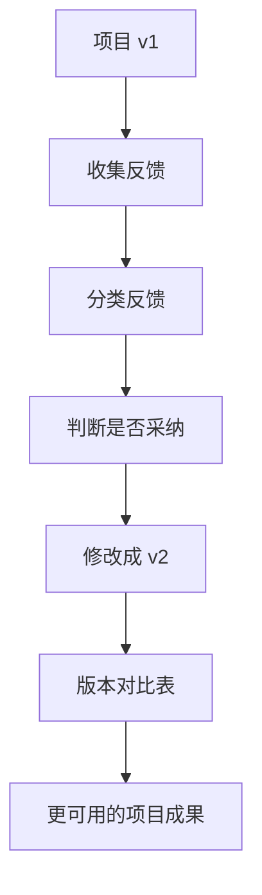

# 第 18 章：反馈和修改

> ※ 通用约定（AI 价值原则、SOP 五步、自评三档、提示词骨架、AI 工具入口、敏感信息约定）见 [`00_课程总纲/10_课程通用约定.md`](../00_课程总纲/10_课程通用约定.md)。本章只写章节特化部分。

## 一、为什么要学（问题引入）

**本章在课程闭环中的位置**：项目第一版已经完成，本章通过反馈把它变成更可靠、更适合真实使用的版本。

**真实问题**：很多人害怕反馈，觉得反馈等于否定。其实反馈是项目变好的原料，没有反馈就只有自我感觉。

**课堂引导可以这样讲**：

> 反馈像试吃，不是说你厨艺不行，而是告诉你咸了、淡了、火候差一点。

**本章交付物**：《前后版本对比表》与《项目 v2》
**配套实操手册：[Day18_第18章：反馈和修改_实操手册](#manual-day18)。**

## 二、核心概念讲解

| 概念 | 大白话解释 |
| --- | --- |
| 反馈 | 基于目标和标准指出哪里可用、哪里要改。 |
| 修改决策 | 不是所有反馈都照单全收，要判断是否符合项目目标。 |
| 版本对比 | 记录 v1 到 v2 的变化和原因。 |
| 复核标准 | 用统一标准判断修改是否达标。 |

**一个好记的类比**：反馈不是打分羞辱，而是帮你校准方向盘。车还在你手上，方向更准了。

## 三、方法论（可复用框架）

**方法框架：收集-分类-判断-修改-记录 五步反馈法**

| 步骤 | 动作 | 怎么做 |
| --- | --- | --- |
| 1 | 收集 | 请 1 到 3 人给出具体反馈。 |
| 2 | 分类 | 把反馈分为事实错误、结构问题、表达问题、业务建议。 |
| 3 | 判断 | 决定采纳、部分采纳或暂不采纳。 |
| 4 | 修改 | 按优先级改成 v2。 |
| 5 | 记录 | 写下修改原因，形成前后版本对比。 |

**本章 Checklist**

- 反馈是否具体到内容或步骤。
- 是否区分事实错误和个人偏好。
- 是否记录采纳与不采纳的理由。
- v2 是否解决了最关键的 3 个问题。

**本章流程图**

> 通用 SOP 五步（写清问题 → 脱敏输入 → AI 生成 → 人工复核 → 沉淀模板）见通用约定。本章流程图是这五步的特化形态。

## 四、工具与资源

| 工具 / 资源 | 用途 | 使用场景与提醒 |
| --- | --- | --- |
| 评分反馈表 | 统一评价标准 | 避免反馈只停留在喜欢或不喜欢。 |
| 版本对比表 | 记录 v1、反馈、修改、v2 | 适合沉淀经验。 |
| 对话大模型 | 辅助归类反馈和生成修改建议 | 最终采纳仍由人判断。 |
| 文档评论功能 | 收集团队反馈 | Google Docs、飞书文档、Notion 均可。 |

> 通用 AI 工具入口表（ChatGPT / Claude / Gemini / Qwen / DeepSeek / 豆包）和工具组合建议（基础版 / 稳妥版 / 团队版）统一放在 [`00_课程总纲/10_课程通用约定.md`](../00_课程总纲/10_课程通用约定.md)。本章只列与本章动作直接相关的工具。

## 五、案例讲解

**场景**：客服 FAQ v1 完成后，同事反馈：语气还可以，但退换货部分承诺不够严谨，物流延迟回复不够安抚。

**输入资料**：项目 v1、同事反馈、售后政策。

**AI 可以帮忙**：把反馈分类为语气、规则、结构、遗漏内容，并建议修改顺序。

**人必须判断**：优先修改规则风险和客户情绪处理，暂不处理个别风格偏好。

**最后留下**：《前后版本对比表》和《项目 v2》。

## 六、实操练习

**Mini 项目：把项目 v1 改成 v2**

**准备资料**：项目 v1、至少 1 份反馈、评分表。

**操作步骤**

1. 收集具体反馈。
2. 把反馈放入分类表。
3. 决定采纳情况。
4. 修改成 v2。
5. 写出 3 条最重要修改原因。

**交付物**：《前后版本对比表》与《项目 v2》

**自评要点**：本章交付物按通用三档（好 / 中性 / 需要继续改）自评，重点看是否做出了**《前后版本对比表》与《项目 v2》**——结构是否完整、是否有人工复核痕迹、下次能否复用。

**提示词建议**：优先用 [`09_章节实操手册/`](../09_章节实操手册/) 里本章 4 条专用提示词（拆任务 / 生成第一版 / 自评 / 模板化）。如果想从零起步，可以先用通用约定里的提示词骨架做一版。

## 七、常见误区

| 误区 | 会带来的问题 | 改法 |
| --- | --- | --- |
| 把反馈当否定 | 容易防御，错过改进机会。 | 只看反馈是否帮助项目更可用。 |
| 所有反馈都采纳 | 项目目标会被改散。 | 按项目目标筛选反馈。 |
| 不记录原因 | 下次还会重复同样问题。 | 用版本对比表沉淀修改逻辑。 |

## 八、本章小结

**带走什么**

- 反馈是项目质量提升的关键环节。
- 好修改要有取舍，不是把所有意见都塞进去。
- v2 和版本对比表会为下一章模板化提供材料。

**和下一章的关系**

下一章会把项目 v2 中稳定可复用的部分固化成模板。
