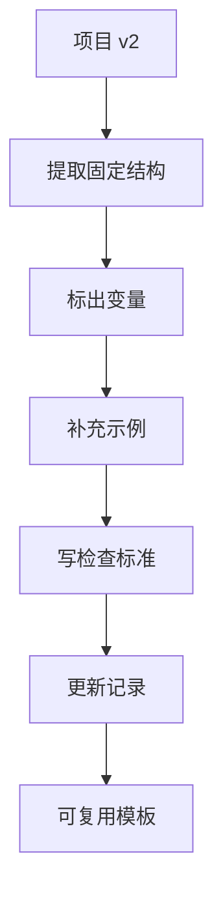

# 第 19 章：固化成模板

> ※ 通用约定（AI 价值原则、SOP 五步、自评三档、提示词骨架、AI 工具入口、敏感信息约定）见 [`00_课程总纲/10_课程通用约定.md`](../00_课程总纲/10_课程通用约定.md)。本章只写章节特化部分。

## 一、为什么要学（问题引入）

**本章在课程闭环中的位置**：项目已经完成并修改，本章把一次成果变成下次可复用的模板。

**真实问题**：如果成果只解决这一次，下次还是从零开始。真正的提效来自复用：把稳定结构留下，把可替换内容标出来。

**课堂引导可以这样讲**：

> 模板像模具。第一次做费点劲，后面每次都能更快、更稳定地做出相似成果。

**本章交付物**：《可复用模板 v1》
**配套实操手册：[Day19_第19章：固化成模板_实操手册](#manual-day19)。**

## 二、核心概念讲解

| 概念 | 大白话解释 |
| --- | --- |
| 模板 | 固定结构加可替换变量，让下一次使用更快。 |
| 变量 | 每次使用时需要替换的内容，例如产品名、平台、时间范围、数据。 |
| 使用说明 | 告诉别人什么时候用、准备什么、怎么检查。 |
| 维护机制 | 模板需要根据业务变化更新。 |

**一个好记的类比**：模板不是把内容锁死，而是把路修好。下次换一辆车，也知道怎么走。

## 三、方法论（可复用框架）

**方法框架：固定结构-变量字段-示例版本-检查标准-更新记录 模板化五步**

| 步骤 | 动作 | 怎么做 |
| --- | --- | --- |
| 1 | 固定结构 | 保留每次都需要的标题、字段和步骤。 |
| 2 | 变量字段 | 用【】标出每次要替换的内容。 |
| 3 | 示例版本 | 保留一个真实示例，帮助新人理解。 |
| 4 | 检查标准 | 写清使用后必须复核什么。 |
| 5 | 更新记录 | 记录模板版本、更新时间和修改原因。 |

**本章 Checklist**

- 模板是否能脱离原项目复用。
- 变量是否标得足够清楚。
- 是否有一个填写示例。
- 是否写清人工检查点和更新规则。

**本章流程图**

> 通用 SOP 五步（写清问题 → 脱敏输入 → AI 生成 → 人工复核 → 沉淀模板）见通用约定。本章流程图是这五步的特化形态。

## 四、工具与资源

| 工具 / 资源 | 用途 | 使用场景与提醒 |
| --- | --- | --- |
| 对话大模型 | 辅助提取固定结构和变量字段 | 要求不要改变业务事实。 |
| 模板库文件夹 | 集中保存模板 | 按岗位或场景分类。 |
| Notion / 飞书文档 / Google Docs | 发布模板和使用说明 | 适合团队复用。 |
| 表格工具 | 适合结构化模板 | 如评论分析表、广告复盘表、项目拆解表。 |

> 通用 AI 工具入口表（ChatGPT / Claude / Gemini / Qwen / DeepSeek / 豆包）和工具组合建议（基础版 / 稳妥版 / 团队版）统一放在 [`00_课程总纲/10_课程通用约定.md`](../00_课程总纲/10_课程通用约定.md)。本章只列与本章动作直接相关的工具。

## 五、案例讲解

**场景**：客服 FAQ v2 已经可以使用，现在要变成后续新品也能用的模板。

**输入资料**：项目 v2、版本对比表、客服规则。

**AI 可以帮忙**：提取固定字段：问题类型、客户情绪、回复模板、可替换变量、禁用承诺、升级条件。

**人必须判断**：检查变量是否清楚，补充一个填写示例和复核清单。

**最后留下**：《可复用客服 FAQ 模板》。

## 六、实操练习

**Mini 项目：把项目 v2 改成模板**

**准备资料**：项目 v2 和版本对比表。

**操作步骤**

1. 圈出每次都不变的结构。
2. 把每次变化的内容改成【变量】。
3. 保留一个完整示例。
4. 写使用前准备资料和使用后检查点。
5. 保存到模板库。

**交付物**：《可复用模板 v1》

**自评要点**：本章交付物按通用三档（好 / 中性 / 需要继续改）自评，重点看是否做出了**《可复用模板 v1》**——结构是否完整、是否有人工复核痕迹、下次能否复用。

**提示词建议**：优先用 [`09_章节实操手册/`](../09_章节实操手册/) 里本章 4 条专用提示词（拆任务 / 生成第一版 / 自评 / 模板化）。如果想从零起步，可以先用通用约定里的提示词骨架做一版。

## 七、常见误区

| 误区 | 会带来的问题 | 改法 |
| --- | --- | --- |
| 模板太具体 | 只能用于这一次项目。 | 把具体内容改成变量。 |
| 模板太空 | 别人不知道怎么填。 | 保留示例和填写说明。 |
| 没有检查标准 | 复用时容易复制错误。 | 模板必须附带复核清单。 |

## 八、本章小结

**带走什么**

- 模板化让一次项目变成长期资产。
- 好模板要同时有固定结构、变量、示例和检查标准。
- 下一章会围绕这个模板设计 7 天持续使用计划。

**和下一章的关系**

下一章会把模板放进未来一周的真实工作节奏里，避免结营后就停用。
