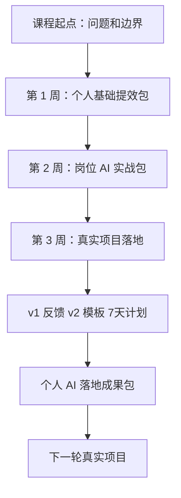

# 第 21 章：结营复盘：建立个人 AI 落地成果包

> ※ 通用约定（AI 价值原则、SOP 五步、自评三档、提示词骨架、AI 工具入口、敏感信息约定）见 [`00_课程总纲/10_课程通用约定.md`](../00_课程总纲/10_课程通用约定.md)。本章只写章节特化部分。

## 一、为什么要学（问题引入）

**本章在课程闭环中的位置**：课程终点。把 21 天学习成果汇总成一个可展示、可复用、可继续迭代的个人落地成果包。

**真实问题**：课程结束后，如果只留下“我学过”，价值会很快消散。真正应该留下的是：我解决了什么问题、怎么做的、产出了什么、下次如何复用。

**课堂引导可以这样讲**：

> 结营不是散场，而是把这次路程整理成地图。以后再走类似的路，你会更快。

**本章交付物**：《个人 AI 落地成果包》
**配套实操手册：[Day21_第21章：结营复盘：建立个人AI落地成果包_实操手册](#manual-day21)。**

## 二、核心概念讲解

| 概念 | 大白话解释 |
| --- | --- |
| 落地成果包 | 包含项目选择、拆解、v1、反馈、v2、模板和 7 天计划的完整材料。 |
| 能力证据 | 用交付物和版本变化证明自己真的掌握了方法。 |
| 迁移能力 | 把同一套方法迁移到新品、广告、客服、周报或团队协作。 |
| 下一阶段 | 明确继续练什么、在哪个岗位场景继续使用。 |

**一个好记的类比**：成果包像作品集，不是炫耀，而是让自己和团队看见：这套方法已经能解决真实问题。

## 三、方法论（可复用框架）

**方法框架：起点-动作-版本-模板-计划 结营复盘法**

| 步骤 | 动作 | 怎么做 |
| --- | --- | --- |
| 1 | 起点 | 写清课程开始前的真实问题。 |
| 2 | 动作 | 列出自己完成的关键步骤。 |
| 3 | 版本 | 展示 v1 到 v2 的变化。 |
| 4 | 模板 | 说明哪些成果已可复用。 |
| 5 | 计划 | 写清未来 7 天和下一个项目。 |

**本章 Checklist**

- 成果包是否包含完整项目链路。
- 是否能看到前后版本变化。
- 是否至少有一个可复用模板。
- 是否明确下一步继续使用场景。

**本章流程图**

> 通用 SOP 五步（写清问题 → 脱敏输入 → AI 生成 → 人工复核 → 沉淀模板）见通用约定。本章流程图是这五步的特化形态。

## 四、工具与资源

| 工具 / 资源 | 用途 | 使用场景与提醒 |
| --- | --- | --- |
| 云盘 / Notion / 飞书文档 | 整理成果包和索引页 | 适合长期保存和展示。 |
| 结营复盘表 | 记录起点、动作、成果、证据和下一步 | 课程模板即可。 |
| 对话大模型 | 辅助整理复盘故事和下一步计划 | 不要夸大成果，保留真实证据。 |
| PPT / Canva（可选） | 做 3 页成果展示 | 适合内部分享。 |

> 通用 AI 工具入口表（ChatGPT / Claude / Gemini / Qwen / DeepSeek / 豆包）和工具组合建议（基础版 / 稳妥版 / 团队版）统一放在 [`00_课程总纲/10_课程通用约定.md`](../00_课程总纲/10_课程通用约定.md)。本章只列与本章动作直接相关的工具。

## 五、案例讲解

**场景**：一位客服负责人从“回复不统一”出发，完成了 FAQ 模板和 7 天使用计划。

**输入资料**：项目选择表、项目拆解表、v1、反馈表、v2、模板、7 天计划。

**AI 可以帮忙**：帮忙整理成一页成果摘要：问题、过程、产出、改进证据、下一步。

**人必须判断**：确认表达真实，不写夸张效果，只展示可验证变化。

**最后留下**：《个人 AI 落地成果包》。

## 六、实操练习

**Mini 项目：整理并展示自己的 AI 落地成果包**

**准备资料**：三周全部核心交付物。

**操作步骤**

1. 建立成果包首页。
2. 按第 1 周、第 2 周、第 3 周归档。
3. 选择一个最能代表进步的前后版本对比。
4. 写 200 字以内成果说明。
5. 确定下一个 7 天继续项目。

> **归档时对照（避免漏件）**：第 1 周以 Day07《个人 AI 基础提效包》为入口（内含 Day01-06 六个交付物）；第 2 周以 Day14《岗位 AI 实战包》为入口（内含 Day08-13 六个交付物）；第 3 周放入项目链路六件：选择表、拆解表、项目 v1、反馈修改记录与 v2、固化模板、7 天计划；最后加上本章《结营复盘表》。逐项核对见 [`10_TCI化教材系统/02_实操工作簿/21天交付物检查清单.md`](../10_TCI化教材系统/02_实操工作簿/21天交付物检查清单.md)。

**交付物**：《个人 AI 落地成果包》

**自评要点**：本章交付物按通用三档（好 / 中性 / 需要继续改）自评，重点看是否做出了**《个人 AI 落地成果包》**——结构是否完整、是否有人工复核痕迹、下次能否复用。

**提示词建议**：优先用 [`09_章节实操手册/`](../09_章节实操手册/) 里本章 4 条专用提示词（拆任务 / 生成第一版 / 自评 / 模板化）。如果想从零起步，可以先用通用约定里的提示词骨架做一版。

## 七、常见误区

| 误区 | 会带来的问题 | 改法 |
| --- | --- | --- |
| 只写学习心得 | 看不见真实能力提升。 | 用交付物和版本证据说话。 |
| 夸大效果 | 短期好看，长期不可持续。 | 只写已经发生和能验证的变化。 |
| 没有下一步 | 课程结束即停止。 | 把下一个项目写进计划。 |

## 八、本章小结

**带走什么**

- 完整闭环是：看见问题、拆成动作、借助 AI、得到反馈、固化模板。
- 课程终点不是会用某个工具，而是能把 AI 放进真实工作并留下可复用成果。
- 个人落地成果包是下一轮岗位优化和团队协作的起点。

**和下一章的关系**

课程完成后，可以每 7 天选择一个小项目继续循环：选项目、拆步骤、做第一版、收反馈、固化模板。
