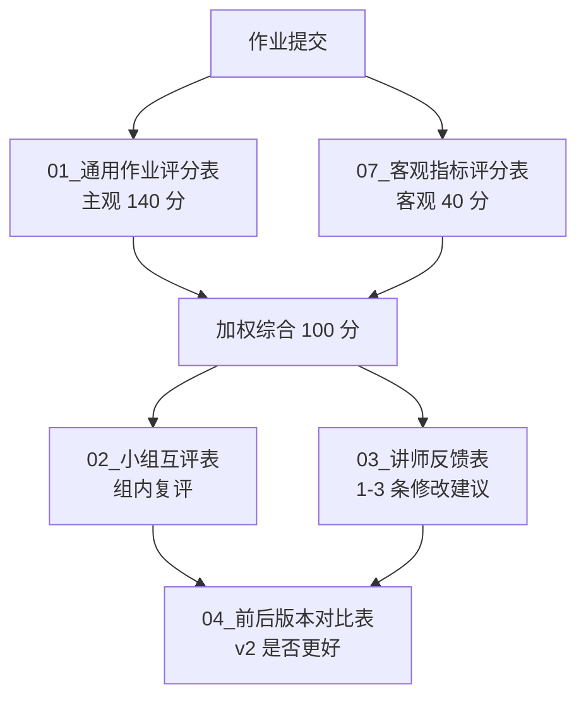

# 客观指标评分表（量化补充）

> **定位**：作为 [`01_通用作业评分表.md`](./01_通用作业评分表.md) 的**客观补充**，不替代主观评分。  
> 主观评分回答"做得好不好"，客观指标回答"事实上是不是这样"。  
> 两者按 **6 : 4** 加权（主观 60% + 客观 40%）综合判断作业层级。

## 一、为什么要加客观指标

主观评分容易出现两类问题：

- **"看起来很完整就给高分"**：内容流畅但有事实/合规问题，仍被打到 100+ 分。
- **"评分员状态影响结果"**：同一份作业不同人评，分差 ±20 很常见。

加 4 类客观指标，可以把以下事项变成**用机器或简单规则可验证的硬约束**：

1. **可读性**——内容是不是适合目标用户读。
2. **关键词覆盖**——AI 输出是否真的覆盖了业务必含信息。
3. **风险词命中**——是否触碰红线词（参见附录 C）。
4. **结构完整性**——是否齐全所需结构字段。

---

## 二、4 类客观指标定义

### 2.1 可读性指标（满分 10）

按内容类型选不同基准（任选其一适用项）：

| 内容类型 | 用什么衡量 | 满分（10）标准 | 得 5 分标准 | 0 分标准 |
| --- | --- | --- | --- | --- |
| 英文 Listing / 客服回复 | Flesch Reading Ease | 60-70（普通用户能读懂） | 50-59 或 71-80 | < 40 或 > 90 |
| 中文运营周报 / SOP | 句长平均 ≤ 25 字 + 段落 ≤ 5 行 | 完全符合 | 部分符合 | 大段堆叠 |
| 提示词模板 | 8 格结构齐备（角色/背景/产品/用户/任务/限制/输出/标注） | 8 格全有 | 6-7 格有 | ≤ 5 格 |

**测量方法**：可以让学员粘贴到 [hemingwayapp.com](https://hemingwayapp.com) 或类似工具自查；或让 AI 用提示词扫描计算。

### 2.2 关键词覆盖率（满分 10）

预先定义"必含关键词清单"，作业输出对清单的覆盖率：

| 内容类型 | 必含关键词清单（示例） |
| --- | --- |
| Listing | 核心品类词 + 主功能词 + 主材质/规格 + 目标用户场景词 + 安全/认证词（若适用） |
| 客服回复 | 客户姓名/称呼 + 订单号 + 问题确认 + 解决方案 + 时效承诺 |
| 广告复盘 | 周期 + CTR + CVR + ACOS + TACOS + 决策动作 ≤ 3 |
| 周报 | 上周成果 + 本周计划 + 风险/阻塞 + 求支持 |

**计分**：覆盖率 = 命中数 / 应有数 × 10，向下取整。**< 5 分直接判定不合格**。

### 2.3 风险词命中（满分 10，扣分制）

参见 [`../11_附录章节/附录C_跨境电商合规与踩坑.md`](../11_附录章节/附录C_跨境电商合规与踩坑.md) §3。

| 命中级别 | 扣分 | 处理 |
| --- | --- | --- |
| P0 红线（医疗/儿童安全/侵权） | **直接 0 分** | 全篇判定不合格，不进总分 |
| P1 高风险（虚假/比较/环保无证） | -3 / 处 | 必须修改后复评 |
| P2 文化禁区 | -2 / 处 | 标 [REVIEW] 提示 |

**测量方法**：用红线词词表正则扫描（每个团队按品类自维护）。

### 2.4 结构完整性（满分 10）

按作业类型对应的"骨架字段"逐项打钩：

| 作业类型 | 必有字段（举例） |
| --- | --- |
| 提示词作业 | 角色 / 背景 / 任务 / 限制 / 输出格式 / 主动标注（缺一扣 2） |
| Listing 作业 | Title / 5 Bullets / Description / Backend Keywords / 合规审核记录（缺一扣 2） |
| SOP 作业 | 触发条件 / 步骤序号 / 输入输出 / 责任人 / 异常处理 / 验收标准（缺一扣 2） |
| 项目作业 | 目标 / 现状 / 步骤拆解 / 时间表 / 验收 / 复盘（缺一扣 2） |

---

## 三、客观分计算与综合判定

```
客观总分（满分 40） = 可读性 + 关键词覆盖 + 风险词命中 + 结构完整性
主观总分（满分 140，来自 01_通用作业评分表.md）

综合分（满分 100） = 主观总分 / 140 × 60 + 客观总分 / 40 × 40
```

| 综合分 | 层级 | 处理 |
| --- | --- | --- |
| ≥ 85 | 优秀，可作为示例作品 | 沉淀模板 |
| 70 – 84 | 合格，建议小修后再发 | 改 1-3 处 |
| 55 – 69 | 需修改，再交一版 | 回到资料和判断 |
| < 55 | 不合格 | 重做 |
| 任意 P0 命中 | **直接不合格** | 必须重写并讨论 |

---

## 四、如何快速做客观评分（30 分钟方案）

不要为客观评分建复杂工具链。最小可行流程：

1. **可读性**：把英文输出贴 hemingwayapp.com，记 grade 与 reading ease；中文用"打开看"判断段长。
2. **关键词覆盖**：每个作业类型预存一份 markdown 清单，评分员对照打钩。
3. **风险词命中**：维护一份 `risk_words.txt`，用 VS Code/任何编辑器搜索 + 正则。
4. **结构完整性**：作业模板里把字段列成 `## 一、xxx` 标题，缺哪个看一眼就知道。

> 全程 30 分钟内完成 1 份作业的客观评分，否则就太重了。

---

## 五、给讲师的使用建议

1. **先用 1-2 周磨合**：先只做主观评分，再叠加客观；让学员知道客观指标怎么算。
2. **客观指标公开透明**：把红线词清单、关键词清单提前发给学员，让他们能自查（这是教学，不是考试）。
3. **客观分用来"否决"，不用来"超车"**：客观分不能把烂内容变成优秀，但能否决"看起来好但有合规问题"的作业。
4. **每月迭代清单**：把本月新出现的红线词、必含关键词加入清单，反映平台政策变化（参见附录 C §7）。

---

## 六、与其他评分文件的关系



---

## 七、关联

- 主观评分：[`01_通用作业评分表.md`](./01_通用作业评分表.md)
- 风险词清单依据：[`../11_附录章节/附录C_跨境电商合规与踩坑.md`](../11_附录章节/附录C_跨境电商合规与踩坑.md)
- 后续 benchmark 测试集：[`08_AI输出质量红线测试集.md`](./08_AI输出质量红线测试集.md)（t11 输出）
