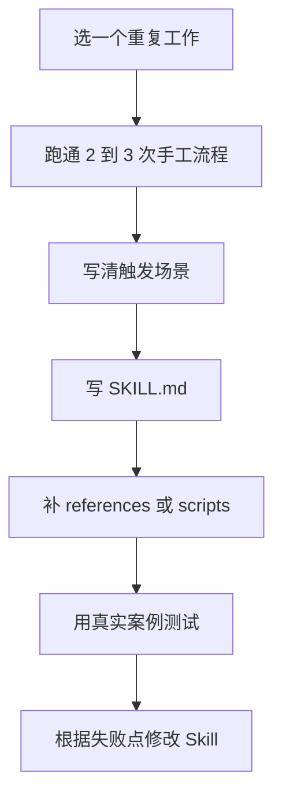

# AI Agent Skills 编写入门教程

这一章给想继续往前一步的学员。  
如果前面 21 章已经能把工作沉淀成模板，这一章就是把“模板”再往前推一步：写成 AI Agent 可以反复调用的 Skill。

## 一、先用大白话理解 Skill

Skill 可以理解成：

> 给 AI Agent 的一份可复用工作说明书。

普通提示词像是“这次请你帮我做一件事”。  
Skill 更像是“以后只要遇到这一类事，都按这套方法做”。

一个 Skill 通常包含：

| 组成 | 大白话解释 | 适合放什么 |
| --- | --- | --- |
| `SKILL.md` | 主说明书 | 什么时候用、按什么步骤做、注意什么 |
| `scripts/` | 可执行小工具 | 重复运行的脚本，例如批量转换文件 |
| `references/` | 参考资料 | 长文档、规则、字段说明、案例库 |
| `assets/` | 产出素材 | 模板、图片、示例文件、固定样式 |

## 二、官方资料入口

建议先看这些资料：

- [OpenAI Codex｜Skills](https://developers.openai.com/codex/skills)
- [OpenAI Codex｜Save workflows as skills](https://developers.openai.com/codex/use-cases/reusable-codex-skills)
- [OpenAI Skills Catalog GitHub](https://github.com/openai/skills)
- [Anthropic｜Agent Skills](https://docs.claude.com/en/docs/agents-and-tools/agent-skills)
- [Anthropic Skills GitHub](https://github.com/anthropics/skills)
- [Agent Skills Specification](https://agentskills.io/specification)

阅读顺序建议：

1. 先看 OpenAI Codex Skills，理解 Codex 怎么使用 Skill。
2. 再看 Agent Skills Specification，理解通用格式。
3. 最后看 GitHub 示例，学习真实 Skill 的目录怎么放。

## 三、Skill 和提示词有什么区别

| 对比 | 提示词 | Skill |
| --- | --- | --- |
| 使用频率 | 偶尔用一次 | 反复用 |
| 内容长度 | 通常较短 | 可以包含说明、脚本、参考资料 |
| 适合场景 | 生成一次文案、整理一次表格 | 固定流程、团队规范、复杂任务 |
| 维护方式 | 复制粘贴修改 | 放在文件夹里持续迭代 |

简单判断：

- 一次性任务：用提示词。
- 每周都做：写模板。
- 多人反复做、容易出错：可以写 Skill。

## 四、一个最小 Skill 长什么样

下面是一个“Listing 审核 Skill”的最小示例。

```text
listing-review/
└── SKILL.md
```

`SKILL.md` 可以这样写：

```markdown
---
name: listing-review
description: Use when reviewing cross-border ecommerce product listing drafts for clarity, factual accuracy, platform-risk wording, and reusable improvement suggestions.
---

# Listing Review

## Workflow

1. Read the product facts first.
2. Check title, bullet points, and description separately.
3. Mark claims that need evidence.
4. Rewrite only after risks are identified.
5. Return a table with original text, issue, suggested edit, and reason.

## Rules

- Do not invent certifications, test results, warranty promises, or medical claims.
- Keep wording clear and specific.
- If product facts are missing, ask for them instead of guessing.
```

小白可以先记住 3 件事：

1. `name` 是 Skill 的名字。
2. `description` 决定 AI 什么时候会想到用它。
3. 正文写具体工作步骤和注意事项。

## 五、从课程案例迁移成 Skill

### Case 1：Listing 审核 Skill

适合从第 5、6 章迁移。

可以这样拆：

| 部分 | 写什么 |
| --- | --- |
| 触发场景 | 审核 Listing 初稿、五点描述、产品描述 |
| 输入资料 | 产品理解卡、竞品评论分析、Listing 初稿 |
| 工作步骤 | 事实检查、合规检查、可读性检查、修改建议 |
| 输出格式 | 原句、问题、修改建议、原因 |
| 风险提醒 | 不编造认证、功效、销量和平台政策 |

举一反三：

- 服饰类 Listing：重点检查尺码、材质、洗护方式。
- 电子配件 Listing：重点检查兼容型号、接口、功率。
- 家居类 Listing：重点检查尺寸、承重、安装方式。

### Case 2：广告复盘 Skill

适合从第 10 章迁移。

可以这样拆：

| 部分 | 写什么 |
| --- | --- |
| 触发场景 | 每周广告数据复盘 |
| 输入资料 | 曝光、点击、CTR、CPC、转化率、ACOS、花费 |
| 工作步骤 | 找异常、列可能原因、提示需要回查的数据、给下周动作 |
| 输出格式 | 指标变化、异常判断、可能原因、证据、下一步 |
| 风险提醒 | 不直接决定预算，不替代人工业务判断 |

举一反三：

- Amazon Ads：重点看 ACOS、CPC、转化率。
- Meta Ads：重点看 CTR、CPM、落地页转化。
- TikTok Shop：重点看视频素材、点击、成交和评论反馈。

### Case 3：客服 FAQ Skill

适合从第 11 章迁移。

可以这样拆：

| 部分 | 写什么 |
| --- | --- |
| 触发场景 | 整理客服常见问题和标准回复 |
| 输入资料 | 脱敏后的客户问题、平台规则、产品资料 |
| 工作步骤 | 分类、生成回复、标记人工升级条件、保存 FAQ |
| 输出格式 | 问题类型、标准回复、不能承诺的话、人工升级条件 |
| 风险提醒 | 不处理敏感隐私，不承诺超出权限的补偿 |

举一反三：

- 物流类问题：重点解释状态和查询方式。
- 产品质量问题：重点收集图片、批次、订单状态。
- 使用方法问题：重点给步骤和注意事项。

## 六、什么时候需要 `scripts/`

如果只是告诉 AI 怎么写文案，不一定需要脚本。  
如果每次都要做重复、机械、容易出错的动作，可以考虑脚本。

适合放进 `scripts/` 的例子：

- 批量把 Markdown 打包成 HTML。
- 批量检查文件名是否规范。
- 批量统计每章是否包含交付物、作业和评分标准。
- 批量把 CSV 广告数据转成固定汇总表。

不适合一开始就写脚本的情况：

- 业务规则还没稳定。
- 每次输入都差别很大。
- 人还没有跑通过 2 到 3 次手工流程。

## 七、什么时候需要 `references/`

当资料太长，不适合全部塞进 `SKILL.md`，就放到 `references/`。

例如：

```text
listing-review/
├── SKILL.md
└── references/
    ├── platform-risk-words.md
    ├── product-fact-checklist.md
    └── example-reviews.md
```

好处是：  
AI 先读短说明，需要时再读长资料，不会一开始就被大量内容淹没。

## 八、写 Skill 的 6 步



1. 选一个重复工作。
2. 先不用 Skill，手工跑通 2 到 3 次。
3. 写清楚什么时候使用这个 Skill。
4. 写 `SKILL.md`，先写步骤和规则。
5. 需要长资料再加 `references/`，需要机械处理再加 `scripts/`。
6. 用真实案例测试，发现不清楚就修改。

## 九、常见错误

1. **一上来写得太大**  
   例如“跨境电商全自动运营 Skill”。范围太大，AI 不知道先做什么。

2. **description 写得太空**  
   例如“帮助我做运营”。更好的写法是“当需要审核 Amazon Listing 初稿时使用”。

3. **把所有资料都塞进 `SKILL.md`**  
   主文件太长，AI 很难抓重点。长资料放进 `references/`。

4. **没有测试真实案例**  
   Skill 看起来完整，不代表能用。至少拿一个真实任务跑一遍。

5. **让 Skill 替代人做最终判断**  
   跨境电商里涉及平台规则、客户权益、财务和账号安全的判断，仍然要人工确认。

## 十、课堂练习

请从下面 3 个题目里选一个：

1. 把《Listing 审核清单》写成一个最小 Skill。
2. 把《广告数据复盘表》写成一个最小 Skill。
3. 把《客服 FAQ 与回复库》写成一个最小 Skill。

交付物：

- 一个 Skill 文件夹结构。
- 一个 `SKILL.md`。
- 一个真实测试案例。
- 一段复盘：这次 Skill 哪里还不够清楚。

