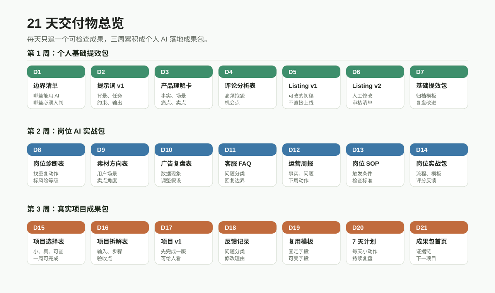

# 学员主教材使用说明

学员主教材负责“读懂为什么做、怎么做、做到什么程度”。

它不是工作纸，也不是讲师话术。学员阅读主教材后，应能理解本章要解决的真实工作问题，并知道本章交付物在整个课程成果包中的位置。

## 先看 21 天交付物

| 天数 | 章节主题 | 核心交付物 |
| --- | --- | --- |
| Day01 | AI 使用边界 | AI 使用边界清单 |
| Day02 | 把问题说清楚 | 个人提示词模板 v1 |
| Day03 | 产品理解 | 产品理解卡 |
| Day04 | 竞品和评论分析 | 竞品评论分析表 |
| Day05 | Listing 初稿 | Listing 初稿 v1 |
| Day06 | 修改与审核 | Listing 修改稿 v2、审核清单 |
| Day07 | 第 1 周复盘 | 个人 AI 基础提效包 |
| Day08 | 岗位提效诊断 | 岗位提效诊断表 |
| Day09 | 广告素材方向 | 广告素材方向表 |
| Day10 | 广告数据复盘 | 广告数据复盘表 |
| Day11 | 客服和售后回复 | 客服 FAQ 表、标准回复库 |
| Day12 | 运营周报 | 运营周报模板 |
| Day13 | 岗位 SOP | 岗位 SOP v1 |
| Day14 | 第 2 周复盘 | 岗位 AI 实战包 |
| Day15 | 真实项目选择 | 落地项目选择表 |
| Day16 | 项目拆解 | 项目拆解表 |
| Day17 | 完成第一版 | 项目初稿 v1 |
| Day18 | 反馈和修改 | 项目修改稿 v2 |
| Day19 | 固化成模板 | 个人可复用模板 |
| Day20 | 7 天微计划 | 7 天 AI 使用计划 |
| Day21 | 结营复盘 | 个人 AI 落地成果包 |

## 阅读顺序

建议每章按这个顺序阅读：

1. 真实工作挑战。
2. 本章核心问题。
3. 学完能带走什么。
4. 关键概念。
5. 方法框架。
6. 案例与证据材料。
7. AI 辅助步骤。
8. 人工判断步骤。
9. 课堂活动。
10. 本章交付物。
11. 自评与互评。
12. 常见误区。
13. 可迁移场景。

## 阅读时要注意

- 不要追求一次读懂所有工具。
- 先看真实问题，再看 AI 怎么参与。
- 看到案例时，要关注输入资料和人工修改，而不只是看最后答案。
- 每章结束后，转到实操工作簿完成交付物。

## 和原课程章节的关系

学员主教材来自原来的 21 章正文，但会重新整理为更清楚的学习路径。原章节仍保留在 `01_第1周_AI基础提效周/`、`02_第2周_AI岗位实战周/`、`03_第3周_AI落地陪跑周/`。
