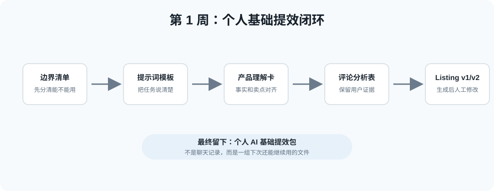
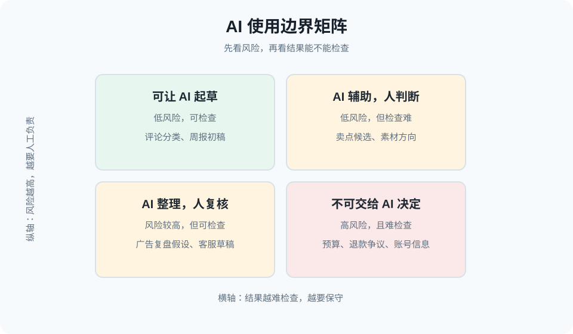
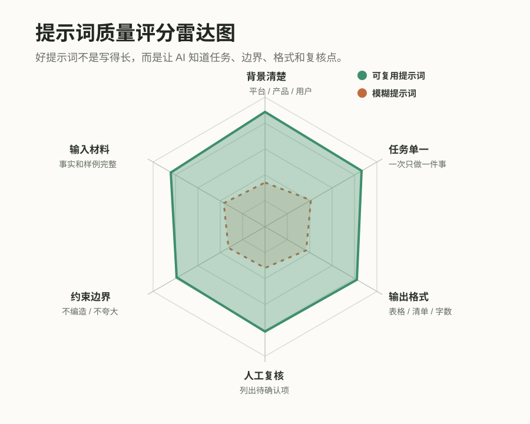
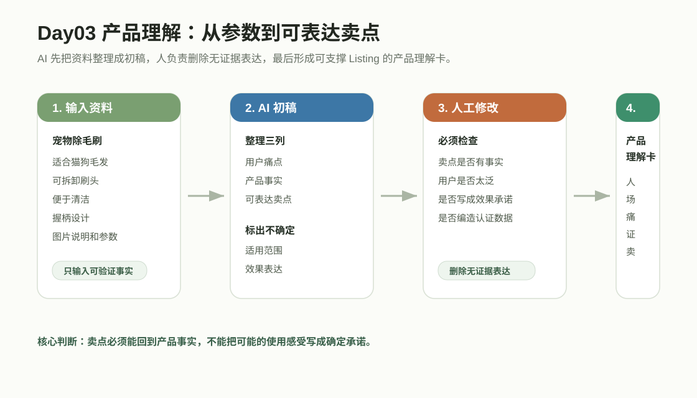

# 第 1 周：个人基础提效单元


## 单元核心问题

我如何安全地把 AI 用到一个低风险、可检查的重复工作里？

## 单元成果

本周最终形成《个人 AI 基础提效包》。

它不是聊天记录合集，而是一组以后还能继续使用的基础工具：边界清单、提示词模板、产品理解卡、竞品评论分析表、Listing 初稿、Listing 修改稿和审核清单。





---

# 第 1 章：AI 不是神，是减轻重复劳动的助手

## 1. 真实工作挑战

很多人刚开始用 AI 时会走两个极端：要么什么都敢交给 AI，要么觉得 AI 会乱写所以干脆不用。

这两个极端都会影响效率。真正适合的做法，是先分清哪些动作可以让 AI 辅助，哪些动作必须由人判断。

## 2. 本章核心问题

我如何判断一个工作动作能不能交给 AI 辅助？

## 3. 学完能带走什么

本章交付物是《AI 使用边界清单》。它会保护后面所有章节的实操安全。

## 4. 关键概念

| 概念 | 大白话解释 |
| --- | --- |
| AI 辅助 | AI 适合整理、分类、起草、归纳。 |
| 人工判断 | 产品取舍、预算、客户争议、品牌承诺必须由人负责。 |
| 边界意识 | 先分清能做什么、不能做什么，再开始使用工具。 |
| 结果复核 | AI 输出越流畅，越要检查事实和风险。 |

## 5. 方法框架

使用“可交给、可辅助、不可交给”三分法。

| 类型 | 适合内容 | 例子 |
| --- | --- | --- |
| 可交给 AI 起草 | 低风险、可检查、重复多 | 评论分类、周报初稿、标题候选 |
| 可让 AI 辅助 | 需要人判断，但可先整理 | Listing 修改建议、广告复盘假设 |
| 不可交给 AI | 高风险、敏感或最终决策 | 预算决定、退款争议、账号密码、客户隐私 |

## 6. 案例与证据材料

一位亚马逊运营每天整理评论。她可以把脱敏评论交给 AI 分类，但不能把订单号、买家邮箱、账号后台截图发给 AI，也不能让 AI 决定最终产品改版。

## 7. AI 辅助步骤

```text
请帮我把下面 5 个工作动作分成“可交给 AI 起草 / 可让 AI 辅助 / 不可交给 AI”三类。

工作动作：【填写】

请输出：
1. 分类结果
2. AI 可以帮哪一步
3. 人必须检查哪一步
4. 哪些资料不能上传
```

## 8. 人工判断步骤

人要判断：

- 资料是否已脱敏。
- 结果是否可检查。
- 出错后是否会影响客户、预算、合规或品牌承诺。
- AI 输出是否被当成最终答案。

## 9. 课堂活动

活动名称：给自己的工作做一张 AI 边界清单。

步骤：

1. 写出 5 个真实工作动作。
2. 标注风险：低、中、高。
3. 写出 AI 能帮哪一步。
4. 写出人必须检查哪一步。
5. 标出不能上传的资料。

## 10. 本章交付物

交付物：《AI 使用边界清单》。

最低完成标准：

- 至少 5 个真实工作动作。
- 每个动作有风险等级。
- 每个动作有 AI 可辅助步骤和人工检查点。
- 明确列出不能上传的敏感资料。

## 11. 自评与互评

| 维度 | 好 | 中性 | 需要继续改 |
| --- | --- | --- | --- |
| 动作真实 | 来自实际工作 | 部分偏泛 | 只是试工具 |
| 边界清楚 | 能区分可辅助和不可交给 | 有边界但理由少 | 什么都想交给 AI |
| 安全意识 | 明确脱敏和人工复核 | 有提醒但不具体 | 上传敏感信息 |
| 复用价值 | 后续章节能继续用 | 可参考 | 做完就丢 |

## 12. 常见误区

| 误区 | 问题 | 改法 |
| --- | --- | --- |
| 把 AI 当答案机 | 错误容易进入业务 | 把输出看成初稿 |
| 上传敏感资料 | 有隐私和商业风险 | 先脱敏，再输入 |
| 一开始做大项目 | 反馈慢、容易失控 | 先选低风险小动作 |

## 13. 可迁移场景

这张边界清单可以迁移到广告、客服、周报、Listing、评论分析等所有 AI 使用场景。每次使用前先问：资料能不能给、结果谁检查、最终谁负责。

---

# 第 2 章：学会把问题说清楚

## 1. 真实工作挑战

很多 AI 输出不好，不是因为模型不够聪明，而是任务说明太模糊。只说“帮我写一下”，AI 只能猜。

## 2. 本章核心问题

我如何把一个模糊需求改成 AI 能执行的清楚任务？

## 3. 学完能带走什么

本章交付物是《个人提示词模板 v1》。

## 4. 关键概念

| 概念 | 大白话解释 |
| --- | --- |
| 提示词 | 给 AI 的任务交接单，不是咒语。 |
| 上下文 | 平台、产品、用户、目标和限制。 |
| 输出格式 | 提前规定结果是表格、清单、文案还是报告。 |
| 复核点 | 要求 AI 标出不确定和需人工确认的内容。 |

## 5. 方法框架

使用 R-B-T-C-O-R 六段式提示词框架。

| 段落 | 含义 | 要写什么 |
| --- | --- | --- |
| Role | 角色 | 让 AI 以什么身份协助 |
| Background | 背景 | 平台、产品、用户、问题 |
| Task | 任务 | 这次只做什么 |
| Constraint | 约束 | 不能编造、不能夸大、不能碰敏感信息 |
| Output | 输出 | 格式、字段、字数、语气 |
| Review | 复核 | 标出需要人工确认的地方 |



提示词写完后，先用下面这张表自查，再让 AI 执行任务：

| 检查维度 | 最低标准 | 常见问题 |
| --- | --- | --- |
| 背景清楚 | 说清平台、产品、用户和目标 | 只写“帮我写一下” |
| 任务单一 | 一次只处理一个具体动作 | 同时要求分析、写作、翻译和判断 |
| 输入材料 | 给出事实、样例或限制条件 | 让 AI 自己猜产品信息 |
| 约束边界 | 明确不能编造、不能夸大、不能碰敏感信息 | 没有告诉 AI 哪些不能写 |
| 输出格式 | 规定表格、清单、字数或语气 | 输出不可比较、不可复用 |
| 人工复核 | 要求列出待确认项 | 把输出直接当最终答案 |

## 6. 案例与证据材料

模糊需求：

```text
帮我写 Listing。
```

改写后：

```text
你是一位跨境电商 Listing 文案助手。
背景：我要为 Amazon US 的旅行收纳袋写五点描述。
任务：请基于我提供的尺寸、材质、颜色和使用场景生成五点描述。
约束：不要编造防水、承重、认证；不要使用夸大承诺。
输出：用英文输出 5 条 Bullet Points，每条对应一个产品事实。
复核：单独列出需要人工确认的参数或表达。
```

## 7. AI 辅助步骤

让 AI 反过来帮你检查提示词：

```text
请检查下面这条提示词是否足够清楚。

提示词：【粘贴】

请指出缺少的背景、任务、约束、输出格式和复核点，并帮我改成更清楚的版本。
```

## 8. 人工判断步骤

人要检查：

- 提示词是否一次只解决一个问题。
- 是否给了足够背景。
- 是否规定输出格式。
- 是否写清不能做什么。
- 是否要求标出不确定内容。

## 9. 课堂活动

活动名称：把一句模糊需求改成六段式提示词。

步骤：

1. 写一句真实模糊需求。
2. 按六段式补全。
3. 用 AI 跑一次。
4. 根据输出问题反向修改提示词。
5. 保存为个人模板。

## 10. 本章交付物

交付物：《个人提示词模板 v1》。

最低完成标准：

- 包含角色、背景、任务、约束、输出、复核。
- 适用于一个真实工作场景。
- 能标出需要人工确认的内容。

## 11. 自评与互评

| 维度 | 好 | 中性 | 需要继续改 |
| --- | --- | --- | --- |
| 背景 | 平台、产品、用户清楚 | 背景略少 | AI 只能猜 |
| 任务 | 一次只做一件事 | 任务稍多 | 一条提示词塞太多事 |
| 约束 | 明确不能编造和夸大 | 有约束但不细 | 没有边界 |
| 输出 | 格式清楚 | 格式可理解 | 输出不可控 |

## 12. 常见误区

| 误区 | 问题 | 改法 |
| --- | --- | --- |
| 提示词太短 | 输出泛 | 补背景和格式 |
| 一次塞太多任务 | 每块都不深 | 拆成小任务 |
| 不要复核 | AI 写得很肯定 | 要求列出待确认项 |

## 13. 可迁移场景

六段式提示词可迁移到产品理解、评论分析、Listing、广告素材、客服回复、周报和 SOP。

---

# 第 3 章：AI 辅助产品理解

## 1. 真实工作挑战

很多产品资料只有尺寸、材质、颜色和重量。参数不是卖点，卖点也不一定是用户愿意购买的理由。

## 2. 本章核心问题

我如何把零散产品资料整理成一张能支撑后续文案和运营的产品理解卡？

## 3. 学完能带走什么

本章交付物是《产品理解卡》。

## 4. 关键概念

| 概念 | 大白话解释 |
| --- | --- |
| 产品事实 | 能被验证的信息，如尺寸、材质、适用范围。 |
| 使用场景 | 用户在什么时间、地点、状态下使用。 |
| 用户痛点 | 用户不方便、不满意、担心或反复抱怨的地方。 |
| 可表达卖点 | 有事实支撑、能回应痛点的购买理由。 |

## 5. 方法框架

使用“人-场-痛-证-卖”产品理解框架。

| 步骤 | 问题 |
| --- | --- |
| 人 | 谁会用这个产品？ |
| 场 | 在什么场景里用？ |
| 痛 | 解决什么不方便？ |
| 证 | 有什么事实或资料支撑？ |
| 卖 | 怎么说成用户听得懂的表达？ |



这张图的读法：AI 先把零散资料整理成结构，人再检查卖点是否有事实支撑。

| 环节 | AI 做什么 | 人改什么 | 最后留下什么 |
| --- | --- | --- | --- |
| 产品资料整理 | 把参数、图片说明、使用场景归类 | 删除不确定或无来源信息 | 可检查的产品事实 |
| 痛点和卖点初稿 | 初步匹配用户痛点、产品事实和表达角度 | 判断用户是否太泛，卖点是否夸大 | 产品理解卡 |
| 待确认项 | 标出认证、适用范围、数据等不确定信息 | 回到资料或业务人员处确认 | 后续 Listing 的事实底稿 |

## 6. 案例与证据材料

产品：宠物除毛刷。

资料：适合猫狗毛发、可拆卸刷头、便于清洁、有握柄设计。

可整理成：

| 痛点 | 产品事实 | 可表达卖点 |
| --- | --- | --- |
| 沙发和衣服容易粘毛 | 刷头适合清理织物表面 | 日常清理沙发、外套更省力 |
| 清理工具本身麻烦 | 可拆卸刷头 | 用完后更容易清洁 |

## 7. AI 辅助步骤

```text
请根据下面产品资料，整理一张产品理解卡。

产品资料：【填写】

请按“目标用户 / 使用场景 / 用户痛点 / 产品事实 / 可表达卖点 / 需要人工确认的信息”输出。

要求：
- 不要编造产品能力。
- 所有卖点都要对应产品事实。
- 标出认证、数据、适用范围等需要人工确认的地方。
```

## 8. 人工判断步骤

人要检查：

- 卖点是否有事实支撑。
- 目标用户是否太宽。
- 是否把功能误写成效果承诺。
- 是否编造认证、适用范围或数据。

## 9. 课堂活动

活动名称：为一个真实产品做产品理解卡。

步骤：

1. 准备产品参数和图片说明。
2. 写出目标用户和 3 个场景。
3. 用 AI 整理痛点、事实和卖点。
4. 删除无证据表达。
5. 保存产品理解卡。

## 10. 本章交付物

交付物：《产品理解卡》。

最低完成标准：

- 有目标用户和至少 3 个使用场景。
- 每个卖点都有产品事实支撑。
- 有需要人工确认的信息。

## 11. 自评与互评

| 维度 | 好 | 中性 | 需要继续改 |
| --- | --- | --- | --- |
| 事实 | 可验证 | 部分需补资料 | 大量推测 |
| 用户 | 具体 | 略宽 | 写成所有人 |
| 卖点 | 痛点和事实对应 | 有卖点但证据弱 | 只有形容词 |
| 安全 | 标出待确认信息 | 有提醒 | 编造认证或效果 |

## 12. 常见误区

| 误区 | 问题 | 改法 |
| --- | --- | --- |
| 参数当卖点 | 用户不知道为什么买 | 翻译成使用利益 |
| 用户太宽 | 文案没有方向 | 写具体人群和场景 |
| AI 编造证据 | 有虚假风险 | 回到原资料核实 |

## 13. 可迁移场景

产品理解卡可以作为 Listing、广告素材、客服 FAQ、产品培训和新品会议的共同输入。

---

# 第 4 章：AI 辅助竞品和评论分析

## 1. 真实工作挑战

评论区里有大量用户真实反馈，但声音很杂。只看销量、价格和图片，会漏掉用户真正满意、不满和担心的地方。

## 2. 本章核心问题

我如何借助 AI 从公开评论中整理出可追溯的用户证据？

## 3. 学完能带走什么

本章交付物是《竞品评论分析表》。

## 4. 关键概念

| 概念 | 大白话解释 |
| --- | --- |
| 竞品 | 和自己争夺同一类用户的产品。 |
| 评论证据 | 用户原话、星级、图片反馈等可追溯资料。 |
| 高频问题 | 多位用户反复提到的问题。 |
| 机会点 | 从好评、差评和顾虑中提炼出的改进方向。 |

## 5. 方法框架

使用“收集-清洗-分类-证据-转化”五步法。

| 步骤 | 做什么 |
| --- | --- |
| 收集 | 选择 3 到 5 个竞品和评论 |
| 清洗 | 去掉无关、重复和隐私信息 |
| 分类 | 按功能、质量、物流、包装、场景归类 |
| 证据 | 每个结论保留用户原话或来源 |
| 转化 | 转成卖点、FAQ、广告方向或避坑提醒 |

## 6. 案例与证据材料

产品：露营灯。

评论摘要：

- “亮度够，但电池没撑过一整晚。”
- “挂在帐篷里很方便。”
- “下雨后还能用，但接口盖有点松。”

可转化为：

- 续航要谨慎表达。
- 悬挂场景可做卖点。
- 防水表达要核对等级，不能写成所有天气。

## 7. AI 辅助步骤

```text
请根据下面脱敏竞品评论，整理一份评论分析表。

评论资料：【粘贴公开评论】

请输出：
1. 高频好评
2. 高频差评
3. 用户常见顾虑
4. 可转化为 Listing 卖点的内容
5. 需要避开的表达
6. 每个结论对应的原文证据
```

## 8. 人工判断步骤

人要检查：

- 是否保留原文证据。
- 是否把个别极端评论夸大成普遍问题。
- 是否直接照抄竞品表达。
- 是否把评论转成下一步动作。

## 9. 课堂活动

活动名称：完成 30 条评论轻量分析。

步骤：

1. 收集 30 条公开评论。
2. 清洗隐私和重复内容。
3. 用 AI 分类归纳。
4. 人工保留证据。
5. 标注可转卖点、需避坑、需客服解释、需产品改进。

## 10. 本章交付物

交付物：《竞品评论分析表》。

最低完成标准：

- 至少 30 条评论。
- 好评和差评都包含。
- 每个结论有原文证据。
- 至少 3 个可转化动作。

## 11. 自评与互评

| 维度 | 好 | 中性 | 需要继续改 |
| --- | --- | --- | --- |
| 评论来源 | 公开且可追溯 | 来源略少 | 无来源 |
| 分类 | 清楚有用 | 分类偏泛 | 只是摘要 |
| 证据链 | 结论有原文 | 部分有证据 | 没证据 |
| 转化 | 能进入 Listing 或广告 | 可参考 | 没动作 |

## 12. 常见误区

| 误区 | 问题 | 改法 |
| --- | --- | --- |
| 只看差评 | 方向过度防御 | 好评差评都看 |
| 没证据链 | 无法复查 | 保留原文 |
| 照抄竞品 | 同质化和合规风险 | 学需求，不复制表达 |

## 13. 可迁移场景

可迁移到 Listing 卖点提炼、广告钩子、客服 FAQ、产品改进会议和新品调研。

---

# 第 5 章：AI 辅助 Listing 初稿

## 1. 真实工作挑战

Listing 写作如果从空白页开始，容易堆关键词或堆形容词。AI 可以降低起稿难度，但初稿不能直接发布。

## 2. 本章核心问题

我如何用产品理解卡和评论分析表生成一版可修改的 Listing 初稿？

## 3. 学完能带走什么

本章交付物是《Listing 初稿 v1》。

## 4. 关键概念

| 概念 | 大白话解释 |
| --- | --- |
| Listing | 商品详情页内容，如标题、五点、描述。 |
| 关键词 | 用户搜索时可能使用的词，要自然融入。 |
| 卖点结构 | 用户问题、产品事实、使用利益。 |
| 合规初审 | 检查夸大、虚假、禁用词和无法证明的承诺。 |

## 5. 方法框架

使用“资料-结构-表达-合规-版本”起稿法。

| 步骤 | 做什么 |
| --- | --- |
| 资料 | 输入产品理解卡、评论分析表、关键词 |
| 结构 | 分别生成标题、五点、描述 |
| 表达 | 清楚、克制、用户能理解 |
| 合规 | 标出风险词和待确认信息 |
| 版本 | 保存 v1，进入下一章修改 |

## 6. 案例与证据材料

产品：可折叠瑜伽垫收纳架。

输入资料：

- 产品理解卡：可折叠、节省空间、适合家庭健身角。
- 评论痛点：瑜伽垫乱放、占地方、拿取不方便。
- 关键词：yoga mat holder, home gym storage, foldable rack。

## 7. AI 辅助步骤

```text
请基于下面资料生成一版 Listing 初稿。

产品理解卡：【粘贴】
竞品评论分析：【粘贴】
关键词：【粘贴】
平台：【填写】

请输出：标题、五点描述、产品描述、关键词建议、需要人工确认的地方。

要求：
- 不要编造产品功能。
- 不要使用夸大承诺。
- 每个卖点要对应产品事实或评论证据。
```

## 8. 人工判断步骤

人要检查：

- 标题是否自然，不堆关键词。
- 五点是否每条只讲一个主卖点。
- 卖点是否来自事实或评论证据。
- 是否出现“最强、100%、必备神器”等风险表达。

## 9. 课堂活动

活动名称：生成一版 Listing 初稿。

步骤：

1. 准备产品理解卡。
2. 准备评论分析表。
3. 输入关键词清单。
4. 用 AI 分模块生成。
5. 标出风险词和待确认信息。

## 10. 本章交付物

交付物：《Listing 初稿 v1》。

最低完成标准：

- 有标题、五点、产品描述。
- 每条卖点有事实或评论支撑。
- 有风险词和待确认信息清单。

## 11. 自评与互评

| 维度 | 好 | 中性 | 需要继续改 |
| --- | --- | --- | --- |
| 输入资料 | 产品卡和评论表齐全 | 输入资料不完整 | 让 AI 凭空写 |
| 结构 | 标题五点描述清楚 | 结构可用 | 混在一起 |
| 证据 | 卖点有来源 | 部分有来源 | 大量无证据 |
| 风险意识 | 标出待确认项 | 有提醒 | 当终稿发布 |

## 12. 常见误区

| 误区 | 问题 | 改法 |
| --- | --- | --- |
| 凭空写 | 内容不真实 | 输入产品卡和证据 |
| 关键词堆砌 | 不自然 | 自然融入 |
| 初稿当终稿 | 有发布风险 | 进入下一章修改 |

## 13. 可迁移场景

这套起稿法可用于 Shopify 商品页、TikTok Shop 商品描述、广告脚本初稿和邮件产品介绍。

---

# 第 6 章：修改比生成更重要

## 1. 真实工作挑战

AI 初稿常常“看起来不错”，但可能有事实错误、语气不合适、平台风险或用户看不懂的问题。

## 2. 本章核心问题

我如何把 AI 生成的 Listing v1 改成更稳、更真实、更可用的 v2？

## 3. 学完能带走什么

本章交付物是《Listing 修改稿 v2》与《Listing 审核清单》。

## 4. 关键概念

| 概念 | 大白话解释 |
| --- | --- |
| 初稿 | 第一版可修改材料。 |
| 修改稿 | 经过人工判断和事实核对后的版本。 |
| 审核清单 | 发布前逐项检查事实、规则、用户和品牌。 |
| 版本对比 | 把 v1 和 v2 放一起，看哪里变好。 |

## 5. 方法框架

使用“四审修改法”。

| 审核 | 看什么 |
| --- | --- |
| 事实审 | 尺寸、材质、认证、适用范围是否真实 |
| 规则审 | 是否有禁用词、夸大承诺、敏感表达 |
| 用户审 | 用户是否看得懂，疑问是否被回答 |
| 品牌审 | 语气是否符合品牌，不油腻不突兀 |

## 6. 案例与证据材料

AI 初稿：

```text
超长续航，适合所有天气，是户外必备神器。
```

产品事实：

- 续航约 8 小时。
- IPX4 防泼水。
- 适合露营、庭院、停电备用。

修改后：

```text
最长约 8 小时照明，适合露营、庭院和停电备用等日常场景；IPX4 防泼水设计可应对轻微泼溅。
```

## 7. AI 辅助步骤

```text
请检查下面 Listing 初稿，帮我找出事实风险、规则风险、用户不清楚的地方和语气问题。

Listing v1：【粘贴】
产品事实：【粘贴】

请输出：
1. 问题位置
2. 风险类型
3. 修改建议
4. 是否必须人工确认
```

## 8. 人工判断步骤

人要决定：

- 哪些 AI 修改建议采用。
- 哪些参数必须回到原资料核实。
- 哪些表达涉及平台规则。
- 哪些语气不符合品牌。

## 9. 课堂活动

活动名称：把 Listing v1 改成 v2。

步骤：

1. 把 v1 放入版本对比表。
2. 按四审标注问题。
3. 用 AI 提出修改建议。
4. 人工决定采用或拒绝。
5. 输出 v2 和审核清单。

## 10. 本章交付物

交付物：《Listing 修改稿 v2》与《Listing 审核清单》。

最低完成标准：

- 有 v1/v2 对比。
- 至少 3 条修改理由。
- 审核清单覆盖事实、规则、用户和品牌。

## 11. 自评与互评

| 维度 | 好 | 中性 | 需要继续改 |
| --- | --- | --- | --- |
| 事实审 | 错误和待确认项清楚 | 部分检查 | 只改语言 |
| 规则审 | 删除风险表达 | 有提醒 | 保留夸大词 |
| 用户审 | 更清楚可读 | 略有优化 | 用户仍看不懂 |
| 版本对比 | 修改原因清楚 | 有对比 | 无记录 |

## 12. 常见误区

| 误区 | 问题 | 改法 |
| --- | --- | --- |
| 只润色语言 | 错误事实还在 | 先核事实 |
| 全听 AI 建议 | AI 也会误判 | 人最终决定 |
| 不保留版本 | 看不见进步 | 留 v1、理由、v2 |

## 13. 可迁移场景

四审修改法可迁移到广告文案、客服回复、运营周报、SOP 和结营成果包。

---

# 第 7 章：第 1 周复盘：建立个人 AI 基础提效包

## 1. 真实工作挑战

一周练习后，如果文件散在聊天记录和下载目录里，下次还是用不起来。第 7 章要把这些小成果整理成工具箱。

## 2. 本章核心问题

我如何把第 1 周的练习整理成一个下周还能继续使用的个人 AI 基础提效包？

## 3. 学完能带走什么

本章交付物是《个人 AI 基础提效包》。

## 4. 关键概念

| 概念 | 大白话解释 |
| --- | --- |
| 成果包 | 把清单、模板、表格和版本稿整理在一起。 |
| 复盘 | 不写空泛心得，而是看哪些动作可复用。 |
| 正反馈 | 用小成果证明自己能做到。 |
| 基础提效 | 先减轻个人重复动作，再进入岗位应用。 |

## 5. 方法框架

使用“整理-筛选-打包-演练-更新”五步复盘法。

| 步骤 | 做什么 |
| --- | --- |
| 整理 | 找回第 1 到第 6 章交付物 |
| 筛选 | 留下会再次使用的版本 |
| 打包 | 按边界、提示词、产品、评论、Listing、审核归档 |
| 演练 | 用一个新产品试跑 |
| 更新 | 记录最需要改的一条规则或提示词 |

## 6. 案例与证据材料

个人基础提效包可以包含：

- AI 使用边界清单。
- 个人提示词模板 v1。
- 产品理解卡。
- 竞品评论分析表。
- Listing 初稿 v1。
- Listing 修改稿 v2。
- Listing 审核清单。

## 7. AI 辅助步骤

```text
请帮我把下面第 1 周交付物整理成一个个人 AI 基础提效包目录。

已有文件：【列出文件名】

请输出：
1. 成果包首页目录
2. 每个文件的用途
3. 推荐使用顺序
4. 还缺少哪些内容
5. 第 2 周适合进入哪个岗位场景
```

## 8. 人工判断步骤

人要检查：

- 哪些文件真的会再次使用。
- 文件命名是否清楚。
- 是否保留 v1/v2 对比。
- 第 2 周最适合落地哪个岗位场景。

## 9. 课堂活动

活动名称：搭建个人 AI 基础提效包。

步骤：

1. 建立一个文件夹或文档首页。
2. 放入第 1 到第 6 章交付物。
3. 为每个文件写一句用途说明。
4. 选择一个文件做二次优化。
5. 写下第 2 周想落地的岗位场景。

## 10. 本章交付物

交付物：《个人 AI 基础提效包》。

最低完成标准：

- 至少包含 5 个第 1 周交付物。
- 有首页索引。
- 每个文件有用途说明。
- 写出第 2 周岗位场景。

## 11. 自评与互评

| 维度 | 好 | 中性 | 需要继续改 |
| --- | --- | --- | --- |
| 文件完整 | 关键交付物齐全 | 缺 1 到 2 个 | 文件散乱 |
| 索引 | 用途和顺序清楚 | 有目录但说明少 | 找不到怎么用 |
| 版本 | 有 v1/v2 和修改理由 | 有版本但理由少 | 无版本记录 |
| 下周衔接 | 岗位场景清楚 | 方向偏大 | 无法进入第 2 周 |

## 12. 常见误区

| 误区 | 问题 | 改法 |
| --- | --- | --- |
| 只收藏不整理 | 下次找不到 | 建首页索引 |
| 复盘写成感想 | 没有动作 | 用交付物复盘 |
| 追求大礼包 | 整理成本高 | 先保留核心文件 |

## 13. 可迁移场景

个人基础提效包可以作为第 2 周岗位实战的输入，也可以迁移到新品上架、广告素材、客服 FAQ 和运营周报。
