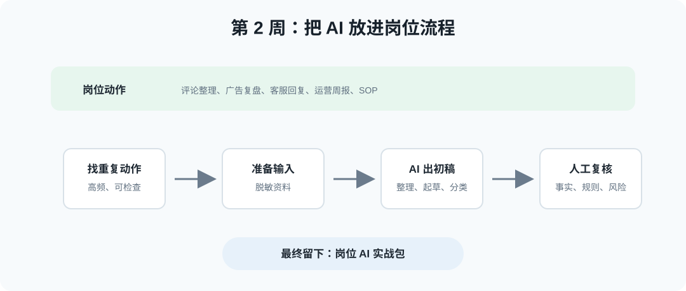
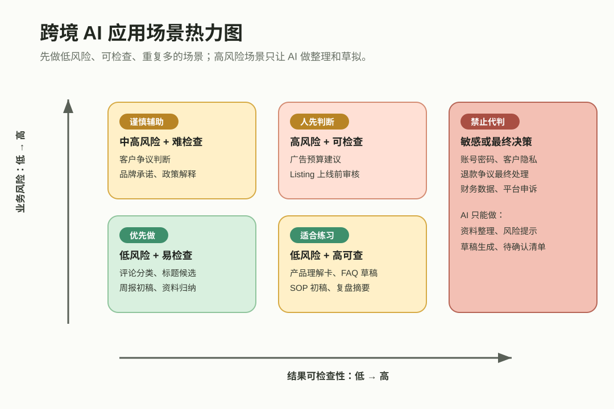
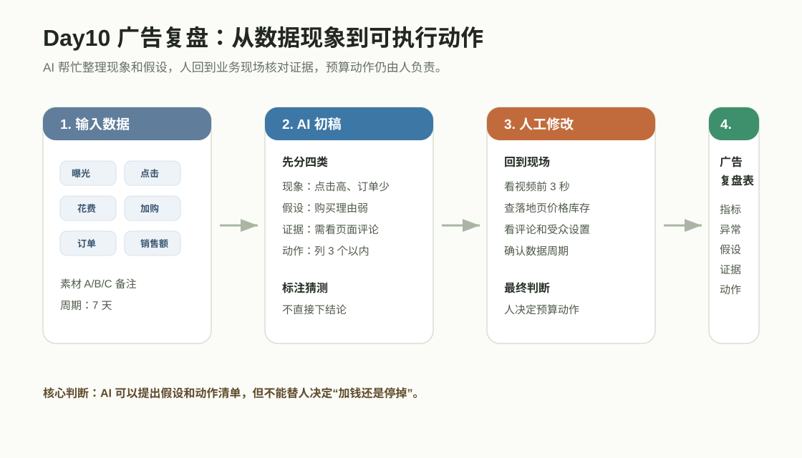

# 第 2 周：岗位 AI 实战单元


## 单元核心问题

我如何把 AI 放进岗位流程，而不是零散试工具？

## 单元成果

本周最终形成《岗位 AI 实战包》。它不是一组聊天记录，而是一套可以继续使用的岗位工作材料。

本文件已按 TCI 化结构整理第 2 周 7 个章节。第 10 章是最完整的数据复盘样板，其他章节沿用同一学习闭环。





第 2 周选试点动作时，先看“重复程度、业务风险、结果可检查性”三件事：

| 场景 | 适合程度 | 原因 | 人工检查重点 |
| --- | --- | --- | --- |
| 评论分类、资料归纳 | 高 | 重复多、风险低、容易核对 | 分类是否贴近真实问题 |
| 周报初稿、SOP 初稿 | 高 | 有固定结构，可复用 | 数据是否准确、结论是否克制 |
| 客服 FAQ 草稿 | 中 | 可节省起草时间，但涉及客户体验 | 政策、承诺和升级条件 |
| 广告复盘假设 | 中 | 可帮助整理现象，但不能替人决策 | 数据来源、预算动作 |
| 退款争议、账号申诉 | 低 | 风险高、责任重 | AI 只做资料整理和风险提示 |

---

# 第 8 章：从“会用 AI”到“用 AI 做工作”

## 1. 真实工作挑战

很多人已经会偶尔问 AI，但岗位工作没有真正变轻。问题通常不是工具不够，而是 AI 没有被放进固定动作里。

例如运营每天都要整理评论、跟进广告、处理客服问题、写周报。如果每次都临时问 AI，结果会零散，无法复用。

## 2. 本章核心问题

我如何找出岗位里最适合先用 AI 辅助的一个动作？

## 3. 学完能带走什么

本章交付物是《岗位提效诊断表》。它是第 2 周所有岗位实战的起点。

完成后，你应该能说清：

- 自己岗位里有哪些重复动作。
- 哪些动作风险低、可检查、适合先试点。
- AI 能帮哪一步，人必须检查哪一步。
- 本周先优化哪一个动作。

## 4. 关键概念

| 概念 | 大白话解释 |
| --- | --- |
| 岗位任务 | 每天或每周必须完成的真实工作，不是职责口号。 |
| 提效诊断 | 找出重复、耗时、容易出错、结果可检查的动作。 |
| 输入输出 | 执行动作前需要什么资料，完成后留下什么结果。 |
| 试点动作 | 先挑一个低风险动作跑通，不一次改完整个岗位。 |

## 5. 方法框架

使用“岗位动作四格诊断法”。

| 类型 | 判断 | 处理方式 |
| --- | --- | --- |
| 高重复低风险 | 经常做，出错影响小 | 优先试点 |
| 高重复高风险 | 经常做，涉及客户或预算 | AI 辅助，人强复核 |
| 低重复低风险 | 偶尔做，风险小 | 可练习，不优先 |
| 低重复高风险 | 偶尔做，影响大 | 暂不交给 AI |

## 6. 案例与证据材料

一位运营列出一天工作：

| 动作 | 频率 | 风险 | 结果是否可检查 |
| --- | --- | --- | --- |
| 整理评论问题 | 每周 | 低 | 是 |
| 写客服争议回复 | 每天 | 高 | 是 |
| 看广告异常 | 每天 | 中 | 是 |
| 决定下周预算 | 每周 | 高 | 是 |
| 写运营周报 | 每周 | 中 | 是 |

优先试点不是“决定预算”，而是“整理评论问题”或“周报初稿”。

## 7. AI 辅助步骤

可以让 AI 帮你把岗位动作分类：

```text
请基于我的岗位工作记录，帮我按“重复程度 / 业务风险 / AI 可辅助步骤 / 人工检查点 / 适合试点程度”整理成表格。

要求：
- 不要替我决定最终优先级。
- 高风险动作要标出人工复核。
- 优先推荐 1 个低风险、可检查的小动作。
```

## 8. 人工判断步骤

人要判断：

- 这个动作是否真的来自日常工作。
- 是否有足够资料给 AI。
- 输出结果是否能被检查。
- 如果出错，会不会影响客户、平台规则、预算或品牌承诺。

## 9. 课堂活动

活动名称：拆解自己的岗位一天。

步骤：

1. 写出最近一天或一周的 8 个真实动作。
2. 标注重复程度和风险。
3. 选出 1 个高重复低风险动作。
4. 写出它的输入、输出和人工检查点。

## 10. 本章交付物

交付物：《岗位提效诊断表》。

最低完成标准：

- 至少列出 8 个岗位动作。
- 每个动作有重复程度和风险判断。
- 至少选出 1 个试点动作。
- 写清 AI 可辅助步骤和人工检查点。

## 11. 自评与互评

| 维度 | 好 | 中性 | 需要继续改 |
| --- | --- | --- | --- |
| 动作真实 | 来自实际工作记录 | 部分真实，部分偏泛 | 写成岗位职责口号 |
| 风险判断 | 能区分低风险和高风险 | 有判断但理由不清 | 只看能不能用 AI |
| 试点选择 | 小、具体、可检查 | 稍大但可拆 | 一开始就做高风险任务 |
| 复用价值 | 能指导后续章节 | 只能参考 | 做完不能落到动作 |

## 12. 常见误区

| 误区 | 问题 | 改法 |
| --- | --- | --- |
| 把岗位写成职责 | 无法执行 | 写具体动作 |
| 先做高风险动作 | 容易出业务问题 | 先做低风险试点 |
| 追求自动化 | 放大混乱 | 先把人工流程跑清楚 |

## 13. 可迁移场景

这张诊断表可以用于运营、广告、客服、供应链、老板助理等岗位。迁移时保留同一个判断：重复程度、风险、输入、输出、人工检查点。

---

# 第 9 章：AI 辅助广告素材方向

## 1. 真实工作挑战

广告素材经常变成“今天想到什么就做什么”。这样素材很多，但复盘时看不出到底验证了哪个假设。

AI 能帮你扩展素材方向，但不能替你判断哪些方向真实可拍、可证明、符合品牌和平台规则。

## 2. 本章核心问题

我如何用 AI 把广告素材从随机灵感变成可测试的方向？

## 3. 学完能带走什么

本章交付物是《广告素材方向表》。它会成为第 10 章广告数据复盘的前置材料。

## 4. 关键概念

| 概念 | 大白话解释 |
| --- | --- |
| 素材方向 | 一组围绕同一痛点、场景或卖点的创意假设。 |
| 钩子 | 前 3 秒吸引用户继续看的画面或话。 |
| 证明点 | 支撑卖点的证据，如演示、对比、评价、参数。 |
| 测试假设 | 这条素材想验证什么。 |

## 5. 方法框架

使用“人群-痛点-钩子-场景-证明”五格素材法。

| 步骤 | 问题 |
| --- | --- |
| 人群 | 这条素材给谁看？ |
| 痛点 | 这个人正在被什么问题困扰？ |
| 钩子 | 前 3 秒怎么让他停下来？ |
| 场景 | 在什么真实使用场景里展示？ |
| 证明 | 用什么证据让他相信？ |

## 6. 案例与证据材料

产品：厨房切菜辅助工具。

用户痛点来自评论：

- 切菜慢。
- 手容易碰到食材。
- 清洗麻烦。
- 厨房台面容易乱。

可转成素材方向：

| 方向 | 假设 |
| --- | --- |
| 省时间 | 用户在意备菜效率 |
| 少接触 | 用户在意卫生和安全感 |
| 易清洗 | 用户在意用完后的麻烦程度 |

## 7. AI 辅助步骤

```text
请基于产品理解卡和用户痛点，生成 3 个广告素材方向。

每个方向请包含：目标人群、痛点、前 3 秒钩子、使用场景、证明点、测试假设。

要求：
- 一个方向只验证一个主要假设。
- 不要夸大承诺。
- 标出哪些证明点需要人工确认是否真实可拍。
```

## 8. 人工判断步骤

人要检查：

- 痛点是否来自真实评论或客服反馈。
- 钩子是否夸大。
- 证明点是否能真实拍出来。
- 一个素材是否只验证一个假设。

## 9. 课堂活动

活动名称：为一个产品生成 3 个素材方向。

步骤：

1. 从产品理解卡里选 1 个产品。
2. 从评论里选 3 个痛点。
3. 用 AI 生成素材方向表。
4. 删除无法真实证明的方向。
5. 保留 3 个可测试方向。

## 10. 本章交付物

交付物：《广告素材方向表》。

最低完成标准：

- 至少 3 个素材方向。
- 每个方向有目标人群、痛点、钩子、场景、证明点。
- 每个方向只验证一个假设。
- 已标出需要人工确认的证明点。

## 11. 自评与互评

| 维度 | 好 | 中性 | 需要继续改 |
| --- | --- | --- | --- |
| 痛点来源 | 来自真实评论或产品卡 | 有痛点但证据弱 | 凭空想象 |
| 钩子 | 直接但不夸张 | 有吸引力但偏泛 | 虚假或过度承诺 |
| 测试假设 | 一个方向一个假设 | 假设略混杂 | 一个素材讲太多 |
| 可执行性 | 能拍、能测、能复盘 | 需要再细化 | 只是创意口号 |

## 12. 常见误区

| 误区 | 问题 | 改法 |
| --- | --- | --- |
| 只追热点形式 | 和购买理由无关 | 回到人群和痛点 |
| 一个素材讲太多 | 难复盘 | 一个素材一个假设 |
| 钩子夸大 | 伤害信任 | 保持真实可证明 |

## 13. 可迁移场景

可迁移到短视频广告、主图测试、详情页首屏、邮件标题、达人脚本。保留同一条线：人群、痛点、钩子、场景、证明。

---

# 第 10 章：AI 辅助广告数据复盘

## 1. 真实工作挑战

你负责一组广告素材。上周素材点击率看起来不错，但订单没有明显增加，花费还在上涨。

如果只看一个数字，很容易做出过度反应：

- 看到点击率高，就继续加预算。
- 看到 ROAS 低，就立刻停掉素材。
- 看到转化下降，就把问题全归到落地页。

这些判断都可能太快。广告复盘要先把“现象、假设、证据、动作”分开。

## 2. 本章核心问题

我如何借助 AI 整理广告数据，但仍然由人判断下一步动作？

## 3. 学完能带走什么

本章交付物是《广告数据复盘表》。

它会进入第 2 周的《岗位 AI 实战包》，帮助你把广告工作从“看数据”推进到“用数据改动作”。

完成后，你应该能说清：

- 这组广告数据里发生了什么。
- 哪些地方只是现象，哪些地方是原因假设。
- 需要补充哪些业务证据。
- 下周最多做哪 3 个动作。

## 4. 关键概念

| 概念 | 大白话解释 |
| --- | --- |
| 指标 | 用来观察广告表现的数字，例如曝光、点击、花费、订单、ROAS。 |
| 异常 | 和目标、历史或同组素材相比，明显高了或低了的地方。 |
| 假设 | 对异常原因的解释。假设不能直接当结论，需要证据支持。 |
| 证据 | 能帮助判断假设是否成立的资料，例如素材内容、落地页、库存、价格、评论。 |
| 动作 | 复盘后真正要执行的事，例如继续测试、修改钩子、检查页面、暂停素材。 |

广告数据像体检报告。一个指标异常不等于马上下结论，要把多个指标和业务现场放在一起看。

## 5. 方法框架

本章使用“指标-异常-假设-证据-动作”五步复盘法。

| 步骤 | 做什么 | 产出 |
| --- | --- | --- |
| 1. 指标 | 先看本次复盘最重要的 3 到 5 个指标 | 核心指标表 |
| 2. 异常 | 找出和目标或同组素材相比偏离明显的地方 | 异常点清单 |
| 3. 假设 | 请 AI 帮忙列出可能原因 | 原因假设列表 |
| 4. 证据 | 回到素材、页面、评论、库存、价格和受众设置核对 | 证据记录 |
| 5. 动作 | 写出下周 3 个以内具体动作 | 优化动作清单 |

这一章要特别注意：AI 适合帮你整理和提出假设，不适合替你决定预算。



这张图的读法：AI 先把数据变成观察和假设，人再回到素材、页面、库存、评论和受众设置核对。

| 环节 | AI 做什么 | 人改什么 | 最后留下什么 |
| --- | --- | --- | --- |
| 数据整理 | 把曝光、点击、花费、加购、订单整理成现象 | 检查周期、口径和缺失数据 | 核心指标表 |
| 假设生成 | 根据异常列出可能原因 | 区分事实、猜测和需要补证据的地方 | 原因假设列表 |
| 动作草案 | 整理下周 3 个以内动作 | 判断预算、素材、页面和受众动作是否可执行 | 广告数据复盘表 |

## 6. 案例与证据材料

案例场景：某 DTC 店铺测试 3 条短视频广告，周期为 7 天。

脱敏数据如下：

| 素材 | 方向 | 曝光 | 点击 | 花费 | 加购 | 订单 | 销售额 | 备注 |
| --- | --- | ---: | ---: | ---: | ---: | ---: | ---: | --- |
| 素材 A | 强痛点开头 | 12000 | 420 | 360 | 18 | 3 | 210 | 点击高，评论里有人问材质 |
| 素材 B | 使用场景演示 | 9000 | 180 | 210 | 20 | 8 | 640 | 点击低，成交相对稳定 |
| 素材 C | 价格优惠 | 15000 | 300 | 390 | 12 | 2 | 140 | 点击一般，订单少 |

观察时不要急着判断谁好谁坏。先看每条素材的漏斗：

```text
曝光 -> 点击 -> 加购 -> 订单 -> 销售额
```

素材 A 可能吸引点击，但购买理由不够强。素材 B 可能点击不高，但来的人更精准。素材 C 可能只靠优惠吸引注意，但没有建立足够信任。

这些都只是初步假设，需要继续看素材内容、落地页、评论和库存情况。

## 7. AI 辅助步骤

AI 适合帮你做三件事：

1. 把数据转成结构化观察。
2. 列出可能原因。
3. 把下一步动作整理成清单。

可以这样提问：

```text
你是一位务实的跨境电商广告复盘助手。

请基于下面脱敏广告数据，帮我整理一版广告复盘初稿。

业务背景：
我们在测试 3 条短视频广告，周期 7 天。目标不是马上决定预算，而是找出下周优化方向。

数据：
【粘贴素材、曝光、点击、花费、加购、订单、销售额、备注】

请按下面结构输出：
1. 先列出每条素材的主要现象。
2. 再列出可能原因，明确哪些只是猜测。
3. 写出需要人工补充确认的证据。
4. 给出下周 3 个以内可执行动作。

要求：
- 不要编造数据里没有的信息。
- 不要替我做最终预算决定。
- 所有结论都要标出需要人工确认的地方。
- 语言清楚、克制、适合真实工作复盘。
```

## 8. 人工判断步骤

AI 给出初稿后，人要检查这些地方：

| 检查点 | 为什么要人工判断 |
| --- | --- |
| 数据周期 | 单日波动不能直接代表趋势 |
| 素材内容 | AI 只看表格时，不知道视频前 3 秒到底讲了什么 |
| 落地页状态 | 页面速度、价格、库存、评价会影响转化 |
| 受众设置 | 点击高低可能和人群宽窄有关 |
| 预算动作 | 加预算、停素材、换人群涉及业务风险，必须由人负责 |

本章最重要的判断是：不要让 AI 直接决定“加钱还是停掉”。AI 可以帮你把证据摆整齐，决定权仍在你手里。

## 9. 课堂活动

活动名称：复盘 3 条广告素材。

建议时间：25 分钟。

活动步骤：

1. 5 分钟：阅读案例数据，圈出你认为最明显的 2 个异常。
2. 7 分钟：用提示词让 AI 生成复盘初稿。
3. 5 分钟：标出 AI 输出中“只是猜测”的部分。
4. 5 分钟：补充人工需要确认的证据。
5. 3 分钟：写出下周最多 3 个动作。

课堂产出是一张《广告数据复盘表》，不需要做成完整报告。

## 10. 本章交付物

交付物：《广告数据复盘表》。

最低完成标准：

- 写清数据周期和复盘对象。
- 至少列出 3 个核心指标。
- 至少写出 2 个异常点。
- 每个原因假设都标出证据或待确认项。
- 下周动作不超过 3 个，并且能执行。

推荐文件名：

```text
Day10_广告数据复盘表_姓名_v2
```

## 11. 自评与互评

| 维度 | 好 | 中性 | 需要继续改 |
| --- | --- | --- | --- |
| 真实问题 | 来自真实广告复盘，有明确对象和周期 | 有广告数据，但目标不够清楚 | 只是想试 AI，没有明确业务问题 |
| 数据输入 | 数据脱敏，包含曝光、点击、花费、转化相关字段 | 有部分数据，但缺少关键字段 | 数据太少，或包含敏感账户信息 |
| 假设与证据 | 能区分现象、假设和证据 | 有原因分析，但证据不够 | 把 AI 猜测当成结论 |
| 人工判断 | 明确写出需要人工确认的点 | 有检查，但不够具体 | 直接复制 AI 输出 |
| 下一步动作 | 动作少、具体、能执行 | 有动作，但偏泛 | 动作过多或直接涉及预算拍板 |

互评时，可以只问三个问题：

1. 这份复盘有没有把现象和原因分开？
2. 哪个判断还需要补证据？
3. 下周动作是否真的能执行？

## 12. 常见误区

| 误区 | 问题 | 改法 |
| --- | --- | --- |
| 只看 ROAS | 忽略曝光、点击、加购、订单之间的断点 | 分层看漏斗 |
| 让 AI 直接决定预算 | 预算涉及业务风险 | AI 整理信息，人做判断 |
| 没有写数据周期 | 不同周期不可比 | 每次复盘先写清时间范围 |
| 动作太多 | 团队执行不下去 | 下周只保留 1 到 3 个动作 |

## 13. 可迁移场景

这套复盘法还能迁移到：

- Amazon Ads 关键词复盘。
- Meta / TikTok 素材测试复盘。
- Google Ads 搜索词复盘。
- 达人投放素材表现复盘。
- 邮件营销标题和点击复盘。

迁移时保留同一条线：

```text
指标 -> 异常 -> 假设 -> 证据 -> 动作
```

---

# 第 11 章：AI 辅助客服和售后回复

## 1. 真实工作挑战

客服回复最怕两个问题：慢和乱。慢会影响客户体验，乱会造成承诺不一致，甚至触碰平台规则。

AI 可以帮客服先搭回复骨架，但不能无人监管地自动回复客户。

## 2. 本章核心问题

我如何用 AI 整理高频客服问题，并生成可人工审核的回复库？

## 3. 学完能带走什么

本章交付物是《客服 FAQ 与回复库》。它能帮助团队保持回复速度、语气和边界一致。

## 4. 关键概念

| 概念 | 大白话解释 |
| --- | --- |
| FAQ | 高频问题和标准答案集合。 |
| 售后边界 | 哪些能解释，哪些必须升级人工或主管。 |
| 语气一致 | 不同客服回复要保持同一种品牌感觉。 |
| 敏感信息 | 订单号、地址、联系方式等不能随意输入 AI。 |

## 5. 方法框架

使用“情绪-事实-规则-方案-复核”五段回复法。

| 步骤 | 做什么 |
| --- | --- |
| 情绪 | 先回应客户着急、失望或疑问 |
| 事实 | 核对物流、产品、订单状态，但先脱敏 |
| 规则 | 对照平台和店铺政策 |
| 方案 | 给出清楚下一步 |
| 复核 | 发送前检查语气、承诺和敏感信息 |

## 6. 案例与证据材料

客户问题：

```text
我的包裹已经晚了 5 天，你们到底什么时候送到？如果再不到我就要投诉。
```

已知资料：

- 物流状态：已到本地配送中心，预计 2 到 3 天内更新。
- 店铺政策：可协助查询，暂不能直接承诺赔偿。
- 客户情绪：着急、生气，需要先安抚。

## 7. AI 辅助步骤

```text
请根据下面脱敏客服问题，生成一版温和、清楚、有边界的回复草稿。

客户问题：【粘贴脱敏问题】
可用背景：【物流摘要 / 店铺政策 / 产品信息】

请输出：
1. 客户情绪判断
2. 回复草稿
3. 需要人工确认的信息
4. 不能承诺的内容
5. 是否需要升级人工
```

## 8. 人工判断步骤

人要检查：

- 物流和订单事实是否准确。
- 有没有承诺政策之外的补偿。
- 有没有泄露客户隐私。
- 语气是否既安抚又不推责。
- 是否需要升级给主管或平台流程。

## 9. 课堂活动

活动名称：整理 5 个高频客服问题。

步骤：

1. 准备 5 条脱敏客服问题。
2. 按物流、退换、质量、使用、售前分类。
3. 用 AI 生成回复草稿。
4. 人工删除过度承诺。
5. 整理成 FAQ 与回复库。

## 10. 本章交付物

交付物：《客服 FAQ 与回复库》。

最低完成标准：

- 至少 5 个高频问题。
- 每个问题有回复草稿和人工检查点。
- 标出是否需要转人工。
- 不包含客户隐私。

## 11. 自评与互评

| 维度 | 好 | 中性 | 需要继续改 |
| --- | --- | --- | --- |
| 问题分类 | 高频问题分类清楚 | 分类可用但略粗 | 问题混在一起 |
| 回复语气 | 温和、清楚、有边界 | 能用但偏模板化 | 冷硬或过度承诺 |
| 规则边界 | 明确不能承诺什么 | 有提醒但不具体 | AI 直接替客服承诺 |
| 安全处理 | 已脱敏并标转人工 | 有脱敏意识 | 包含敏感信息 |

## 12. 常见误区

| 误区 | 问题 | 改法 |
| --- | --- | --- |
| 直接复制 AI 回复 | 可能承诺过度 | 发送前人工复核 |
| 只讲规则不安抚 | 客户体验差 | 先情绪，再事实 |
| 不写升级条件 | 新人不知道何时转人工 | 写清转人工标准 |

## 13. 可迁移场景

可迁移到售前咨询、差评安抚、退换货说明、物流延迟、产品使用指导。核心不变：情绪、事实、规则、方案、复核。

---

# 第 12 章：AI 辅助运营周报

## 1. 真实工作挑战

很多周报写成流水账：本周做了什么、发了什么、看了什么。团队真正需要的是：发生了什么变化、为什么、下周怎么办。

AI 可以帮你把数据和事件整理成结构，但原因判断仍然要回到业务现场。

## 2. 本章核心问题

我如何用 AI 把运营周报从流水账改成可复盘、可执行的工作记录？

## 3. 学完能带走什么

本章交付物是《运营周报模板》。

## 4. 关键概念

| 概念 | 大白话解释 |
| --- | --- |
| 核心指标 | 销售、流量、转化、库存、广告、客服等关键数字。 |
| 变化 | 和上周、目标或活动前相比的差异。 |
| 原因假设 | 对变化的解释，需要数据或事件支持。 |
| 下周动作 | 接下来要做的具体事项。 |

## 5. 方法框架

使用“数据-变化-原因-动作-风险”五段周报法。

| 步骤 | 做什么 |
| --- | --- |
| 数据 | 只列核心指标 |
| 变化 | 标出上升、下降、异常 |
| 原因 | 结合广告、库存、评价、活动提出假设 |
| 动作 | 写出下周 3 到 5 个事项 |
| 风险 | 提醒库存、评分、预算、物流等问题 |

## 6. 案例与证据材料

某 Amazon 店铺本周销售额下降，但广告点击上升，库存接近预警。

可用资料：

- 本周销售额、订单量、转化率。
- 广告点击、花费、ACOS。
- 库存天数。
- 本周活动和价格调整记录。

## 7. AI 辅助步骤

```text
请基于下面脱敏运营数据，生成一版 1 页周报初稿。

请按“本周核心数据 / 主要变化 / 可能原因 / 下周动作 / 风险提醒”输出。

要求：
- 不要把未经确认的原因写成事实。
- 标出需要人工确认的数据和判断。
- 下周动作要有负责人、时间和验收标准。
```

## 8. 人工判断步骤

人要检查：

- 时间范围和数据来源是否清楚。
- 原因是否有事件或数据支持。
- 是否遗漏库存、评价、价格、活动等背景。
- 下周动作是否有人负责。

## 9. 课堂活动

活动名称：写一份 1 页运营周报。

步骤：

1. 选 5 个以内核心指标。
2. 写出本周 3 个主要变化。
3. 用 AI 生成周报初稿。
4. 人工补充原因证据和风险。
5. 把下周动作写成清单。

## 10. 本章交付物

交付物：《运营周报模板》。

最低完成标准：

- 有时间范围和数据来源。
- 有核心数据和变化摘要。
- 有原因假设和待确认项。
- 下周动作有负责人、时间和验收标准。

## 11. 自评与互评

| 维度 | 好 | 中性 | 需要继续改 |
| --- | --- | --- | --- |
| 数据选择 | 少而关键 | 数据略多 | 堆后台截图 |
| 变化判断 | 能看到重点变化 | 变化描述偏泛 | 只写做了什么 |
| 原因分析 | 有证据或待确认项 | 有假设但证据弱 | 把猜测当事实 |
| 行动计划 | 明确可执行 | 可参考但不够细 | 没负责人或标准 |

## 12. 常见误区

| 误区 | 问题 | 改法 |
| --- | --- | --- |
| 写成流水账 | 看不出重点 | 围绕变化和动作写 |
| 数据没来源 | 无法复查 | 写清时间和来源 |
| 动作太虚 | 下周难执行 | 写负责人和验收标准 |

## 13. 可迁移场景

可迁移到月报、活动复盘、广告周报、客服周报、老板简报。保留同一结构：数据、变化、原因、动作、风险。

---

# 第 13 章：把一个动作变成 SOP

## 1. 真实工作挑战

很多团队不是没人会做，而是只有某个人会做。经验不写下来，换人、忙起来或重复做时就容易变形。

AI 可以帮你把口述流程整理成 SOP 初稿，人要补充边界和异常处理。

## 2. 本章核心问题

我如何把一个做过的岗位动作，整理成别人也能照着做的 SOP？

## 3. 学完能带走什么

本章交付物是《岗位 SOP 模板》。

## 4. 关键概念

| 概念 | 大白话解释 |
| --- | --- |
| SOP | 标准操作流程，写清输入、步骤、输出和检查。 |
| 动作颗粒度 | 步骤不能太粗，也不能细到读不下去。 |
| 检查标准 | 告诉执行者做到什么程度算完成。 |
| 异常处理 | 遇到特殊情况时怎么暂停、复核或升级。 |

## 5. 方法框架

使用“输入-步骤-输出-检查-异常”五件套。

| 部分 | 要写清什么 |
| --- | --- |
| 输入 | 资料、权限、模板 |
| 步骤 | 按真实顺序写 |
| 输出 | 最终文件或结果 |
| 检查 | 合格标准 |
| 异常 | 何时暂停、复核、升级 |

## 6. 案例与证据材料

场景：每周整理竞品评论，但团队成员分类方式不同。

可整理成 SOP：

```text
准备评论 -> 清洗无关内容 -> AI 初步分类 -> 人工核对原文证据 -> 输出高频问题 -> 归档命名
```

## 7. AI 辅助步骤

```text
请把下面这个岗位动作整理成简单 SOP。

工作动作：【填写】
当前做法：【粘贴操作记录或口述流程】

请输出：SOP 名称、适用场景、输入资料、操作步骤、输出结果、检查标准、常见错误、需要人工判断的地方。
```

## 8. 人工判断步骤

人要补充：

- 哪些输入资料必须脱敏。
- 哪些步骤不能跳过。
- 哪些结论必须保留原文证据。
- 哪些情况需要升级或二次复核。

## 9. 课堂活动

活动名称：把一个重复动作写成 SOP。

步骤：

1. 选择广告复盘、客服 FAQ、周报或评论分析中的一个动作。
2. 口述自己平时怎么做。
3. 用 AI 整理成五件套。
4. 人工补检查标准和异常处理。
5. 让同伴读一遍，标出不清楚的地方。

## 10. 本章交付物

交付物：《岗位 SOP 模板》。

最低完成标准：

- 有输入、步骤、输出、检查、异常。
- 步骤按真实顺序写。
- 至少 3 个检查项。
- 至少 2 个异常处理条件。

## 11. 自评与互评

| 维度 | 好 | 中性 | 需要继续改 |
| --- | --- | --- | --- |
| 可执行性 | 新人能照着做 | 大体能懂 | 只是原则 |
| 检查标准 | 明确可判断 | 有标准但偏泛 | 不知道是否完成 |
| 异常处理 | 有暂停和升级条件 | 有提醒但不清楚 | 遇到异常就卡住 |
| 复用价值 | 能进入团队流程 | 可个人复用 | 只像一次记录 |

## 12. 常见误区

| 误区 | 问题 | 改法 |
| --- | --- | --- |
| SOP 写成原则 | 不能执行 | 写动作和标准 |
| 没有异常处理 | 特殊情况会卡住 | 写暂停和升级条件 |
| 写完不更新 | 很快失效 | 保留版本号和更新时间 |

## 13. 可迁移场景

可迁移到评论分析 SOP、广告复盘 SOP、客服升级 SOP、周报 SOP、新品资料整理 SOP。

---

# 第 14 章：第 2 周复盘：建立岗位 AI 实战包

## 1. 真实工作挑战

第 2 周会产出很多材料：岗位诊断、广告方向、广告复盘、客服回复、周报、SOP。如果不整理，很快又会散掉。

本章要把它们打包成一个岗位工作台。

## 2. 本章核心问题

我如何把第 2 周的材料整理成一套别人也能看懂、自己下周还能用的岗位 AI 实战包？

## 3. 学完能带走什么

本章交付物是《岗位 AI 实战包》。它会成为第 3 周真实项目落地的输入。

## 4. 关键概念

| 概念 | 大白话解释 |
| --- | --- |
| 岗位实战包 | 围绕一个岗位沉淀的工具、模板、流程和反馈标准。 |
| 岗位闭环 | 诊断问题、执行动作、得到反馈、固化流程。 |
| 交接友好 | 别人能看懂用途、输入、输出和注意事项。 |
| 持续更新 | 实战包会随业务迭代，不是一次性文件夹。 |

## 5. 方法框架

使用“场景-工具-流程-反馈-索引”五步打包法。

| 步骤 | 做什么 |
| --- | --- |
| 场景 | 说明服务哪个岗位、哪个任务 |
| 工具 | 放入提示词、表格、模板 |
| 流程 | 放入 SOP 和执行顺序 |
| 反馈 | 放入评分表和复盘方式 |
| 索引 | 一页说明每个文件怎么用 |

## 6. 案例与证据材料

广告专员的岗位包可以包含：

- 岗位提效诊断表。
- 广告素材方向表。
- 广告数据复盘表。
- 广告复盘 SOP。
- 单章评分标准。

## 7. AI 辅助步骤

```text
请帮我把下面这些岗位材料整理成一个岗位 AI 实战包目录。

岗位：【填写】
已有材料：【列出文件名和用途】

请输出：
1. 岗位包首页目录
2. 每个文件什么时候用
3. 推荐使用顺序
4. 缺少哪些材料
5. 第 3 周适合落地的真实项目建议
```

## 8. 人工判断步骤

人要判断：

- 哪些文件真的会再次使用。
- 哪些材料重复，可以合并。
- 哪些模板缺少检查标准。
- 第 3 周选择哪个小项目最合适。

## 9. 课堂活动

活动名称：整理岗位 AI 实战包。

步骤：

1. 选择一个岗位视角。
2. 放入 3 个以上可复用文件。
3. 为每个文件写使用场景和输入资料。
4. 加入一个 SOP 或固定流程。
5. 写出第 3 周想落地的真实项目。

## 10. 本章交付物

交付物：《岗位 AI 实战包》。

最低完成标准：

- 有岗位包首页。
- 至少 3 个可复用文件。
- 至少 1 个 SOP。
- 每个文件有使用场景和输入资料说明。
- 有第 3 周项目候选。

## 11. 自评与互评

| 维度 | 好 | 中性 | 需要继续改 |
| --- | --- | --- | --- |
| 目录清楚 | 一眼能看懂怎么用 | 有目录但说明少 | 文件堆在一起 |
| 工具可复用 | 模板、提示词、评分都有 | 有工具但不完整 | 只有聊天记录 |
| 流程完整 | 有 SOP 和反馈 | 有流程但缺验收 | 不知道下一步 |
| 项目衔接 | 能进入第 3 周 | 方向还需收窄 | 和真实工作无关 |

## 12. 常见误区

| 误区 | 问题 | 改法 |
| --- | --- | --- |
| 全部文件都塞进去 | 看似丰富，实际难用 | 只保留会再用的 |
| 没有使用顺序 | 不知道从哪开始 | 写一页索引 |
| 缺反馈表 | 无法越用越好 | 加评分或复盘标准 |

## 13. 可迁移场景

可以做广告岗位包、客服岗位包、运营岗位包、老板决策辅助包。无论哪个岗位，都保留：场景、工具、流程、反馈、索引。
