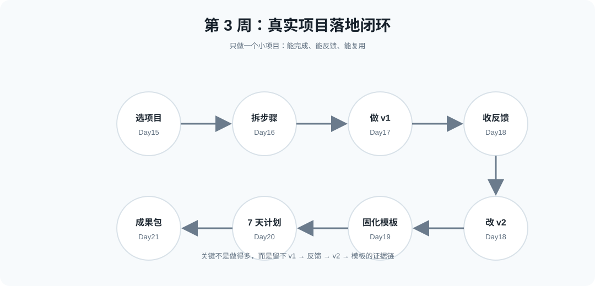
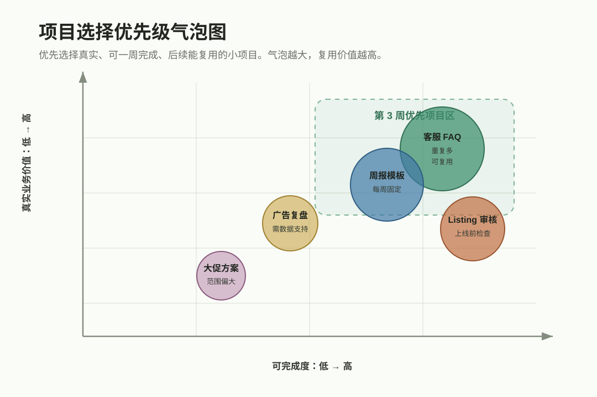
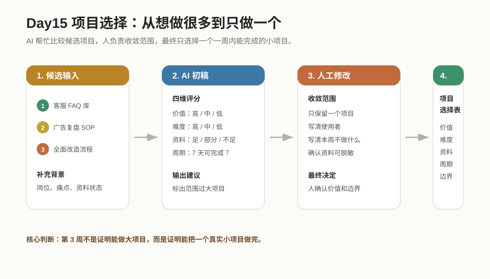
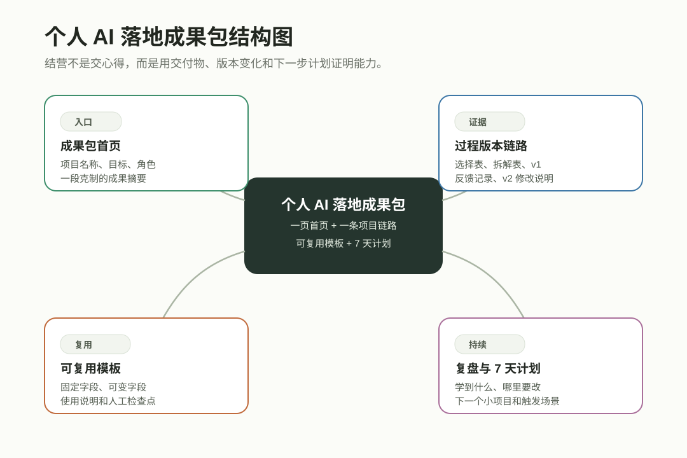
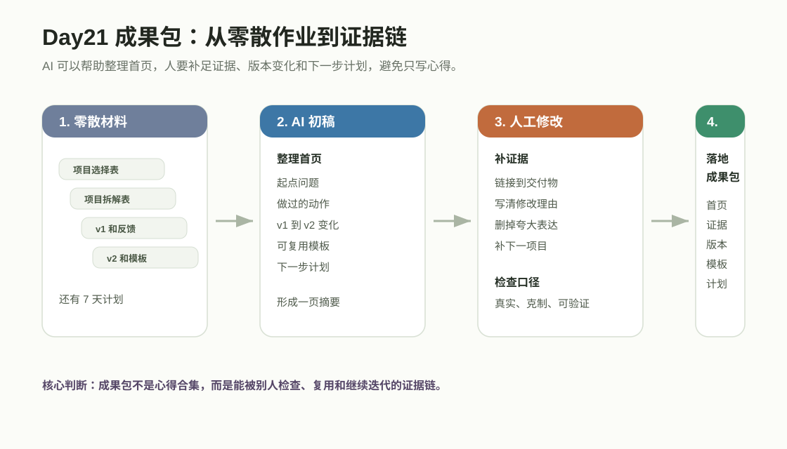

# 第 3 周：真实项目落地单元


## 单元核心问题

我如何完成一个真实、可展示、可复用的小项目？

## 单元成果

本周最终形成《个人 AI 落地成果包》。

第 3 周不做复杂自动化，也不追求一次改造整个公司。它只做一件事：选择一个真实小项目，拆成步骤，做出 v1，收集反馈，改成 v2，固化模板，再设计 7 天继续使用计划。



---

# 第 15 章：选择一个真实项目

## 1. 真实工作挑战

学完前两周后，很多人会想同时改 Listing、广告、客服、周报和 SOP。项目一多，就容易每个都开头，每个都没有完成。

第 3 周只选一个小项目。它要来自真实工作，有明确使用者，有一周内能完成的交付物。

## 2. 本章核心问题

我如何选出一个小、真、可完成、可复用的落地项目？

## 3. 学完能带走什么

本章交付物是《落地项目选择表》。

## 4. 关键概念

| 概念 | 大白话解释 |
| --- | --- |
| 真实项目 | 来自当前工作，有实际使用者和交付物。 |
| 项目范围 | 这次做什么，也写清不做什么。 |
| 可完成性 | 资料、时间、权限和能力支持一周内做出第一版。 |
| 业务价值 | 做完后能减少重复劳动、提升质量或让协作更清楚。 |

## 5. 方法框架

使用“价值-难度-资料-周期”四维选择法。

| 维度 | 评分问题 |
| --- | --- |
| 价值 | 做完后是否改善一个真实工作环节？ |
| 难度 | 现有能力能否完成第一版？ |
| 资料 | 是否已有足够输入资料？ |
| 周期 | 是否能在 7 天内完成并复盘？ |

优先选择高价值、低到中等难度、资料较全、周期可控的项目。



项目选择时不要只看“想做什么”，要看是否能在一周内留下证据：

| 项目类型 | 是否适合第 3 周 | 判断理由 | 收敛建议 |
| --- | --- | --- | --- |
| 客服 FAQ 与回复库 | 推荐 | 重复多、材料易收集、可复用 | 先做一个问题类型 |
| 运营周报模板 | 推荐 | 每周都用，结构稳定 | 先覆盖一个店铺或一个产品线 |
| Listing 审核清单 | 推荐 | 可检查、能直接服务上线前审核 | 先做一个品类 |
| 广告复盘 SOP | 备选 | 需要真实数据，难度中等 | 只做一类异常场景 |
| 全面改造运营流程 | 暂不做 | 范围太大，一周难验收 | 缩成一个固定动作 |



这张图的读法：AI 帮你比较候选项目，人负责缩小范围并做最终选择。

| 环节 | AI 做什么 | 人改什么 | 最后留下什么 |
| --- | --- | --- | --- |
| 候选项目整理 | 按价值、难度、资料、周期做初步比较 | 补充真实使用者、资料状态和业务限制 | 候选项目清单 |
| 范围判断 | 标出范围过大和资料不足的项目 | 把大项目缩成一个可交付的小动作 | 收敛后的项目范围 |
| 推荐排序 | 给出推荐程度和理由 | 最终只选 1 个，并写清本周不做什么 | 落地项目选择表 |

## 6. 案例与证据材料

候选项目：

| 候选项目 | 价值 | 难度 | 资料 | 周期 | 判断 |
| --- | --- | --- | --- | --- | --- |
| 建客服 FAQ 与回复库 | 高 | 中 | 足 | 7 天可完成 | 推荐 |
| 全面改造运营流程 | 高 | 高 | 不足 | 过大 | 暂不做 |
| 重新写全部 Listing | 高 | 高 | 部分 | 过大 | 缩小范围 |
| 做一份广告复盘 SOP | 中 | 中 | 足 | 可完成 | 备选 |

## 7. AI 辅助步骤

```text
请帮我评估下面几个候选项目，按“价值 / 难度 / 资料 / 周期 / 推荐程度 / 范围是否过大”输出表格。

候选项目：【填写】
我的岗位和当前痛点：【填写】

要求：
- 优先推荐一周内能完成的真实小项目。
- 标出范围过大的项目，并给出缩小建议。
- 不要替我做最终决定。
```

## 8. 人工判断步骤

人要判断：

- 谁会使用这个项目成果。
- 资料是否能脱敏并用于练习。
- 一周后能否交付一个文件、模板、表格或 SOP。
- 哪些内容本周明确不做。

## 9. 课堂活动

活动名称：选出本周唯一落地项目。

步骤：

1. 列出 3 到 5 个候选项目。
2. 按四维选择法打分。
3. 删除或缩小过大项目。
4. 选出唯一项目。
5. 写清本周不做什么。

## 10. 本章交付物

交付物：《落地项目选择表》。

最低完成标准：

- 至少 3 个候选项目。
- 每个项目有四维判断。
- 最终只选择 1 个项目。
- 写清最终交付物和本周不做事项。

## 11. 自评与互评

| 维度 | 好 | 中性 | 需要继续改 |
| --- | --- | --- | --- |
| 真实业务 | 来自当前工作 | 有业务影子 | 只是练工具 |
| 范围 | 一周可完成 | 稍大但可缩 | 目标过大 |
| 资料 | 输入资料清楚 | 资料部分缺 | 无资料 |
| 交付物 | 文件或模板明确 | 交付物偏泛 | 看不出产出 |

## 12. 常见误区

| 误区 | 问题 | 改法 |
| --- | --- | --- |
| 项目太大 | 一周内做不完 | 缩小到一个文件或流程 |
| 没使用场景 | 做完没人用 | 先问谁会用、何时用 |
| 只按兴趣选 | 变成玩工具 | 按价值和可完成性选 |

## 13. 可迁移场景

项目选择表可迁移到新品上架、广告复盘、客服库、周报模板、SOP 建设和团队培训。

---

# 第 16 章：把项目拆成小步骤

## 1. 真实工作挑战

“完成客服库”这种任务太大，很难开始。拆成“整理 20 条问题、分类、写 5 条回复、复核规则、归档模板”后，项目就能推进。

## 2. 本章核心问题

我如何把选定项目拆成每天能推进的小步骤？

## 3. 学完能带走什么

本章交付物是《项目拆解表》。

## 4. 关键概念

| 概念 | 大白话解释 |
| --- | --- |
| 任务拆解 | 把目标拆成可执行小动作。 |
| 里程碑 | 阶段性完成点。 |
| 依赖关系 | 哪一步必须等前一步完成。 |
| 完成标准 | 做到什么程度才算完成。 |

## 5. 方法框架

使用“目标-输入-动作-输出-检查”拆解法。

| 模块 | 要写清什么 |
| --- | --- |
| 目标 | 最终交付物是什么 |
| 输入 | 每一步需要哪些资料 |
| 动作 | 用动词开头写任务 |
| 输出 | 每一步留下什么中间成果 |
| 检查 | 完成标准和复核人 |

## 6. 案例与证据材料

项目：《客服 FAQ 与回复库》。

可拆成：

| 步骤 | 输出 |
| --- | --- |
| 整理 30 条脱敏客服问题 | 问题清单 |
| 按类型分类 | 分类表 |
| 生成 10 条回复草稿 | v1 回复库 |
| 人工复核规则和语气 | 修改记录 |
| 整理成模板 | FAQ 模板 |

## 7. AI 辅助步骤

```text
请把下面项目拆成 5 到 7 个小步骤。

项目目标：【填写】
最终交付物：【填写】
已有资料：【填写】

请按“步骤 / 需要资料 / AI 辅助方式 / 输出结果 / 检查标准”输出。

要求：
- 每一步控制在 30 到 90 分钟内能推进。
- 每一步都要有输出物。
- 标出哪些步骤需要人工判断。
```

## 8. 人工判断步骤

人要检查：

- 步骤是否仍然太大。
- 先后顺序是否合理。
- 哪些资料还缺。
- 哪一步今天可以先做。

## 9. 课堂活动

活动名称：把本周项目拆成 5 到 7 个步骤。

## 10. 本章交付物

交付物：《项目拆解表》。

最低完成标准：

- 5 到 7 个步骤。
- 每步有输入、动作、输出和检查标准。
- 标出 AI 辅助和人工判断。
- 写出今日最小动作。

## 11. 自评与互评

| 维度 | 好 | 中性 | 需要继续改 |
| --- | --- | --- | --- |
| 步骤大小 | 每步可推进 | 部分偏大 | 仍是大任务 |
| 输出 | 每步有成果 | 部分有成果 | 做完看不见 |
| 顺序 | 依赖清楚 | 基本合理 | 顺序混乱 |
| 检查 | 标准明确 | 标准偏泛 | 无法验收 |

## 12. 常见误区

| 误区 | 问题 | 改法 |
| --- | --- | --- |
| 步骤太大 | 还是无法开始 | 控制在 30 到 90 分钟 |
| 无中间输出 | 看不见进度 | 每步留下文件 |
| 忽略依赖 | 返工多 | 先资料，再生成，再复核 |

## 13. 可迁移场景

项目拆解法可用于任何小项目：广告复盘 SOP、客服 FAQ、Listing 审核表、运营周报模板。

---

# 第 17 章：完成第一版

## 1. 真实工作挑战

很多项目卡在“我再准备一下”。没有第一版，就没有反馈，也没有真正的改进。

## 2. 本章核心问题

我如何在限定时间内完成一个能看、能改、能反馈的 v1？

## 3. 学完能带走什么

本章交付物是《项目第一版 v1》。

## 4. 关键概念

| 概念 | 大白话解释 |
| --- | --- |
| 第一版 | 能看、能改、能被反馈的初步成果。 |
| 最小可用 | 先包含核心结构和关键内容。 |
| 完成标准 | 做到什么程度可以进入反馈。 |
| 时间盒 | 限定时间，防止无限准备。 |

## 5. 方法框架

使用“MVP 第一版四步法”：定骨架、填核心、标疑问、交反馈。

## 6. 案例与证据材料

客服 FAQ 项目 v1：

| 问题类型 | 用户问题 | 回复草稿 | 需要确认 |
| --- | --- | --- | --- |
| 物流 | 包裹延迟 | 安抚 + 查询路径 | 物流状态 |
| 退换 | 想退货 | 说明退货流程 | 店铺政策 |
| 使用 | 不会安装 | 步骤说明 | 产品型号 |

## 7. AI 辅助步骤

```text
请根据我的项目拆解表和资料，帮我生成项目第一版 v1。

项目目标：【填写】
项目拆解表：【粘贴】
输入资料：【粘贴脱敏资料】

请输出：
1. v1 骨架
2. 核心内容
3. 需要人工确认的地方
4. 适合收集反馈的问题
```

## 8. 人工判断步骤

人要检查：

- v1 是否能让别人看懂项目目标。
- 是否标出待确认内容。
- 是否删除 AI 编造或过度承诺。
- 是否可以交给别人反馈。

## 9. 课堂活动

活动名称：90 分钟完成 v1。

## 10. 本章交付物

交付物：《项目第一版 v1》。

最低完成标准：

- 有完整骨架。
- 有核心内容。
- 有待确认项。
- 有可收集反馈的问题。

## 11. 自评与互评

| 维度 | 好 | 中性 | 需要继续改 |
| --- | --- | --- | --- |
| 骨架 | 清楚完整 | 基本可读 | 看不懂目标 |
| 核心内容 | 覆盖重点 | 内容偏少 | 空壳 |
| 待确认 | 标注清楚 | 部分标注 | 装作都确定 |
| 可反馈 | 能给别人看 | 还需整理 | 无法反馈 |

## 12. 常见误区

| 误区 | 问题 | 改法 |
| --- | --- | --- |
| 等资料全再做 | 没有反馈 | 资料够核心版就开始 |
| 第一版太精致 | 方向错会浪费 | 先验证结构 |
| 不标疑问 | 别人以为已确认 | 明确待确认 |

## 13. 可迁移场景

第一版思维适用于客服库、广告 SOP、周报模板、Listing 审核表和团队知识库。

---

# 第 18 章：反馈和修改

## 1. 真实工作挑战

反馈不是否定，而是让项目变好的原料。没有反馈，项目只停留在自我感觉。

## 2. 本章核心问题

我如何收集反馈，并把 v1 改成更可靠的 v2？

## 3. 学完能带走什么

本章交付物是《前后版本对比表》与《项目 v2》。

## 4. 关键概念

| 概念 | 大白话解释 |
| --- | --- |
| 反馈 | 基于目标和标准指出哪里可用、哪里要改。 |
| 修改决策 | 不是所有反馈都照单全收。 |
| 版本对比 | 记录 v1 到 v2 的变化和原因。 |
| 复核标准 | 用统一标准判断修改是否达标。 |

## 5. 方法框架

使用“收集-分类-判断-修改-记录”五步反馈法。

## 6. 案例与证据材料

客服 FAQ v1 反馈：

| 反馈 | 分类 | 处理 |
| --- | --- | --- |
| 退换货承诺不严谨 | 规则风险 | 采纳 |
| 物流回复不够安抚 | 语气问题 | 采纳 |
| 想加更多表情 | 个人偏好 | 暂不采纳 |

## 7. AI 辅助步骤

```text
请帮我把下面反馈分类，并建议修改优先级。

项目 v1：【粘贴摘要】
反馈内容：【粘贴】

请按“反馈 / 分类 / 建议是否采纳 / 修改建议 / 需要人工判断”输出。
```

## 8. 人工判断步骤

人要判断：

- 哪些反馈和项目目标一致。
- 哪些反馈只是个人偏好。
- 哪些问题影响规则、安全或业务结果。
- 哪些修改进入 v2。

## 9. 课堂活动

活动名称：把 v1 改成 v2。

## 10. 本章交付物

交付物：《前后版本对比表》与《项目 v2》。

最低完成标准：

- 至少 1 份具体反馈。
- 反馈已分类。
- 有采纳或不采纳理由。
- v2 解决最关键 3 个问题。

## 11. 自评与互评

| 维度 | 好 | 中性 | 需要继续改 |
| --- | --- | --- | --- |
| 反馈 | 具体可用 | 有反馈但泛 | 只有喜欢不喜欢 |
| 分类 | 清楚 | 基本可分 | 混在一起 |
| 取舍 | 理由明确 | 有取舍但理由少 | 全部照收 |
| v2 | 关键问题已改 | 有改善 | 无明显变化 |

## 12. 常见误区

| 误区 | 问题 | 改法 |
| --- | --- | --- |
| 把反馈当否定 | 容易防御 | 看是否让项目更可用 |
| 全部采纳 | 项目被改散 | 按目标筛选 |
| 不记录原因 | 下次重复问题 | 用版本对比表 |

## 13. 可迁移场景

反馈修改法适用于所有可交付物：模板、SOP、回复库、周报、Listing、广告素材表。

---

# 第 19 章：固化成模板

## 1. 真实工作挑战

如果成果只解决这一次，下次还是从零开始。模板化要把稳定结构留下，把可替换内容标出来。

## 2. 本章核心问题

我如何把项目 v2 改成下次能继续使用的模板？

## 3. 学完能带走什么

本章交付物是《可复用模板 v1》。

## 4. 关键概念

| 概念 | 大白话解释 |
| --- | --- |
| 模板 | 固定结构加可替换变量。 |
| 变量 | 每次需要替换的内容。 |
| 使用说明 | 告诉别人什么时候用、准备什么、怎么检查。 |
| 维护机制 | 模板随业务变化更新。 |

## 5. 方法框架

使用“固定结构-变量字段-示例版本-检查标准-更新记录”五步模板化法。

## 6. 案例与证据材料

客服 FAQ 模板字段：

| 固定字段 | 变量 |
| --- | --- |
| 问题类型 | 【物流 / 退换 / 使用】 |
| 客户情绪 | 【着急 / 疑惑 / 不满】 |
| 回复模板 | 【按政策替换】 |
| 禁用承诺 | 【不能承诺内容】 |
| 升级条件 | 【何时转人工】 |

## 7. AI 辅助步骤

```text
请帮我把项目 v2 提取成可复用模板。

项目 v2：【粘贴】

请输出：
1. 固定结构
2. 变量字段，用【】标出
3. 示例版本
4. 使用前准备资料
5. 使用后人工检查点
6. 更新记录字段
```

## 8. 人工判断步骤

人要检查：

- 模板是否脱离原项目也能用。
- 变量是否清楚。
- 示例是否真实但已脱敏。
- 检查标准是否能防止复制错误。

## 9. 课堂活动

活动名称：把 v2 改成模板。

## 10. 本章交付物

交付物：《可复用模板 v1》。

最低完成标准：

- 有固定结构。
- 有变量字段。
- 有示例。
- 有人工检查点。
- 有版本记录。

## 11. 自评与互评

| 维度 | 好 | 中性 | 需要继续改 |
| --- | --- | --- | --- |
| 结构 | 可复用 | 略依赖原项目 | 只能用一次 |
| 变量 | 清楚 | 部分不清 | 没变量 |
| 示例 | 能帮助填写 | 示例太少 | 没示例 |
| 检查 | 防止复制错误 | 检查偏泛 | 无检查 |

## 12. 常见误区

| 误区 | 问题 | 改法 |
| --- | --- | --- |
| 模板太具体 | 只能用一次 | 把具体内容改变量 |
| 模板太空 | 不知道怎么填 | 保留示例 |
| 无检查标准 | 复制错误 | 附复核清单 |

## 13. 可迁移场景

模板化可用于客服 FAQ、广告复盘、周报、SOP、Listing 审核和项目复盘。

---

# 第 20 章：做一个 7 天微计划

## 1. 真实工作挑战

课程结束后最容易回到旧习惯。不是不想用，而是没有安排具体使用场景和时间。

## 2. 本章核心问题

我如何把模板放回真实工作节奏，设计 7 天继续使用计划？

## 3. 学完能带走什么

本章交付物是《7 天 AI 使用计划》。

## 4. 关键概念

| 概念 | 大白话解释 |
| --- | --- |
| 微计划 | 7 天内能完成的小动作。 |
| 触发场景 | 什么时候打开模板和 AI。 |
| 复盘点 | 每天记录一个使用问题或改进点。 |
| 持续使用 | 把 AI 放回日常工作。 |

## 5. 方法框架

使用“触发-动作-产出-复盘-调整”7 天循环。

## 6. 案例与证据材料

客服 FAQ 模板 7 天计划：

| 天数 | 动作 | 产出 |
| --- | --- | --- |
| 第 1 天 | 用模板处理 5 条物流问题 | 5 条回复 |
| 第 2 天 | 收集客服反馈 | 反馈清单 |
| 第 3 天 | 修改模板 | v1.1 |
| 第 4 天 | 扩展到退换问题 | 5 条新回复 |
| 第 5 天 | 检查转人工规则 | 升级清单 |
| 第 6 天 | 整理 FAQ 首页 | 索引页 |
| 第 7 天 | 复盘更新 | 下一轮计划 |

## 7. AI 辅助步骤

```text
请基于我的可复用模板，帮我制定 7 天 AI 使用计划。

模板名称：【填写】
使用场景：【填写】
每次可投入时间：【填写】

请按“日期 / 触发场景 / 小动作 / 预计用时 / 产出 / 复盘问题”输出。

要求：
- 每天动作控制在 30 分钟以内。
- 绑定真实工作场景。
- 第 7 天安排复盘和模板更新。
```

## 8. 人工判断步骤

人要检查：

- 每天动作是否现实。
- 是否绑定真实工作场景。
- 是否每天都有产出。
- 是否安排复盘和调整。

## 9. 课堂活动

活动名称：制定 7 天微计划。

## 10. 本章交付物

交付物：《7 天 AI 使用计划》。

最低完成标准：

- 7 天都有小动作。
- 每天动作不超过 30 分钟。
- 每天有产出。
- 第 7 天有复盘和更新。

## 11. 自评与互评

| 维度 | 好 | 中性 | 需要继续改 |
| --- | --- | --- | --- |
| 真实场景 | 绑定工作 | 场景偏泛 | 靠热情 |
| 动作大小 | 小而可做 | 部分偏大 | 太满 |
| 产出 | 每天可见 | 部分有产出 | 无记录 |
| 复盘 | 有调整 | 有记录 | 只使用不改 |

## 12. 常见误区

| 误区 | 问题 | 改法 |
| --- | --- | --- |
| 计划太满 | 很快放弃 | 每天一个小动作 |
| 不绑定场景 | 想起来才用 | 绑定固定工作时刻 |
| 只用不复盘 | 模板不变好 | 每天记一个问题 |

## 13. 可迁移场景

7 天微计划可用于任何课程后的持续练习：广告复盘、客服库、周报、Listing 审核、SOP 维护。

---

# 第 21 章：结营复盘：建立个人 AI 落地成果包

## 1. 真实工作挑战

课程结束后，如果只留下“我学过”，价值很快会消散。真正应该留下的是：我解决了什么问题、怎么做的、产出了什么、下次如何复用。

## 2. 本章核心问题

我如何把 21 天成果整理成可展示、可复用、可继续迭代的个人 AI 落地成果包？

## 3. 学完能带走什么

本章交付物是《个人 AI 落地成果包》。

## 4. 关键概念

| 概念 | 大白话解释 |
| --- | --- |
| 落地成果包 | 包含项目选择、拆解、v1、反馈、v2、模板和计划的完整材料。 |
| 能力证据 | 用交付物和版本变化证明自己真的掌握了方法。 |
| 迁移能力 | 把方法迁移到新品、广告、客服、周报或团队协作。 |
| 下一阶段 | 明确继续练什么、在哪个岗位继续用。 |

## 5. 方法框架

使用“起点-动作-版本-模板-计划”结营复盘法。



成果包至少要回答四个问题：

| 模块 | 要证明什么 | 需要放入的材料 |
| --- | --- | --- |
| 首页 | 我做了什么，解决什么问题 | 项目名称、目标、角色、成果摘要 |
| 过程证据 | 我不是只写心得，而是真的做过版本迭代 | 选择表、拆解表、v1、反馈记录、v2 |
| 可复用模板 | 这次成果以后还能继续使用 | 固化模板、使用说明、人工检查点 |
| 7 天计划 | 课程结束后还能继续推进 | 每天动作、触发场景、复盘问题 |



这张图的读法：AI 可以帮你整理一页摘要，人要补证据、删夸大、写清下一步。

| 环节 | AI 做什么 | 人改什么 | 最后留下什么 |
| --- | --- | --- | --- |
| 零散材料归并 | 把选择表、拆解表、v1/v2、模板和计划串起来 | 检查材料是否齐全、命名是否清楚 | 成果包材料清单 |
| 首页摘要 | 草拟起点、动作、版本变化和下一步 | 删除夸大表达，补可验证证据 | 成果包首页 |
| 复用说明 | 总结模板使用方式和适用场景 | 增加人工检查点和下一项目 | 个人 AI 落地成果包 |

## 6. 案例与证据材料

客服负责人落地成果包：

- 起点：客服回复不统一。
- 动作：整理问题、分类、生成 v1、收反馈、改 v2。
- 版本：v1 到 v2 删除过度承诺，补转人工条件。
- 模板：客服 FAQ 模板。
- 计划：7 天继续使用计划。

## 7. AI 辅助步骤

```text
请帮我把下面课程成果整理成个人 AI 落地成果包首页。

我的起点问题：【填写】
我的项目过程：【填写】
我的核心交付物：【列出】
v1 到 v2 的变化：【填写】
可复用模板：【填写】
7 天计划：【填写】

请输出一页成果摘要，要求真实、克制、可验证，不夸大效果。
```

## 8. 人工判断步骤

人要检查：

- 是否展示真实证据。
- 是否有前后版本变化。
- 是否夸大成果。
- 是否有下一轮真实项目。

## 9. 课堂活动

活动名称：整理并展示个人 AI 落地成果包。

## 10. 本章交付物

交付物：《个人 AI 落地成果包》。

最低完成标准：

- 有成果包首页。
- 有项目链路。
- 有 v1/v2 变化。
- 有可复用模板。
- 有 7 天计划和下一项目。

## 11. 自评与互评

| 维度 | 好 | 中性 | 需要继续改 |
| --- | --- | --- | --- |
| 链路 | 起点到计划完整 | 部分完整 | 只有心得 |
| 证据 | 有版本变化 | 证据偏少 | 无交付物 |
| 模板 | 可复用 | 需整理 | 只能用一次 |
| 下一步 | 清楚可执行 | 偏大 | 没有下一步 |

## 12. 常见误区

| 误区 | 问题 | 改法 |
| --- | --- | --- |
| 只写心得 | 看不见能力 | 用交付物说话 |
| 夸大效果 | 不可持续 | 只写可验证变化 |
| 没下一步 | 课程结束即停止 | 写下一个 7 天项目 |

## 13. 可迁移场景

落地成果包可以用于内部汇报、个人作品集、团队培训、岗位交接和下一轮项目复盘。
