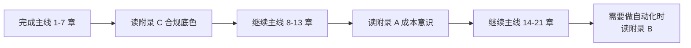

# 附录章节说明

> 21 章主线之外的扩展专题。不是必学，但解决三类"主线没法展开但又躲不开"的问题：花钱、自动化、合规。

## 附录定位与三层视图关系

| 章节 | 在哪种场景必读 | 与主线关系 |
| --- | --- | --- |
| **附录 A：AI 预算与成本意识** | 任何要给团队配 AI 工具时 | 补第 8 章"用 AI 做工作"的成本面 |
| **附录 B：Agent 与工作流** | 团队 SOP 跑稳 ≥ 1 个月、想做自动化时 | 衔接第 13 章 SOP 与第 19 章固化模板 |
| **附录 C：跨境电商合规与踩坑** | 任何对外内容/客服/广告投放之前 | 第 5/9/11/17 章必须前置读 |

## 阅读顺序建议

## 设计原则

1. **附录 ≠ 必学**：21 章主线已能解决跨境电商 80% 的提效问题；附录是为剩下 20% 的进阶场景准备。
2. **附录 = 决策框架**：不教"怎么做炫技实现"，只教"什么时候做、做到什么程度停"。
3. **附录受单源约定约束**：与主线/实操手册/TCI 主教材冲突时，以源章节（`01_~03_`）为准；附录是补充视角，不是覆盖主线。

## 关联

- 单源约定：[`../00_课程总纲/11_单源一致性约定.md`](../00_课程总纲/11_单源一致性约定.md)
- 课程总目录：[`../00_课程总纲/01_课程总目录.md`](../00_课程总纲/01_课程总目录.md)
