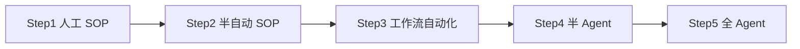

# 附录 B：Agent 与工作流——把 SOP 变成可跑的流程

> **建议阅读时机**：完成第 13 章（把一个动作变成 SOP）和第 19 章（固化成模板）之后。  
> **本附录定位**：扩展阅读，不是必学。给完成 21 章主线、想再向前一步的学员。  
> **一句话定位**：SOP 是"人按步骤做"的规则；Agent 是"机器按规则做"的人。这一章帮你判断**哪些 SOP 值得变成 Agent，哪些不值得**。

---

## 一、为什么要有这一章

很多团队在跑通 SOP 之后，会立刻被一种声音吸引：

> "这套流程都成型了，干嘛不直接做成 Agent，让 AI 自动跑？"

这句话听起来很合理，但 90% 的情况下，过早做 Agent 比继续用 SOP 更糟糕：

- SOP 写错了，人会感觉到不对劲、停下来、问一句；Agent 写错了，会**安静地错 100 次**才被发现。
- SOP 改一个步骤，10 分钟；Agent 改一个步骤，可能要重测整条链路。
- SOP 出问题，责任清晰（是谁这一步没做）；Agent 出问题，责任模糊（是模型/提示词/数据/接口？）。

**这一章不是教你怎么造 Agent，是教你怎么判断该不该造、什么时候造、造到什么程度就停**。

---

## 二、核心概念：SOP / 工作流 / Agent 的边界

| 名称 | 谁在做 | 决策权 | 适用场景 |
| --- | --- | --- | --- |
| **SOP** | 人，按步骤操作，AI 当工具 | 100% 在人 | 流程未稳定、变动多、责任要清晰 |
| **工作流（Workflow）** | 系统按预设节点跑，固定分支 | 95% 在规则，5% 在人审 | 流程已稳定、分支可枚举、出错代价低 |
| **Agent** | AI 自主拆任务、调工具、做决策 | 50% 在 AI，50% 在人审 | 任务边界清晰、有明确成功标准、有兜底 |

一句话区分：

- SOP = 菜谱，人照做。
- 工作流 = 自动化流水线，按图索骥。
- Agent = 厨师助理，给目标自己想办法。

> ⚠️ **本课程的整体立场**：跨境电商日常 80% 的场景，**SOP + 工作流就够了**，不需要 Agent。Agent 适合的场景非常窄。

---

## 三、判断"该不该上 Agent"：5 道闸门

一个 SOP 想升级成 Agent，必须**全部通过**这 5 道闸门，缺一不可：

| # | 闸门 | 通过标准 | 不通过的后果 |
| --- | --- | --- | --- |
| 1 | **稳定度** | SOP 已稳定运行 ≥ 4 周，期间步骤改动 ≤ 2 次 | 流程一改 Agent 就废，得不偿失 |
| 2 | **频次** | 每周触发 ≥ 20 次 | 频次太低，人手做更划算 |
| 3 | **可量化的成功标准** | 能用 1-2 个数字判断"这次跑得对不对" | 无法判断对错，Agent 等于黑盒 |
| 4 | **错误代价可控** | 单次错误损失 ≤ 50 美元 / 不影响合规 | 错误代价高，必须人审，Agent 优势消失 |
| 5 | **可兜底** | 有"人工接管"按钮，能立刻停 | 出问题没法刹车，等于在马路上放无人车 |

**5 道闸门全过 → 可以做。过 3-4 道 → 先做"半 Agent"（自动跑 + 人工最后一步审核）。过 2 道及以下 → 老老实实用 SOP。**

---

## 四、跨境电商常见任务的"上 Agent 适配度"

| 任务 | 5 道闸门通过情况 | 建议 |
| --- | --- | --- |
| 每周广告周报生成 | ✅✅✅✅✅ | **可以做工作流**，结论由人审定 |
| 自动回复 5 星好评 | ✅✅✅✅✅ | **可以做半 Agent**，发布前批量人审 |
| 自动回复差评 | ✅✅⚠️❌✅ | **不要做**，差评回复直接关系品牌口碑 |
| 自动调广告竞价 | ✅✅✅⚠️✅ | **只做"建议"，不做"执行"** |
| 自动生成 Listing | ✅⚠️✅✅✅ | 人写 + AI 改，比 Agent 全自动更稳 |
| 自动处理退换货退款 | ✅✅✅❌⚠️ | **绝对不要**，涉及钱+合规 |
| 每日竞品价格监控 + 报警 | ✅✅✅✅✅ | **典型工作流场景**，不需要 Agent |
| 每周 Listing 关键词排名跟踪 | ✅✅✅✅✅ | **典型工作流场景** |

**规律**：凡是涉及"花钱、回复用户、改对外内容"的，至少要保留人审；只有"读数据、出报表、做提醒"的，才适合全自动。

---

## 五、方法论：从 SOP 到工作流的 4 步演化

不要一步跨到 Agent，按这 4 步走：



| 阶段 | 谁做什么 | 典型工具 |
| --- | --- | --- |
| Step1 人工 SOP | 人按 checklist 操作，AI 只做单步骤辅助 | 文档 + ChatGPT |
| Step2 半自动 SOP | 多个步骤拼成提示词链，人触发、人收尾 | 提示词模板 + 表格 |
| Step3 工作流自动化 | 固定分支自动跑，人只在关键节点审核 | n8n / Make / 飞书多维表格 + AI 字段 |
| Step4 半 Agent | AI 自主决策中间节点，最终输出人审 | Coze / Dify / Flowise |
| Step5 全 Agent | AI 全程自主，人只看日志 | LangChain / AutoGPT 类（**99% 跨境团队不需要走到这步**） |

**本课程立场**：如果你能把团队稳定推到 Step3，已经超过 90% 的同行。Step4/5 是"研发型团队"才该考虑的事。

---

## 六、半 Agent 的标准结构（如果真要做）

如果你确实判断某个任务值得做半 Agent，按这个结构做，能少踩 80% 的坑：

```
[输入门] → [拆任务] → [调工具] → [自检] → [人审] → [输出门]
   ↑                                          ↓
   └──────── 失败时回退到 SOP ──────────────────┘
```

每个节点的硬要求：

| 节点 | 必须有 | 常见错误 |
| --- | --- | --- |
| 输入门 | 字段校验 + 异常输入拦截 | 直接把用户原话喂进去，被 prompt injection |
| 拆任务 | 限制最多 5 步，每步有名字 | 让 AI 自由发挥，跑出 20 步还在转圈 |
| 调工具 | 工具列表 ≤ 6 个，每个有用途说明 | 工具太多，AI 选错 |
| 自检 | 输出前用规则/小模型校验一遍 | 直接发出去，错了才发现 |
| 人审 | 必须有"通过/驳回/修改"三选一 | 只能"通过"，等于没审 |
| 输出门 | 每次留日志：输入、过程、输出、用时、成本 | 出问题没法回溯 |

---

## 七、案例：把"广告周报"从 SOP 升到工作流

**起点（Step1，第 12 章 SOP）**：
1. 人下载广告报表 CSV
2. 人喂进 ChatGPT，问"这周哪些词该砍"
3. 人复制结论，整理成周报
4. 人发到群里

**终点（Step3，工作流）**：
1. 每周一 8:00，系统自动从亚马逊广告 API 拉数据
2. 系统按规则筛选异常关键词（CTR < 0.3% 且点击 > 30）
3. 调 LLM 生成"建议清单"，附带数据证据
4. 推送到飞书表格，运营 30 分钟内审核（点击"通过/修改/驳回"）
5. 通过后自动归档到周报模板，发到运营群

**升级带来的变化**：
- 时间：从 90 分钟 → 15 分钟人审
- 错误率：人工漏掉的"长尾差词"从 ~30% → ~5%
- 成本：每周 $0.4 LLM 调用 + 30 分钟人时

**没有变的东西（也不应该变）**：
- 最终决策仍在人
- "是否暂停某关键词"由人按钮触发，不是系统自动改
- 出问题可以一键关闭工作流，回到 Step1 SOP

---

## 八、给团队的 3 条务实建议

1. **先把 SOP 跑稳 1 个月再说自动化**。SOP 都摇摆的流程，自动化只是把摇摆放大。
2. **永远保留"一键回退到人工"的开关**。Agent / 工作流是助手，不是替代品；当它出问题，人要能立刻接管。
3. **优先把工作流做在已有平台里**（飞书多维表格 / 钉钉 / 企业微信 + AI 字段），而不是自建系统。已有平台 = 人已经在用 + 权限/审计已经到位 + 出问题有人维护。

---

## 九、误区与判断门槛

| 误区 | 真相 |
| --- | --- |
| "Agent 越自动越好" | 自动化程度 = 你愿意承担的失控程度，不是越高越好 |
| "做了 Agent 就不用人了" | Agent 让"3 人做 30 人活"，不是"0 人做 30 人活" |
| "AI 能自己学会" | 至少未来 2-3 年，Agent 还是"按你写的规则跑"，不是"自己悟" |
| "别人都在做 Agent" | 你看到的是宣传，看不到的是"上线 1 周回退到 SOP"的团队 |

**一个判断门槛**：如果你回答不出"这个 Agent 出错时，第一时间谁来兜底、怎么兜底"，就不要上线。

---

## 十、本附录小结

- SOP / 工作流 / Agent 是**逐级升级**关系，不是"非此即彼"。
- 跨境电商 80% 任务，**SOP + 工作流足够**，不需要 Agent。
- 升级的判断标准是**5 道闸门**：稳定度、频次、成功标准、错误代价、可兜底。
- 真要做，按 **5 阶段演化**走，永远保留人工兜底。

> 关联章节：第 13 章（SOP 化）、第 19 章（固化成模板）、附录 A（成本意识）、附录 C（合规与踩坑）。
