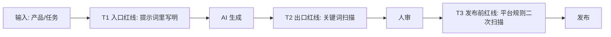

# 附录 C：跨境电商合规与踩坑专题——AI 时代的红线手册

> **建议阅读时机**：第 1 章入门后即可读一遍，作为底色；第 11 章（客服）、第 12 章（周报）、第 17 章（完成第一版）之前再读一遍。  
> **本附录定位**：必读。任何涉及对外内容、用户沟通、广告投放的章节，都必须先过这一关。  
> **一句话定位**：**AI 提效带来的最大风险不是"做不好"，而是"做错而不自知，规模化地错"**。

---

## 一、为什么 AI 时代合规更重要

| 过去 | AI 时代 |
| --- | --- |
| 人手写 100 条 Listing，每条平均 30 分钟，错也错不快 | AI 一小时生成 100 条，每条都可能踩同一个坑 |
| 客服回复一条一条审 | AI 自动回复 100 条，错的话 100 条都错 |
| 广告文案改 1 次跑 1 周 | AI 一天迭代 10 次，违规词被算法识别后惩罚连锁 |

**核心规律**：AI 把"个体出错率"降低了，但把"集体出错的速度"提高了 100 倍。一个 prompt 写错，等于一个错误规模化复制。

---

## 二、跨境电商最容易踩的 7 大红线

按"代价 × 触发频率"排序：

| 优先级 | 红线类别 | 典型违规 | 后果 |
| --- | --- | --- | --- |
| 🔴 P0 | **医疗/健康声明** | "cure", "treat", "FDA approved"（无证）, "guaranteed weight loss" | 平台直接下架 + 监管约谈 |
| 🔴 P0 | **儿童安全/CPSC** | 玩具/婴幼用品缺测试报告、年龄标注错误 | 召回 + 罚款数十万美元 |
| 🟠 P1 | **商标/版权侵权** | Listing/广告里用 Disney/Nike/Apple 等品牌名 | 商标方投诉 → 链接下架 |
| 🟠 P1 | **虚假宣传** | "#1 Best Seller"（无榜单依据）, "100% organic"（无认证） | FTC 警告 + 平台扣分 |
| 🟠 P1 | **比较广告** | "Better than [竞品名]"（无数据支撑） | 竞品投诉 + 平台处理 |
| 🟡 P2 | **review 操纵** | 让 AI 批量生成假好评、刷 5 星 | 账号封禁 |
| 🟡 P2 | **数据隐私** | 把含 PII（邮箱/电话/地址）的数据喂给 AI 不脱敏 | GDPR/CCPA 罚款 + 商业泄露 |

> 每一条都不是吓唬：2024-2026 年间，亚马逊、TikTok Shop、Shopify 都对这 7 类违规加大了 AI 检测力度。

---

## 三、AI 输出"红线词"分级清单

把这份清单贴在每个提示词模板里，作为输出后必查项。

### 3.1 绝对禁止（P0，命中即否决）

```
医疗类: cure, treat, heal, prevent, diagnose, FDA approved（无证）,
        clinical proof（无证）, doctor recommended（无证）

数据类: 100%, guaranteed, never fails, always works,
        #1（无榜单链接）, best in market（无数据）

侵权类: [品牌名直接出现，如 Apple/Nike/Disney/Lego/Marvel...]
        compatible with iPhone（需写"compatible with smartphones"）
```

### 3.2 高风险（P1，需带证据才可用）

```
环保类: organic, natural, eco-friendly, biodegradable, sustainable
       → 必须带认证编号（USDA Organic / OEKO-TEX / FSC...）

性能类: waterproof（→ IPX 等级）, unbreakable（→ 测试条件）,
       lifetime warranty（→ 条款链接）

群体类: kids-safe, baby-safe, pet-safe
       → 必须带对应安全标准（CPSIA / ASTM / AAFCO...）
```

### 3.3 文化/翻译禁区（按市场区分）

| 市场 | 高敏感词/话题 |
| --- | --- |
| 美国 | 种族/宗教/性取向暗示词、政治人物名 |
| 欧洲（DE/FR） | 二战相关符号、宗教节日商业化用词 |
| 中东 | 酒精、猪肉、女性形象（部分国家） |
| 日本 | 直接对比竞品、过度夸张表达 |
| 印度 | 宗教符号、种姓相关词 |

---

## 四、把红线检查嵌入工作流的 3 个时点

不要靠"事后人审"，要把检查做进流程：



| 时点 | 谁做 | 用什么 | 输出 |
| --- | --- | --- | --- |
| **T1 入口红线** | 提示词模板 | 把"禁用词清单"+"必须有证据的词"写进 prompt 的 Constraints | AI 主动避开 |
| **T2 出口红线** | 自动扫描脚本/正则 | 红线词词表（按品类维护） | 命中即标红 |
| **T3 发布前红线** | 人工 + 平台规则库 | 平台最新政策（每季度更新一次） | 通过/驳回 |

> **本课程立场**：T1 + T2 必须自动化；T3 涉及合规判断的，永远人工。

---

## 五、提示词里的"合规护栏"标准段落

把下面这段放进所有对外内容（Listing/广告/客服）的提示词末尾：

```
### Compliance Constraints (must follow):
- DO NOT use absolute claims (100%, always, guaranteed, never, best, #1) 
  unless I provide a verifiable source.
- DO NOT make medical/health claims (cure, treat, prevent, FDA approved) 
  unless I provide certification number.
- DO NOT mention competitor brand names directly. Use generic terms.
- DO NOT use "organic / natural / eco-friendly" unless I provide certification.
- For kids/pet products, only use safety claims that match the certifications I listed.
- If you are uncertain whether a phrase is compliant, mark it with [REVIEW] 
  and explain why.

### Output requirement:
- At the end of output, list all claims that need human verification, 
  in this format: "Claim: ... | Why review: ... | Suggested evidence: ..."
```

效果：AI 会主动把"我也不确定能不能写"的部分标出来，而不是闷着头帮你写违规。

---

## 六、5 个真实踩坑案例（脱敏）

### 案例 1：瑜伽垫的"环保"翻车

某团队让 AI 生成 Listing，AI 写了 "100% eco-friendly natural rubber"。  
**问题**：产品材质实际是 TPE（合成材料），不是天然橡胶；"100%" + "natural" 双重违规。  
**结果**：上架 3 天后被竞品投诉，listing 下架，重新过审花了 11 天。  
**教训**：T1 没有把"环保词必须带认证"写进 prompt。

### 案例 2：宠物喂食器的"健康"承诺

AI 在客服回复里写了 "This will improve your cat's digestion and prevent obesity."  
**问题**：医疗效果声明，且无任何依据。  
**结果**：用户截图发到 Reddit，引发"虚假宣传"讨论，品牌评分一周内从 4.4 → 4.0。  
**教训**：客服回复也要过红线扫描，不只是 Listing。

### 案例 3：耳机的"对比"广告

广告文案 AI 写："Better sound than AirPods at half the price."  
**问题**：直接对比品牌名 + 无数据支撑的"better"。  
**结果**：苹果商标方投诉，Sponsored 广告被下架，账户广告权重受影响 2 周。  
**教训**：竞品对比类提示词必须明确写"不要出现品牌名，用 generic terms"。

### 案例 4：差评回复的"过度承诺"

AI 自动回复差评："We will fully refund you and send a replacement, plus a free gift."  
**问题**：超出客服权限（金额 + 赠品）；如果每条差评都这样，月成本爆表。  
**结果**：1 周内 20 条差评回复触发 $800 额外赔付，财务追责。  
**教训**：客服 prompt 必须写明"承诺金额上限"和"超出请转人工"（参见第 11 章硬参数）。

### 案例 5：用户邮件喂给公共 LLM

运营把含用户邮箱、订单号、地址的整封邮件直接粘贴进 ChatGPT 让它"帮忙润色回复"。  
**问题**：PII 数据泄露给第三方 LLM，违反 GDPR。  
**结果**：被合规部门查到，团队被暂停使用 AI 工具 2 周整改。  
**教训**：给 AI 的输入必须先脱敏（见第 11 章实操手册的"脱敏 5 字段"流程）。

---

## 七、各平台合规要点速查

| 平台 | 重点关注 | 更新节奏 |
| --- | --- | --- |
| **Amazon** | Restricted Products / Claim Substantiation / Trademark / Review Policy | 每季度 |
| **TikTok Shop** | 直播话术合规 / 商品准入类目 / 跨境清关 | 每月 |
| **Shopify** | 自有责任，受目标市场法规约束（FTC/GDPR） | 持续 |
| **eBay** | VeRO 项目（品牌投诉） / Listing 准确性 | 每季度 |
| **Walmart** | Trust & Safety / Pricing Parity | 每季度 |

> **建议做法**：每季度第一周，让 1 个人专门把这 5 个平台的"政策更新"过一遍，输出 1 页变更摘要给团队。

---

## 八、给团队的 5 条务实合规守则

1. **任何对外内容 AI 生成后，至少 1 个人过 1 遍红线词清单，再发布**——哪怕你已经在 prompt 里写了 constraints。
2. **把红线词清单按品类拆**：保健 / 玩具 / 电子 / 食品 / 服装的禁词不一样，不要用一份通用清单凑合。
3. **建立"违规事件日志"**：每次踩坑（自己 / 同行）都记一条，每月看一次，更新到 prompt 和扫描词表。
4. **PII 脱敏不是建议是规定**：给 AI 的输入永远先去掉邮箱/电话/地址/订单号/姓名 5 类信息。
5. **不确定就不发**：AI 生成的内容若你需要"研究一下能不能这么说"，那就**默认不能这么说**，先合规再考虑表达。

---

## 九、误区与判断门槛

| 误区 | 真相 |
| --- | --- |
| "我们品类小，平台不会管" | 算法是机器扫描，不分大小，命中即判 |
| "竞品都这么写" | 竞品也在被处理，只是你没看到 |
| "AI 写的不是我说的，平台不会怪我" | 账号是你的，发布按钮是你按的，责任就是你的 |
| "上次没出事这次也不会" | 平台政策每季度更新，过去合规 ≠ 现在合规 |
| "只要不违法就行" | 平台规则比法律更严，且更新更快 |

**一个判断门槛**：发布前问自己一句——**"如果这条内容上了 BBC/Reddit 头条，我能不能解释清楚每一句的依据？"** 答不上来就不发。

---

## 十、本附录小结

- AI 提效带来的不是"少出错"，是"出错被规模化"。
- 跨境电商 7 大红线（医疗/儿童/商标/虚假/比较/操纵/隐私）是底线，**任何提效都不能突破**。
- 合规要做进流程的 3 个时点（T1 入口 / T2 出口 / T3 发布前），不能靠"事后救火"。
- 提示词里加"合规护栏段落"，让 AI 主动标 [REVIEW]，是性价比最高的一步。
- 守住底线的 5 条规则：人审 / 分品类清单 / 违规日志 / PII 脱敏 / 不确定就不发。

> 关联章节：第 5 章（Listing 生成）、第 9 章（广告素材）、第 11 章（客服）、第 13 章（SOP）、附录 A（成本）、附录 B（Agent 与工作流）。
